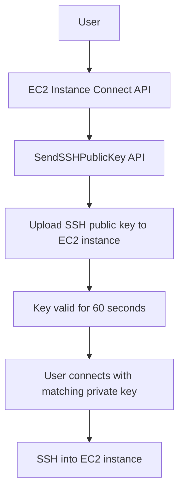

# 40. EC2 Instance Connect

## 🎯 Giới thiệu
EC2 Instance Connect là service/feature cho phép kết nối SSH vào EC2 instance bằng cách **tạm thời đẩy SSH public key** lên instance thông qua **SendSSHPublicKey API**. Điểm cốt lõi là key chỉ có hiệu lực rất ngắn, **60 seconds**.

## 1. Cách hoạt động của EC2 Instance Connect
- EC2 instance có **security group** riêng.
- Inbound rule phải cho phép **SSH port 22** từ một source phù hợp.
- Source này chứa các **IP ranges / prefixes** dùng cho EC2 Instance Connect service.
- Mục đích là mở port 22 để có thể SSH vào instance.

## 2. SendSSHPublicKey API
- Khi khởi tạo EC2 Instance Connect, hệ thống sẽ:
  - **push/upload SSH public key** lên EC2 instance
  - chỉ là hành động **one-time**
- **SendSSHPublicKey API** cho phép:
  - EC2 Instance Connect service upload một SSH key được chỉ định lên EC2 instance
  - thậm chí người dùng cũng có thể dùng API này trực tiếp
- Sau khi public key được upload, bạn có **60 seconds** để kết nối bằng **private key tương ứng**.

## 3. Audit và Visibility
- Mọi kết nối liên quan đến:
  - **SendSSHPublicKey API**
  - **EC2 Instance Connect API**
- đều được ghi trong **CloudTrail**
- Điều này giúp có:
  - **full audit**
  - **visibility** rõ ràng cho hoạt động kết nối

## 📊 Bảng tóm tắt
| Tiêu chí | Mô tả |
|----------|------|
| Mục đích | SSH vào EC2 bằng key tạm thời |
| API chính | `SendSSHPublicKey` |
| Cơ chế | Upload SSH public key lên EC2 instance |
| Thời gian hiệu lực | 60 seconds |
| Network requirement | Security group mở SSH port 22 từ source phù hợp |
| Audit | Ghi log trong CloudTrail |

## 💡 Mẹo ghi nhớ cho kỳ thi AWS
- Nhớ từ khóa: **EC2 Instance Connect = temporary SSH key upload**
- **SendSSHPublicKey** là điểm mấu chốt của flow.
- Key chỉ sống **60 seconds**.
- Nếu câu hỏi nhắc đến **audit/traceability**, nghĩ ngay đến **CloudTrail**.
- Nếu nhắc đến network access, nhớ **security group inbound SSH 22**.

## ✅ Kết luận
EC2 Instance Connect cho phép SSH vào EC2 bằng cách đẩy **SSH public key tạm thời** qua **SendSSHPublicKey API**, key chỉ có hiệu lực **60 seconds**, và toàn bộ hoạt động được ghi nhận trong **CloudTrail** để phục vụ audit.
