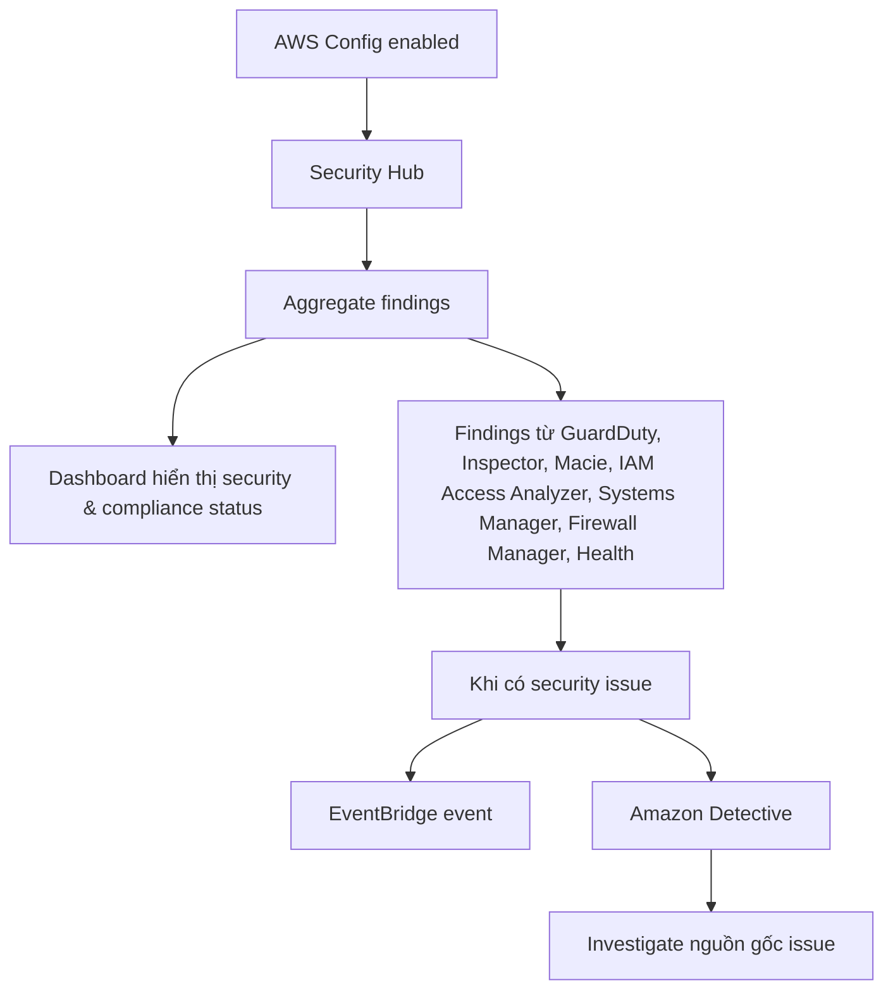

# 41. AWS Security Hub

## 🎯 Giới thiệu
AWS Security Hub là một **central security tool** dùng để:
- Quản lý security trên **multiple AWS accounts**
- **Automate security checks**
- Hiển thị **current security and compliance status** trong một **integrated dashboard**
- **Aggregate alerts/findings** từ nhiều AWS services và partner tools vào một nơi

Security Hub giúp bạn nhanh chóng nhìn thấy các vấn đề bảo mật và hành động từ một dashboard tập trung.

## 1. Vai trò chính của Security Hub
Security Hub hoạt động như một **central hub** cho các security findings từ:
- `Config`
- `GuardDuty`
- `Inspector`
- `Macie`
- `IAM Access Analyzer`
- `AWS Systems Manager`
- `AWS Firewall Manager`
- `AWS Health`
- `AWS Partner Solutions`

Điểm chính:
- Tập hợp findings từ nhiều nguồn
- Hỗ trợ theo dõi security across nhiều account
- Cho phép xem các issue tiềm năng tại một nơi duy nhất

## 2. Luồng hoạt động
Để Security Hub hoạt động, transcript nhấn mạnh rằng bạn **phải enable AWS Config** trước.

Sau đó:
- Security Hub thu thập findings từ các service như `Macie`, `GuardDuty`, `Inspector`, `Firewall Manager`, `IAM Access Analyzer`, `Systems Manager`, `Config`, `Health`
- Các **automatic checks** tạo ra findings và hiển thị trong dashboard
- Khi có security issue, một **event** được tạo trong `EventBridge`
- Để điều tra nguồn gốc issue, có thể dùng `Amazon Detective`

## 3. Cấu hình và pricing
Khi enable Security Hub, transcript mô tả các bước chính:
- Bật `Config` trước
- Chọn các **security standards** muốn tuân theo
- Chọn các **integrations** dựa trên services đã enable
- Sau đó chọn **Enable Security Hub**

Về pricing:
- Có **pricing per check**
- `first 1000 checks` có mức giá riêng
- `ingestion events`: `first 10,000 events` là free
- Sau đó sẽ **pay per finding**
- Có **30 day trial** cho Security Hub

## 📊 Bảng tóm tắt
| Tiêu chí | Mô tả |
|----------|------|
| Mục đích | Central security tool để quản lý security across multiple AWS accounts |
| Chức năng chính | Automate security checks và hiển thị security/compliance status |
| Nguồn findings | `Config`, `GuardDuty`, `Inspector`, `Macie`, `IAM Access Analyzer`, `Systems Manager`, `Firewall Manager`, `Health`, partner tools |
| Điều kiện enable | Phải enable `AWS Config` trước |
| Tích hợp liên quan | `EventBridge` để tạo event khi có security issue, `Amazon Detective` để điều tra |
| Pricing | Tính theo checks, ingestion events, và pay per finding sau ngưỡng free |
| Trial | Có `30 day trial` |

## 💡 Mẹo ghi nhớ cho kỳ thi AWS
- Nhớ cụm từ: **Security Hub = central hub for security findings**
- `AWS Config` là **điều kiện bắt buộc** để Security Hub hoạt động
- Security Hub **không tự tạo tất cả dữ liệu**, mà **aggregate findings** từ nhiều service khác
- Khi có issue:
  - `EventBridge` nhận event
  - `Amazon Detective` hỗ trợ investigation
- Khi đi thi, nếu thấy câu hỏi về:
  - centralized security dashboard
  - multi-account security findings
  - aggregate findings from many services  
  thì nghĩ ngay đến `AWS Security Hub`

## ✅ Kết luận
AWS Security Hub là dịch vụ tập trung giúp bạn theo dõi security và compliance từ nhiều AWS services và partner tools trong một dashboard duy nhất. Trong transcript, các ý quan trọng nhất là: phải enable `AWS Config`, Security Hub aggregate findings, tạo event qua `EventBridge` khi có issue, và có thể dùng `Amazon Detective` để điều tra nguồn gốc vấn đề.
