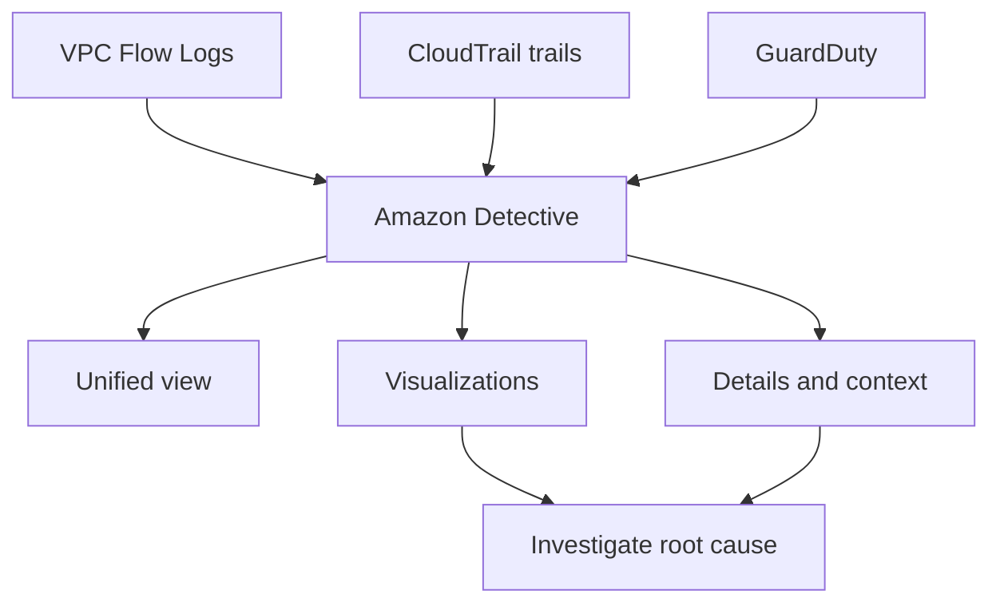

# 42. Amazon Detective

## 🎯 Giới thiệu
Amazon Detective được dùng khi bạn đã có các service như **GuardDuty**, **Macie**, và **Security Hub** để phát hiện các **security findings** nhưng cần đi sâu hơn để tìm **root cause**.  
Mục tiêu chính là giúp **phân tích, điều tra, và xác định nhanh nguyên nhân gốc** của các vấn đề bảo mật hoặc hoạt động đáng ngờ.

## 1. Vấn đề Detective giải quyết
- Khi có security issue, việc truy vết nguyên nhân có thể:
  - dài
  - phức tạp
  - phải phân tích dữ liệu từ nhiều nguồn khác nhau
- Trong bối cảnh bảo mật, cần tìm root cause càng nhanh càng tốt để giảm rủi ro trong kiến trúc.

## 2. Detective hoạt động như thế nào
- Amazon Detective dùng:
  - **machine learning**
  - **graphs**
- Mục đích là tạo ra khả năng phân tích nhanh để đi thẳng đến nơi vấn đề bắt nguồn.
- Detective **tự động thu thập và xử lý** các event từ:
  - **VPC Flow Logs**
  - **CloudTrail trails**
  - **GuardDuty**
- Sau đó, nó tạo ra một **unified view** để hỗ trợ điều tra.

## 3. Kết quả mà Detective cung cấp
- Cung cấp:
  - **visualizations**
  - **details**
  - **context**
- Nhờ đó, người dùng có thể nhanh chóng:
  - hiểu sự việc xảy ra như thế nào
  - xác định **root cause**
  - điều tra các **suspicious activities**

## 📊 Bảng tóm tắt
| Tiêu chí | Mô tả |
|----------|------|
| Mục đích | Phân tích và điều tra security issues, suspicious activities để tìm root cause nhanh |
| Dữ liệu đầu vào | VPC Flow Logs, CloudTrail trails, GuardDuty |
| Cách xử lý | Dùng machine learning và graphs ở backend |
| Kết quả | Unified view, visualizations, details, context |
| Giá trị chính | Giúp truy vết nguyên nhân gốc nhanh hơn trong các vấn đề bảo mật |

## 💡 Mẹo ghi nhớ cho kỳ thi AWS
- Nhớ rằng **Detective = điều tra root cause**.
- Khi đề bài nói đến:
  - tìm nguyên nhân gốc của security findings
  - cần liên kết dữ liệu từ nhiều nguồn
  - cần visual context để điều tra nhanh
  thì nghĩ ngay đến **Amazon Detective**.
- Ba nguồn dữ liệu cần nhớ:
  - **VPC Flow Logs**
  - **CloudTrail**
  - **GuardDuty**
- Từ khóa quan trọng:
  - **machine learning**
  - **graphs**
  - **unified view**

## ✅ Kết luận
Amazon Detective được dùng để **điều tra và xác định nhanh root cause** của các vấn đề bảo mật. Dịch vụ này tự động tổng hợp dữ liệu từ **VPC Flow Logs**, **CloudTrail trails**, và **GuardDuty**, rồi cung cấp **visualizations** cùng **context** để hỗ trợ phân tích nhanh và hiệu quả.
