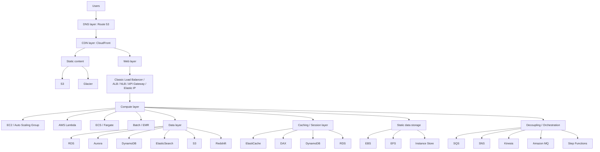

# 43. Solution Architecture on AWS

## 🎯 Giới thiệu
Ở mức tổng quan, solution architecture trên AWS có rất nhiều комбинации, nhưng thường được nhìn theo các lớp chính: **DNS, CDN/static content, web layer, compute layer, data layer, caching, storage, và messaging/orchestration**.  
Mục tiêu của phần này là hiểu **dịch vụ nào phù hợp với lớp nào**, và mỗi lựa chọn sẽ ảnh hưởng đến **cost, availability, durability, scalability** như thế nào.

## 1. 🌐 DNS, CDN và static content
- Người dùng trước hết truy cập qua **DNS**, thường là **Route 53**.
- Với **static content**, kiến trúc thường dùng **CloudFront** để cache và phân phối toàn cầu.
- **CloudFront** thường lấy dữ liệu từ:
  - **S3**
  - **Glacier** cho archive
  - hoặc các **custom sources** khác
- Ý chính:
  - **S3** rất phù hợp với **CloudFront**
  - **Glacier** dùng cho archive và không được nhắc là kết hợp trực tiếp với CloudFront

## 2. 🧩 Web layer, compute layer và data layer
- Với **dynamic content**, thường cần một **web layer** như:
  - **Classic Load Balancer**
  - **Application Load Balancer**
  - **Network Load Balancer**
  - **API Gateway**
  - hoặc **Elastic IP** trong các giải pháp đơn giản
- Web layer sẽ chuyển tiếp sang **compute layer**, có thể là:
  - **EC2**
  - **Auto Scaling Group**
  - **AWS Lambda**
  - **ECS**
  - **Fargate**
  - **Batch**
  - **EMR**
- **Data layer** có thể là:
  - **RDS**
  - **Aurora**
  - **DynamoDB**
  - **ElasticSearch**
  - **S3** cũng được xem như một dạng database trong ngữ cảnh này
  - **Redshift** cho workload thiên về phân tích

## 3. 🗂️ Cache, storage, decoupling và ảnh hưởng kiến trúc
- **Caching / session layer** có thể dùng:
  - **ElastiCache**
  - **DAX**
  - **DynamoDB**
  - **RDS**
- **Static data storage** cho instance có thể nằm ở:
  - **EBS**
  - **EFS**
  - **Instance Store**
- Để **decouple** trong kiến trúc microservices, có thể dùng:
  - **SQS**
  - **SNS**
  - **Kinesis**
  - **Amazon MQ**
  - **Step Functions** cho orchestration
- Compute layer cũng có thể cần truy cập **static assets**, và **S3** là một lựa chọn rõ ràng.
- Điểm quan trọng cho kỳ thi:
  - Mỗi lựa chọn về **database, compute, caching, orchestration, storage, static layer, web layer, CDN** đều ảnh hưởng đến:
    - **cost**
    - **availability**
    - **durability**
    - **scalability**
- Đây chính là kiểu tư duy mà đề thi AWS muốn kiểm tra: **chọn dịch vụ phù hợp cho đúng thời điểm và đúng yêu cầu**.

## 📊 Bảng tóm tắt
| Tiêu chí | Mô tả |
|----------|------|
| DNS | Thường dùng **Route 53** để người dùng bắt đầu truy cập |
| Static content | Thường đi qua **CloudFront**, lấy từ **S3** hoặc **Glacier** |
| Dynamic content | Thường cần **load balancer**, **API Gateway**, hoặc **Elastic IP** |
| Compute | Có thể là **EC2**, **Lambda**, **ECS**, **Fargate**, **Batch**, **EMR** |
| Data layer | Có thể là **RDS**, **Aurora**, **DynamoDB**, **ElasticSearch**, **S3**, **Redshift** |
| Caching / session | Có thể là **ElastiCache**, **DAX**, **DynamoDB**, **RDS** |
| Storage | Có thể dùng **EBS**, **EFS**, **Instance Store** |
| Decoupling / orchestration | Có thể dùng **SQS**, **SNS**, **Kinesis**, **Amazon MQ**, **Step Functions** |
| Tác động kiến trúc | Ảnh hưởng đến **cost**, **availability**, **durability**, **scalability** |

## 💡 Mẹo ghi nhớ cho kỳ thi AWS
- Nhớ luồng cơ bản: **Users → Route 53 → CloudFront → static hoặc web layer → compute → data/cache/storage**
- **CloudFront** thường gắn với **static content**
- **S3** là lựa chọn rất hay cho **static assets**
- **Load balancer / API Gateway** thuộc nhóm xử lý **web layer**
- **EC2 / Lambda / ECS / Fargate** là nhóm **compute**
- **RDS / Aurora / DynamoDB / Redshift** là nhóm **data**
- Khi gặp câu hỏi thi, hãy hỏi:
  - workload là **static** hay **dynamic**
  - cần **cache**, **session**, hay **decoupling**
  - ưu tiên **cost**, **availability**, **durability**, hay **scalability**

## ✅ Kết luận
Kiến trúc AWS ở mức cao là cách kết hợp nhiều lớp dịch vụ khác nhau để phục vụ **static content**, **dynamic content**, **data**, **cache**, **storage**, và **orchestration**.  
Trọng tâm của bài này là hiểu rằng **không có một kiến trúc duy nhất**, mà lựa chọn dịch vụ sẽ phụ thuộc vào yêu cầu và sẽ tác động trực tiếp đến các tiêu chí vận hành quan trọng trong AWS.
