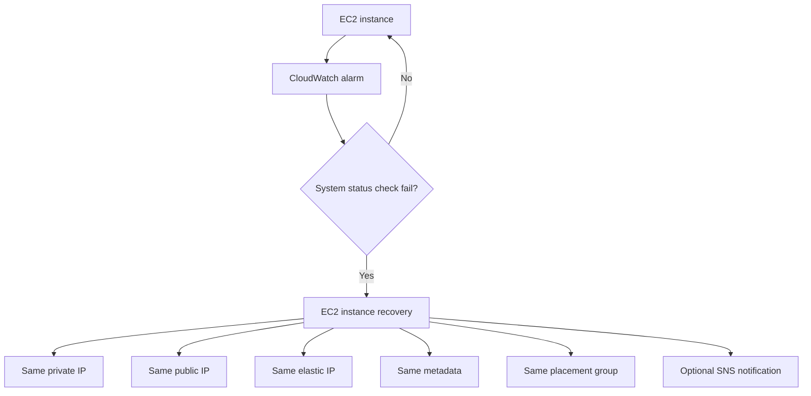

# 44. EC2

## 🎯 Giới thiệu
EC2 là một chủ đề rất lớn trong AWS exam. Transcript tập trung vào các phần quan trọng nhất cần nhớ: **instance types**, **placement groups**, **launch options**, **Graviton**, **metrics**, và **EC2 instance recovery**.

## 1. Instance Types & Placement Groups
### Instance types theo family
- **R**: tối ưu cho ứng dụng cần nhiều **RAM** như in-memory cache.
- **C**: tối ưu cho **CPU** và tính toán, cũng phù hợp cho một số database.
- **M**: cân bằng, phù hợp cho **general web applications**.
- **I**: tối ưu cho **local I/O**, thường đi với **instance store**, phù hợp cho **high performance databases**.
- **G**: có **GPU**, dùng cho **machine learning** hoặc **video rendering**.
- **T2 / T3**: **burstable**, có baseline bình thường nhưng có thể burst lên khi có spike.
- **T2 / T3 Unlimited**: cho phép burst không giới hạn trong một số workload đặc thù.

### Chọn đúng instance
- Nếu instance type tối ưu đúng workload, job có thể chạy nhanh hơn và chi phí có thể thấp hơn.
- Transcript nhắc tới website **ec2instances.info** để tra cứu instance phù hợp.

### Placement groups
Khi launch EC2, mặc định instance được đặt ngẫu nhiên trong AWS data center.  
**Placement group** cho phép AWS “hint” cách đặt instance.

| Strategy | Ý nghĩa | Use case |
|---|---|---|
| **Cluster** | Các instance ở cùng một **AZ**, gần nhau, low-latency | **HPC**, big data job cần tốc độ cao, network throughput lớn |
| **Spread** | Các instance nằm trên hardware khác nhau, tối đa **7 instances per AZ** | Ứng dụng cần giảm rủi ro fail đồng thời, tăng **high availability** |
| **Partition** | AZ chia thành nhiều partition, tối đa **7 partitions per AZ** | **Hadoop**, **Cassandra**, **Kafka**, **HDFS**, **HBase** |

### Điểm cần nhớ
- Có thể **move instance into/out of placement group**.
- Quy trình:
  - **Stop instance**
  - Dùng **CLI** để modify instance placement
  - **Start instance** lại

### Deep dive theo strategy
#### Cluster
- Tất cả instance ở cùng rack / cùng AZ.
- Network rất nhanh, khoảng **10 gigabytes per second bandwidth** theo transcript.
- Ưu điểm: **low latency**, **high network throughput**.
- Nhược điểm: nếu rack/hardware fail thì nhiều instance có thể fail cùng lúc.
- Nên chọn instance type có **enhanced networking**.

#### Spread
- Instance ở khác hardware, khác rack.
- An toàn hơn vì giảm nguy cơ fail đồng thời.
- Giới hạn: **7 instances per AZ per placement group**.
- Phù hợp cho ứng dụng cần **maximum high availability**.

#### Partition
- Instance được chia vào nhiều partition.
- Có thể có **hàng trăm EC2 instances**.
- Instance biết partition của mình nhờ **EC2 metadata service**.
- Nếu một partition fail, các partition khác không bị ảnh hưởng.

## 2. Launch Options & Graviton
### Các kiểu launch EC2
- **On-Demand Instances**
  - Phù hợp workload ngắn.
  - Pricing dự đoán được.
  - Ưu tiên khi cần reliability.

- **Spot Instances**
  - Rất rẻ, có deep discount.
  - Có rủi ro mất instance.
  - Không phù hợp workload dài, ổn định.
  - Tốt nếu ứng dụng **resilient to failure**.

- **Reserved Instances**
  - Minimum period là **1 year**.
  - Phù hợp workload dài.
  - Discount tốt hơn vì cam kết dài hạn.

- **Convertible Reserved Instances**
  - Vẫn cho workload dài.
  - Linh hoạt hơn vì có thể đổi instance type theo thời gian.
  - Discount thấp hơn standard reserved.

### Thanh toán của Reserved Instances
- **All upfront**: discount sâu nhất.
- **Partial upfront**: discount thấp hơn.
- **No upfront**: discount thấp hơn nữa.

### Dedicated options
- **Dedicated Instances**
  - Đảm bảo không có customer khác share hardware của bạn.

- **Dedicated Host**
  - Bạn book cả một physical server.
  - Có thể kiểm soát placement của instance.
  - Use case: **software licenses** theo core hoặc CPU socket.
  - Có thể define **host affinity** để instance reboot vẫn ở cùng host.

### Graviton
- **Graviton processors** mang lại **best price performance** cho EC2.
- Dành cho newer generation instances.
- Hỗ trợ Linux OS như:
  - **Amazon Linux 2**
  - **RedHat**
  - **SUSE**
  - **Ubuntu**
- **Không available cho Windows instances**.
- **Graviton2**: tốt hơn **40% price performance** so với comparable fifth generation x86-based instances.
- **Graviton3**: nhanh hơn **3x** so với Graviton2.
- Use case:
  - app servers
  - microservices
  - HPC
  - machine learning
  - video encoding
  - gaming
  - in-memory caches

## 3. Metrics & EC2 Instance Recovery
### Metrics quan trọng của EC2
- **CPU**: utilization, credit usage, balance cho **T2 Micros**.
- **Network**: **network in / network out**.
- **Status checks**:
  - **Instance status**: kiểm tra EC2 VM.
  - **System status**: kiểm tra underlying hardware.
- **Disk**:
  - read/write ops và bytes
  - chỉ có khi dùng **instance store**
  - nếu dùng **EBS**, metrics có thể xem trực tiếp từ EBS volumes
- **RAM không có sẵn trong EC2 metrics**
  - nếu cần, phải push từ EC2 instance lên **CloudWatch** dưới dạng **custom metric**.

### EC2 instance recovery
- EC2 được monitor bởi **CloudWatch alarm**.
- Alarm kiểm tra **system status check**.
- Khi fail, CloudWatch alarm có thể trigger action **EC2 instance recovery**.

### Điều giữ lại sau recovery
- **Same private IP**
- **Same public IP**
- **Same elastic IP**
- **Same metadata**
- **Same placement group**

### Ý nghĩa thi exam
- Đây là giải pháp tốt cho instance quan trọng khi muốn tự động recover nếu có lỗi ở **instance level** hoặc **system level**.
- CloudWatch alarm có thể nối tiếp sang **SNS topic** để gửi thông báo, ví dụ tới Slack channel.

## 📊 Bảng tóm tắt
| Tiêu chí | Mô tả |
|----------|------|
| Instance families | R, C, M, I, G, T2/T3, T2/T3 Unlimited |
| Placement groups | Cluster, Spread, Partition |
| Cluster | Low-latency, same AZ, phù hợp HPC, risk fail đồng thời |
| Spread | Tách hardware, tối đa 7 instances per AZ, tăng HA |
| Partition | Chia partition, phù hợp Hadoop/Cassandra/Kafka |
| Launch options | On-Demand, Spot, Reserved, Convertible Reserved |
| Dedicated | Dedicated Instances và Dedicated Host cho nhu cầu share hardware / licensing |
| Graviton | Best price performance, không dùng cho Windows theo transcript |
| Metrics | CPU, network, status checks, disk; RAM phải đẩy lên CloudWatch |
| Recovery | CloudWatch alarm + EC2 instance recovery + giữ IP/metadata/placement group |

## 💡 Mẹo ghi nhớ cho kỳ thi AWS
- **R C M I G T**:
  - **R** = RAM
  - **C** = CPU
  - **M** = middle / general purpose
  - **I** = I/O
  - **G** = GPU
  - **T** = burstable
- **Cluster = close together**
- **Spread = spread out**
- **Partition = partitioned scale**
- **Spot = rẻ nhưng rủi ro**
- **Reserved = long-term commitment**
- **RAM không có trong EC2 metrics**: muốn có thì phải đưa sang **CloudWatch custom metric**
- **Recovery qua CloudWatch alarm** thường gắn với **system status check**
- **Graviton** = price/performance tốt hơn, nhưng nhớ transcript nói **không available cho Windows**

## ✅ Kết luận
EC2 trong transcript xoay quanh việc chọn đúng **instance type**, dùng đúng **placement group strategy**, hiểu các **launch options**, và nắm chắc **metrics + recovery flow**. Với exam, các điểm dễ hỏi nhất là sự khác nhau giữa **Cluster / Spread / Partition**, **On-Demand / Spot / Reserved**, và cách **CloudWatch alarm** kích hoạt **EC2 instance recovery**.
