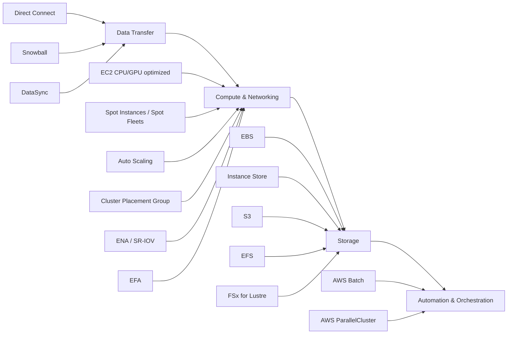

# 45. High Performance Computing (HPC)

## 🎯 Giới thiệu
- **HPC (High-Performance Computing)** là mô hình dùng **rất nhiều tài nguyên compute** để rút ngắn thời gian xử lý và tăng tốc độ ra kết quả.
- Trong AWS, HPC rất phù hợp vì:
  - Có thể tạo số lượng lớn resources rất nhanh.
  - Có thể **scale** theo nhu cầu tính toán.
  - **Chỉ trả tiền cho phần đã dùng**.
  - Khi xong có thể **xóa toàn bộ infrastructure** để không bị tính phí thêm.
- Các use case được nêu trong transcript:
  - genomics
  - computational chemistry
  - financial risk modeling
  - weather prediction
  - machine learning
  - deep learning
  - autonomous driving

## 1. 🚚 Data transfer và data management
- Khi làm HPC, câu hỏi đầu tiên là **đưa dữ liệu vào AWS như thế nào**.
- Các dịch vụ được nhắc đến:
  - **Direct Connect**: chuyển dữ liệu với tốc độ gigabits per second qua private secure network.
  - **Snowball**: chuyển **petabytes** dữ liệu qua **physical route**, phù hợp cho big transfer hoặc one-off transfer.
  - **DataSync**: dùng **DataSync agents** để chuyển lượng dữ liệu lớn giữa on-premise và **NFS/SMB systems** vào:
    - **S3**
    - **EFS**
    - **FSx for Windows**

## 2. 🖥️ Compute, networking và storage
### Compute & networking
- **EC2** là nền tảng compute chính cho HPC.
- Có thể dùng:
  - **CPU optimized instances**
  - **GPU optimized instances**
- Tối ưu chi phí bằng:
  - **Spot Instances**
  - **Spot Fleets**
- Tự động mở rộng bằng:
  - **Auto Scaling**
- Nếu các EC2 instance cần giao tiếp với nhau theo kiểu distributed computation:
  - dùng **EC2 placement group type cluster**
  - để có **best network performance**
  - ví dụ trong transcript là **low latency 10 Gbps network**
  - các instance nằm **cùng rack** và **cùng AZ**

### EC2 enhanced networking
- **EC2 Enhanced Networking** còn gọi là **SR-IOV**
- Lợi ích:
  - higher bandwidth
  - higher PPS (packet per second)
  - lower latency
- Hai cách triển khai được nhắc tới:
  - **Elastic Network Adapter (ENA)**:
    - phổ biến và mới hơn
    - tốc độ đến **100 Gbps**
  - **Intel 82599VF**:
    - legacy option
    - đến **10 Gbps**
- Điểm thi cần nhớ:
  - **ENA** và **Intel 82599VF** đều dùng để có **EC2 enhanced networking**

### EFA
- **Elastic Fabric Adapter (EFA)** là bản nâng cấp của ENA, dành cho **HPC**
- Chỉ hoạt động trên **Linux**
- Phù hợp với:
  - **inter-node communication**
  - **tightly coupled workloads**
  - distributed computation
- EFA dùng **MPI (Message Passing Interface)** và có thể **bypass underlying Linux OS** để đạt:
  - lower latency
  - more reliable transport
- Câu hỏi thi thường yêu cầu phân biệt:
  - **ENA**
  - **EFA**
  - các khái niệm liên quan đến networking cho EC2

### Storage
- Các lựa chọn storage cho HPC:
  - **EBS**
    - có thể lên đến **256,000 IOPS** nếu dùng **io2 Block Express**
  - **Instance Store**
    - có thể lên tới **million of IOPS**
    - gắn trực tiếp với EC2 nên **lower latency**
    - nhưng có thể mất dữ liệu nếu mất instance
  - **Amazon S3**
    - dùng để lưu **large blob of data**
    - không phải file system
  - **EFS**
    - IOPS tăng theo **total size of file system**
    - có thể dùng **provisioned IOPS mode**
  - **FSx for Lustre**
    - file system chuyên cho HPC
    - **HPC optimized**
    - **millions of IOPS**
    - backend được **backed by S3**

## 3. ⚙️ Automation và orchestration
- Hai lựa chọn chính được nêu:
  - **AWS Batch**
    - support service cho **multi-node parallel jobs**
    - chạy job span nhiều **EC2 instances**
    - dễ schedule job và launch EC2 tương ứng
    - được Batch service quản lý
  - **AWS ParallelCluster**
    - **open source cluster management tool**
    - deploy HPC trên AWS
    - configurable bằng **text files**
    - tự động tạo:
      - **VPCs**
      - **Subnets**
      - **cluster types**
      - **instance types**
- Ý chính:
  - HPC trong AWS **không phải một service đơn lẻ**
  - mà là **tổ hợp nhiều services và options** để tối ưu computation

## 📊 Bảng tóm tắt
| Tiêu chí | Mô tả |
|----------|------|
| Mục tiêu HPC | Tăng tốc computation bằng cách dùng rất nhiều tài nguyên AWS trong thời gian ngắn |
| Lợi ích cloud | Scale nhanh, tăng speed to result, chỉ trả tiền cho phần đã dùng |
| Data transfer | **Direct Connect**, **Snowball**, **DataSync** |
| Compute | **EC2**, CPU/GPU optimized instances, **Spot Instances**, **Spot Fleets**, **Auto Scaling** |
| Networking | **Cluster Placement Group**, **ENA / SR-IOV**, **EFA**, **MPI** |
| Storage | **EBS**, **Instance Store**, **S3**, **EFS**, **FSx for Lustre** |
| Automation | **AWS Batch**, **AWS ParallelCluster** |
| Điểm thi quan trọng | Phân biệt **ENA vs EFA**, hiểu **FSx for Lustre**, nhớ HPC là **combination of services** |

## 💡 Mẹo ghi nhớ cho kỳ thi AWS
- **HPC = nhiều compute + network tốt + storage phù hợp + orchestration**
- Nhớ chuỗi tư duy:
  - **đưa dữ liệu vào**
  - **compute mạnh**
  - **network low latency**
  - **storage đúng loại**
  - **tự động hóa job**
- Dễ bị hỏi phân biệt:
  - **ENA**: EC2 enhanced networking, up to **100 Gbps**
  - **EFA**: cho **HPC**, chỉ **Linux**, dùng cho **tightly coupled workloads**
- Dễ bị hỏi chọn dịch vụ:
  - cần chuyển **petabytes** -> **Snowball**
  - cần multi-node batch job -> **AWS Batch**
  - cần cluster management cho HPC -> **AWS ParallelCluster**
  - cần file system HPC optimized -> **FSx for Lustre**
- Với storage:
  - **S3** là object storage, không phải file system
  - **Instance Store** rất nhanh nhưng không bền vững như storage network
- HPC trong AWS thường xuất hiện như một **tổ hợp giải pháp**, không phải chỉ một dịch vụ duy nhất

## ✅ Kết luận
- **HPC trên AWS** là cách tận dụng cloud để chạy các workload tính toán lớn bằng cách ghép nhiều thành phần lại với nhau.
- Transcript nhấn mạnh 4 mảng chính:
  - **data transfer**
  - **compute & networking**
  - **storage**
  - **automation & orchestration**
- Khi ôn thi, cần nhớ rõ các dịch vụ như **Direct Connect, Snowball, DataSync, EC2, ENA, EFA, EBS, EFS, FSx for Lustre, Batch, ParallelCluster** và vai trò của từng dịch vụ trong một kiến trúc HPC.
