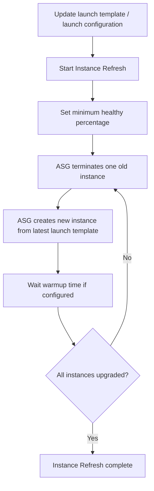

# 46. Auto Scaling

## 🎯 Giới thiệu
Auto Scaling Groups (ASG) dùng để tự động tăng/giảm số lượng EC2 instances theo nhu cầu tải. Transcript tập trung vào:
- Các loại **Dynamic Scaling Policies**
- **Instance Refresh** để cập nhật AMI / launch template
- Các **processes** và **health checks** quan trọng trong ASG

## 1. Dynamic Scaling Policies
ASG có 3 kiểu policy chính:

- **Target Tracking Scaling**
  - Dễ thiết lập nhất.
  - Chỉ cần chọn một metric và đặt target.
  - Ví dụ: giữ **average ASG CPU** quanh **40%**.
  - CPU cao thì ASG **add instances**.
  - CPU thấp thì ASG **terminate instances**.

- **Step Scaling**
  - Dựa trên **CloudWatch alarm**.
  - Cần tự định nghĩa rule.
  - Ví dụ:
    - CPU > **70%** thì **add units**
    - CPU < **30%** thì **remove units**
  - Phức tạp hơn nhưng cho **nhiều control** hơn.

- **Scheduled Actions**
  - Dùng khi biết trước thời điểm tải tăng/giảm.
  - Ví dụ: **Friday 5:00 PM** có traffic cao do promotion.
  - Có thể tăng **minimum capacity** lên **10 instances** trước.

- **Predictive Scaling**
  - AWS phân tích **historical load** để tạo forecast.
  - Sau đó tự lên lịch scaling trước.
  - Hữu ích khi tải có pattern theo **day-to-day** hoặc **week-to-week**.

Các metric tốt để scale trên ASG:
- **CPU utilization**
- **Request Count Per Target**
- **Custom metric** gửi qua CloudWatch

Ví dụ với **Request Count Per Target**:
- Mục tiêu là giữ số request mỗi EC2 instance ổn định.
- Giúp tránh overload khi network in/out cao, như upload/download video.

## 2. Cập nhật ASG và Instance Refresh
Khi muốn dùng AMI mới:
- Cần update **launch template** hoặc **launch configuration**
- Có 2 cách:
  - Terminate EC2 instances manually để rolling upgrade
  - Dùng **EC2 Instance Refresh**

### Instance Refresh
Mục tiêu:
- Tạo lại toàn bộ EC2 instances từ **latest launch template** trong ASG

Cách hoạt động:
- Upload launch template mới với AMI mới
- Gọi API **start instance refresh**
- Đặt **minimum healthy percentage** để không phá hủy tất cả instance cùng lúc
- ASG sẽ:
  - terminate một instance
  - tạo instance mới bằng launch template mới
  - lặp lại cho đến khi upgrade xong

Có thể đặt thêm:
- **warmup time**: thời gian chờ đến khi instance sẵn sàng trước khi tiếp tục terminate instance cũ

### Mermaid

## 3. Processes, Health Checks và các điểm cần nhớ
ASG có nhiều **processes**:

- **Launch process**: thêm EC2 instances vào group
- **Terminate process**: xóa EC2 instance khỏi group
- **Health check**: kiểm tra health của instance
- **Replace unhealthy**: terminate instance unhealthy và tạo lại
- **AZ rebalance**: cân bằng số instance giữa các Availability Zones
- **Alarm notification**: nhận notifications từ CloudWatch cho scaling
- **Scheduled actions**: thực thi scaling theo lịch
- **Add to load balancer**: thêm instance vào load balancer / target group
- **Instance refresh**: thay thế instance bằng launch template mới

Các process này có thể **suspended** nếu cần, ví dụ:
- Tạm ngưng **replace unhealthy** để debug instance

### Health checks
ASG phụ thuộc rất mạnh vào health checks:

- **EC2 status checks**
- **ELB health check**
  - HTTP based
  - Dùng khi có ELB trước ASG

Nếu instance bị đánh giá unhealthy:
- ASG sẽ terminate instance đó
- Sau đó launch instance mới

Điểm quan trọng:
- Health check phải **đơn giản**
- Phải đo đúng “instance health”
- Nếu health check quá nặng hoặc phụ thuộc nhiều bước, ASG có thể terminate nhầm

Ví dụ:
- **Good health check**: route `/health` trả lời “alive” nhanh chóng
- **Bad health check**: route `/number-of-customers` phải gọi database để đếm khách hàng, chậm hoặc lỗi sẽ làm ASG nghĩ instance unhealthy

## 📊 Bảng tóm tắt
| Tiêu chí | Mô tả |
|----------|------|
| Target Tracking Scaling | Đặt metric và target, đơn giản nhất |
| Step Scaling | Dựa trên CloudWatch alarm, nhiều control hơn |
| Scheduled Actions | Scaling theo thời điểm đã biết trước |
| Predictive Scaling | Dự báo load từ historical data và scale trước |
| Metric phổ biến | CPU utilization, Request Count Per Target, custom metric |
| Instance Refresh | Recreate instances theo launch template mới |
| ASG Processes | Launch, Terminate, Health check, AZ rebalance, etc. |
| Health Checks | EC2 status checks, ELB health check |
| Điểm thi hay hỏi | Health check sai có thể làm ASG terminate nhầm instance |

## 💡 Mẹo ghi nhớ cho kỳ thi AWS
- **Target Tracking** = dễ nhất, chỉ cần “metric + target”.
- **Step Scaling** = dùng **CloudWatch alarm**, rule chi tiết hơn.
- **Scheduled Actions** = biết trước traffic tăng thì scale trước.
- **Predictive Scaling** = AWS tự forecast từ lịch sử tải.
- **Instance Refresh** = đổi **launch template** rồi để ASG thay instance dần dần.
- **Health check** phải đơn giản và đúng mục tiêu, nếu không ASG có thể “quá tay” terminate hàng loạt.
- Nhớ các process của ASG: **launch, terminate, replace unhealthy, AZ rebalance, scheduled actions, add to load balancer, instance refresh**.

## ✅ Kết luận
ASG cung cấp cơ chế tự động mở rộng và thu hẹp EC2 instances dựa trên nhiều kiểu scaling policy. Trong transcript này, trọng tâm là:
- Chọn đúng loại scaling policy
- Dùng **Instance Refresh** để cập nhật AMI / launch template
- Hiểu rõ **processes** và đặc biệt là **health checks** để tránh ASG xử lý sai instance
