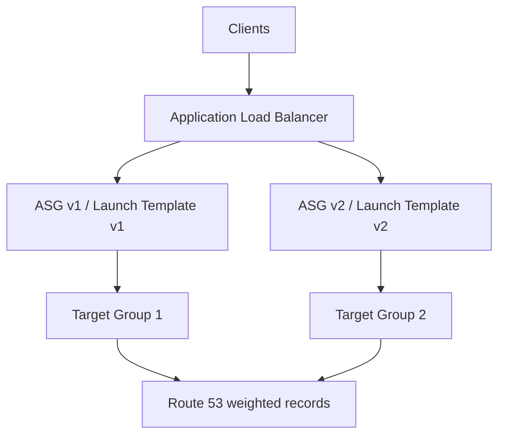

# 47. Auto Scaling Update Strategies

## 🎯 Giới thiệu
Bài giảng này nói về cách cập nhật application trong `Auto Scaling group` và cách lựa chọn kiến trúc phù hợp theo mức độ phức tạp, khả năng kiểm thử và cách shift traffic. Điểm chính là: cùng một yêu cầu update có thể có nhiều phương án đúng, nhưng phương án tốt nhất phụ thuộc vào mục tiêu kiến trúc.

## 1. Giữ nguyên Auto Scaling group, đổi `launch template`
- Giữ nguyên `Auto Scaling group`.
- Tạo `launch template` mới.
- `ASG` sẽ launch thêm `EC2 instances` mới theo template mới.
- Có thể cần tăng gấp đôi capacity tạm thời để chạy song song 2 phiên bản.
- Vì vẫn thuộc cùng một `Auto Scaling group`, các instance cũ và mới cùng nằm trong cùng `target group`.
- `Application Load Balancer (ALB)` sẽ phân phối request đến cả 2 phiên bản cùng lúc.
- Khi xác nhận version mới hoạt động tốt, có thể terminate instance của version cũ.

**Ý nghĩa kiến trúc**
- Đơn giản, dễ triển khai.
- Traffic bị chia cho tất cả phiên bản trong cùng `target group`.
- Phù hợp khi chấp nhận chạy song song trong cùng một `ASG`.

## 2. Tạo `Auto Scaling group` mới và `target group` mới
- Giữ `ALB` hiện tại.
- Tạo `Auto Scaling group` thứ hai.
- Tạo thêm `target group` thứ hai.
- `ALB` có thể split traffic giữa 2 `target group`.
- Có thể gửi một phần nhỏ traffic sang `ASG` mới để test trước.
- Nếu ổn, tăng dần traffic sang `target group` mới.
- Sau đó retire `target group` cũ.

**Ý nghĩa kiến trúc**
- Vẫn chỉ có một `ALB` để client truy cập.
- `ALB` là thành phần thực hiện traffic shifting.
- Có thể test và migrate dần mà không đổi endpoint phía client.

## 3. Tạo hẳn `ALB` mới và `ASG` mới, dùng `Route 53`
- Tạo một `ALB` mới riêng biệt.
- Tạo một `Auto Scaling group` mới riêng biệt.
- Dùng `Route 53` để điều hướng client sang `ALB` mới.
- Tạo `CNAME` và dùng `weighted records`.
- Khi client query DNS, kết quả trả về sẽ phân bổ theo weight giữa 2 `ALB`.
- Một phần client sẽ đi đến `ALB 1`, phần khác đi đến `ALB 2`.
- Có thể cho traffic rất nhỏ sang `ALB 2` trước, rồi tăng dần.

**Rủi ro và điểm cần lưu ý**
- Phụ thuộc vào client behavior.
- Client phải thực hiện DNS query và tôn trọng `TTL`.
- Nếu client không cập nhật đúng, có thể vẫn tiếp tục gọi `ALB 1` dù đã được chuyển sang `ALB 2`.
- Kiến trúc này cho phép test `ALB 2` độc lập trước khi đưa vào phục vụ chính thức.
- Có thể dùng test clients và load testing trước khi chuyển traffic thật.

## 2. So sánh nhanh
| Tiêu chí | Mô tả |
|----------|------|
| Cách 1 | Giữ nguyên `ASG`, đổi `launch template`, traffic chung trong một `target group` |
| Cách 2 | Tạo `ASG` mới và `target group` mới, `ALB` split traffic giữa 2 nhóm |
| Cách 3 | Tạo `ALB` mới + `ASG` mới, dùng `Route 53 weighted records` để phân phối traffic |
| Độ phức tạp | Cách 1 thấp nhất, cách 3 cao nhất |
| Kiểm thử độc lập | Cách 2 và 3 tốt hơn cách 1 |
| Phụ thuộc client | Cách 3 phụ thuộc nhiều nhất vào DNS behavior và `TTL` |
| Traffic shift | Cách 2 và 3 hỗ trợ shift dần dần rõ ràng |

## 📊 Bảng tóm tắt
| Tiêu chí | Mô tả |
|----------|------|
| Mục tiêu | Cập nhật application trong `Auto Scaling group` theo nhiều chiến lược khác nhau |
| Thành phần chính | `ALB`, `ASG`, `launch template`, `target group`, `Route 53` |
| Cách 1 | Giữ `ASG`, tạo `launch template` mới, chạy song song trong cùng `target group` |
| Cách 2 | Tạo `ASG` mới và `target group` mới, shift traffic ở tầng `ALB` |
| Cách 3 | Tạo `ALB` mới và `ASG` mới, dùng `Route 53 weighted records` |
| Điểm cần nhớ | Không phải lúc nào cũng chỉ có 1 đáp án đúng; phải chọn phương án phù hợp nhất với yêu cầu |
| Rủi ro lớn nhất | Cách 3 phụ thuộc vào client behavior và việc tôn trọng `TTL` |

## 💡 Mẹo ghi nhớ cho kỳ thi AWS
- Nhớ theo thứ tự tăng dần về độ phức tạp:
  - `1 ALB + 1 ASG + 2 launch templates`
  - `1 ALB + 2 ASG + 2 target groups`
  - `2 ALB + 2 ASG + Route 53 weighted records`
- Khi cần test dần và giữ nguyên endpoint cho client, nghĩ đến `ALB` với nhiều `target group`.
- Khi cần tách kiến trúc hoàn toàn, nghĩ đến `Route 53` và `weighted records`.
- Nếu đề bài nhấn mạnh kiểm thử độc lập trước khi go-live, kiến trúc tách `ALB` riêng là lựa chọn nổi bật.
- Trong exam, thường có nhiều đáp án đúng; hãy chọn đáp án phù hợp nhất với mục tiêu, mức độ phức tạp và cách rollout.

## ✅ Kết luận
Có 3 chiến lược chính để update ứng dụng trong `Auto Scaling group`:
- Giữ `ASG` và đổi `launch template`.
- Tạo `ASG` mới và `target group` mới để shift traffic qua `ALB`.
- Tạo hẳn `ALB` mới và dùng `Route 53 weighted records` để chuyển dần traffic.

Điểm quan trọng nhất của bài là tư duy kiến trúc: không chỉ hỏi “có làm được không”, mà còn phải chọn cách phù hợp nhất với yêu cầu triển khai, kiểm thử và kiểm soát traffic.
