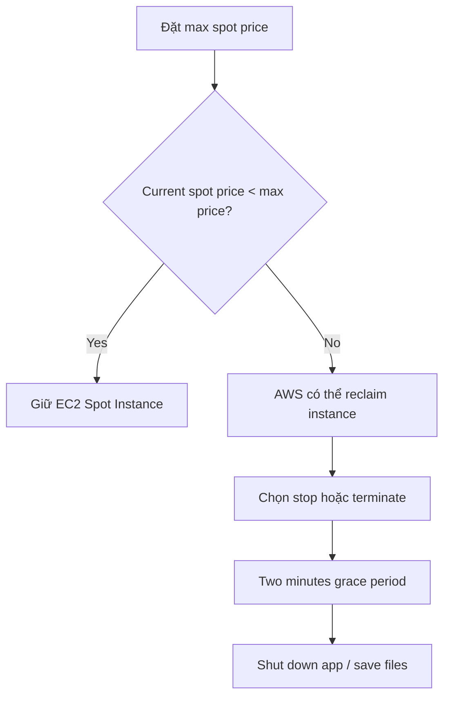
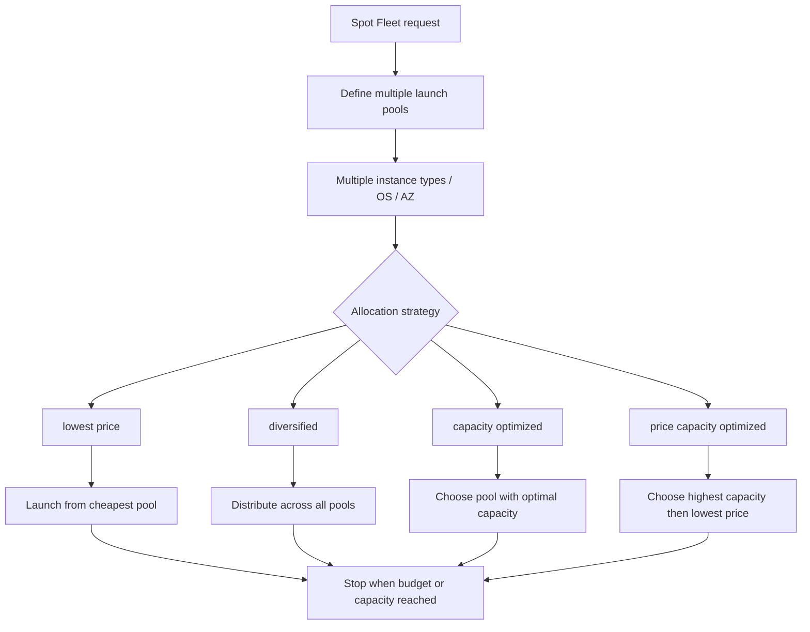

# 48. Spot Instances & Spot Fleet

## 🎯 Giới thiệu
- `EC2 Spot Instances` cho phép giảm chi phí **tới 90%** so với `On-Demand`.
- Cốt lõi của cơ chế này là:
  - Bạn đặt `max spot price`.
  - AWS xác định `spot price` dựa trên `offer and demand`.
  - Nếu `spot price` thấp hơn `max price` thì bạn giữ được instance.
  - Nếu `spot price` vượt `max price` thì instance có thể bị `stop` hoặc `terminate`.
- `Spot Fleet` là cách mở rộng để xin **nhiều Spot Instances** và có thể kèm `On-Demand Instances`, với mục tiêu đạt `target capacity` và tối ưu chi phí.

## 1. `Spot Instances` hoạt động như thế nào
- Bạn đặt một mức giá tối đa có thể chấp nhận.
- `spot price` thay đổi theo:
  - `offer and demand`
  - `capacity`
- Khi `spot price` tăng cao hơn mức bạn đặt:
  - instance có thể bị thu hồi rất nhanh bởi AWS
  - bạn có **2 minutes grace period**
- Trong 2 phút này, bạn có thể:
  - đóng ứng dụng
  - lưu file
  - thực hiện các bước dọn dẹp cần thiết

### Khi nào nên dùng
- `Batch jobs`
- `Data analysis`
- Workload có khả năng chịu lỗi, chấp nhận bị gián đoạn

### Khi nào không nên dùng
- `Critical jobs`
- `Databases`
- Các workload không chịu được việc bị reclaim nhanh

## 2. Đặc điểm giá của Spot Instance
- `Spot price` có thể khác nhau theo:
  - `AZ`
  - thời gian
- Giá thường thấp hơn nhiều so với `On-Demand`.
- Nếu bạn đặt `max price` rất cao, bạn có thể **không bao giờ mất** `Spot Instance` theo biểu đồ giá.
- Nếu đặt `max price` thấp, sẽ có lúc giá vượt ngưỡng và instance bị mất.

## 3. `Spot Fleet` và các chiến lược phân bổ
- `Spot Fleet` là cách để:
  - yêu cầu một tập hợp `Spot Instances`
  - tùy chọn thêm `On-Demand Instances`
- Bạn có thể định nghĩa nhiều `launch pools`, gồm:
  - nhiều `instance types`
  - nhiều `OS`
  - nhiều `Availability Zones`
- `Spot Fleet` sẽ cố gắng đạt `target capacity` trong giới hạn giá bạn đặt.
- Khi đạt:
  - `budget`
  - hoặc `capacity`
  - thì nó dừng launch thêm instance

### Các chiến lược allocation trong `Spot Fleet`
- `lowest price`
  - chọn pool có giá thấp nhất
  - rất phổ biến trong exam
  - tốt cho workload ngắn
- `diversified`
  - phân bổ trên nhiều pools
  - tốt cho `availability` và workload dài
  - nếu một pool mất đi, các pool khác vẫn còn
- `capacity optimized`
  - ưu tiên pool có capacity tối ưu cho số lượng instance cần
- `price capacity optimized`
  - chọn pool có capacity cao nhất trước
  - sau đó chọn pool có giá thấp nhất trong nhóm đó
  - được mô tả là lựa chọn tốt nhất cho đa số workload

## 📊 Bảng tóm tắt
| Tiêu chí | Mô tả |
|----------|------|
| `Spot Instances` | EC2 instance giá rẻ, có thể giảm tới 90% so với `On-Demand` |
| Cách hoạt động | Đặt `max spot price`; giữ instance khi `spot price` thấp hơn ngưỡng |
| Rủi ro | AWS có thể reclaim instance rất nhanh khi giá vượt ngưỡng |
| Grace period | Có `2 minutes grace period` để xử lý trước khi bị stop/terminate |
| Phù hợp | `Batch jobs`, `data analysis`, workload chịu lỗi |
| Không phù hợp | `Critical jobs`, `databases` |
| `Spot Fleet` | Tập hợp nhiều `Spot Instances`, có thể kèm `On-Demand Instances` |
| Mục tiêu | Đạt `target capacity` với ràng buộc giá |
| Launch pools | Có thể gồm nhiều `instance types`, `OS`, `AZ` |
| Strategy nổi bật | `lowest price`, `diversified`, `capacity optimized`, `price capacity optimized` |

## 💡 Mẹo ghi nhớ cho kỳ thi AWS
- `Spot Instance` = **rẻ nhưng có thể bị lấy lại**.
- Nhớ mốc quan trọng: **2 minutes grace period**.
- `lowest price` = chiến lược đơn giản, rất hay gặp trong exam.
- `diversified` = chia đều nhiều pool để tăng `availability`.
- `price capacity optimized` = chọn theo **capacity trước, giá sau**, và được nhấn mạnh là lựa chọn tốt cho nhiều workload.
- Phân biệt rõ:
  - `Spot Instance` = yêu cầu đơn lẻ, biết rõ loại instance và AZ
  - `Spot Fleet` = yêu cầu theo cụm, cho AWS tự chọn nhiều pool để tối ưu chi phí

## ✅ Kết luận
- `EC2 Spot Instances` là lựa chọn tiết kiệm chi phí mạnh, nhưng đổi lại là tính không ổn định.
- `Spot Fleet` nâng cấp cách dùng Spot bằng việc quản lý nhiều pool và nhiều chiến lược phân bổ.
- Điểm cần nhớ nhất khi ôn thi:
  - `max spot price`
  - `2 minutes grace period`
  - các chiến lược của `Spot Fleet`
  - chọn đúng loại workload để tránh mất dữ liệu hoặc gián đoạn không mong muốn
