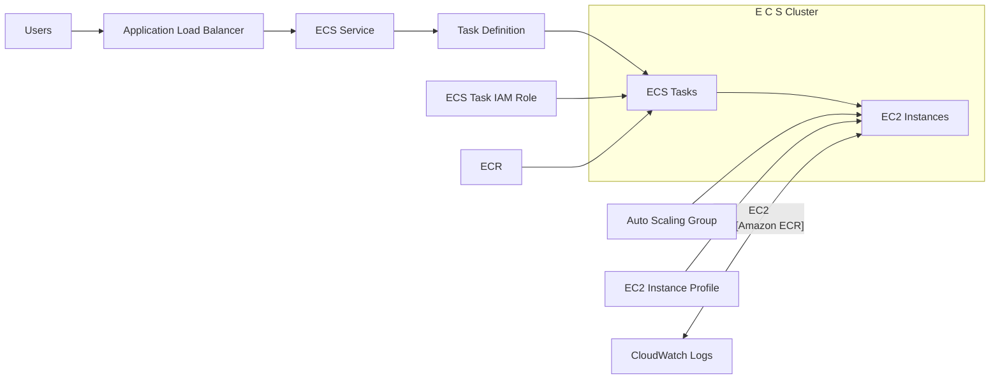

# 49. Amazon ECS - Elastic Container Service

## 🎯 Giới thiệu
- **Amazon ECS (Elastic Container Service)** là dịch vụ container của AWS để chạy và quản lý **Docker containers**.
- Docker giúp ứng dụng chạy nhất quán trên nhiều hệ điều hành, giảm vấn đề tương thích và dễ bảo trì hơn.
- ECS phù hợp cho:
  - **Microservices**
  - Chạy nhiều Docker container trên cùng một máy
  - **Service discovery** giữa các microservices
  - Tích hợp với **Application Load Balancer (ALB)** và **Network Load Balancer (NLB)**
  - **Auto Scaling**
  - **Batch processing** và **scheduled tasks**
  - Migrate ứng dụng từ on-premises sang AWS bằng cách Dockerize trước rồi chuyển sang ECS

## 1. Các khái niệm cốt lõi của ECS
- **ECS Cluster**: nhóm logic của các **EC2 instances**
- **ECS Service**: định nghĩa số lượng **tasks** cần chạy và cách chúng chạy
- **Task Definition**: bản mô tả JSON của task, gồm các thông số như:
  - image name
  - CPU
  - RAM
  - cách ECS chạy Docker container
- **ECS Task**: một instance của task definition đang chạy trong service
- **IAM Roles trong ECS**:
  - **EC2 instance profile**: dùng cho EC2 instance trong cluster để gọi API tới ECS service, gửi logs, v.v.
  - **ECS task IAM role**: gán riêng cho từng task để task có quyền gọi API tới **S3**, **DynamoDB**, và các dịch vụ khác

### 🧭 Flow kiến trúc ECS

## 2. ECS trên EC2 và Fargate
### ECS trên EC2
- Cần provision **EC2 instances** trước để chạy ECS tasks
- Có thể scale số lượng EC2 instances
- Có thể dùng **Auto Scaling Group (ASG)** để quản lý EC2 instances
- Mỗi EC2 instance cần **instance profile** để:
  - đăng ký vào ECS cluster/service
  - gửi logs tới **CloudWatch Logs**

### Tích hợp với ALB
- ECS có **dynamic port mapping**
- Cho phép chạy nhiều instance của cùng một application/Docker container trên cùng một EC2 instance
- Mỗi task có thể dùng port khác nhau, nhưng **ALB** vẫn tìm và map đúng port
- Lợi ích:
  - tăng **resiliency**
  - tối ưu CPU/core trên EC2
  - hỗ trợ **rolling upgrades** bằng cách thay từng task một

### ECS trên Fargate
- **Fargate** là serverless container platform của AWS, dùng được với cả ECS và EKS
- Không cần quản lý EC2 instances
- Chỉ cần tạo **task definition** và chỉ định CPU/RAM cho mỗi task
- ECS tasks sẽ được tạo tự động
- Khi cần scale, chỉ cần tăng số lượng tasks

## 3. Networking, Auto Scaling, Spot và ECR
### Networking cho ECS tasks
- ECS hỗ trợ các mode:
  - **none**: không có network connectivity
  - **bridge**: dùng Docker virtual container-based network
  - **host**: bỏ qua Docker network, dùng host network interface
  - **AWSVPC**:
    - mỗi task có **elastic network interface**
    - mỗi task có **private IP**
    - networking đơn giản hơn
    - bảo mật tốt hơn
    - hỗ trợ **security groups**
    - hỗ trợ quan sát bằng **VPC Flow Logs**
    - là default mode cho **Fargate tasks**

### Service Auto Scaling
- ECS Service có thể tự động tăng/giảm số lượng tasks
- Backend dùng **AWS Application Auto Scaling**
- Có thể scale dựa trên:
  - **target tracking**
  - **step scaling**
  - **schedule scaling**
- **CPU** và **RAM** được theo dõi như metrics trong **CloudWatch** ở mức ECS service
- Nếu ECS service chạy trên **EC2**, cần scale cả EC2 instances để tăng capacity cho cluster
- Với **Fargate**, auto scaling dễ hơn vì không phải quản lý hạ tầng bên dưới

### Spot instances
- **ECS on EC2** có thể dùng EC2 **Spot Instances** trong ASG
- Khi Spot instances bị thu hồi, tasks có thể vào **draining mode** để chuyển sang instance khác
- Tiết kiệm chi phí nhưng giảm độ tin cậy
- Với **Fargate**, có thể dùng:
  - số lượng **on-demand tasks**
  - **Fargate Spot** để tiết kiệm chi phí
- Dù là on-demand hay spot, Fargate vẫn scale dễ theo load

### Amazon ECR
- **Amazon ECR (Elastic Container Registry)** dùng để lưu và quản lý Docker images
- Có:
  - **private registry/repository**
  - **public repository**
- ECS cluster có thể pull image từ ECR lên EC2 instances nhờ **IAM role** của EC2 instance
- ECS và ECR tích hợp chặt chẽ, quyền truy cập do **IAM** kiểm soát
- Nếu gặp lỗi permission, khả năng cao là vấn đề **IAM policy**
- ECR hỗ trợ:
  - **image vulnerability scanning**
  - **versioning**
  - **image tags**
  - **image lifecycle**

## 📊 Bảng tóm tắt
| Tiêu chí | Mô tả |
|----------|------|
| Mục đích | Chạy và quản lý Docker containers trên AWS |
| Thành phần chính | Cluster, Service, Task Definition, Task |
| Chạy trên EC2 | Cần provision EC2 instances trước |
| Chạy trên Fargate | Serverless, không cần quản lý EC2 |
| Networking | none, bridge, host, AWSVPC |
| Load Balancing | Tích hợp với ALB/NLB, có dynamic port mapping |
| Auto Scaling | Dùng AWS Application Auto Scaling, scale theo CloudWatch metrics |
| Bảo mật IAM | EC2 instance profile và ECS task IAM role |
| Image storage | Amazon ECR với private/public repo |
| Chi phí | Có thể dùng Spot Instances hoặc Fargate Spot |

## 💡 Mẹo ghi nhớ cho kỳ thi AWS
- **ECS = Docker container service của AWS**
- Nhớ 4 khái niệm quan trọng: **Cluster - Service - Task Definition - Task**
- **EC2 instance profile** dùng cho máy EC2 trong cluster, còn **task IAM role** dùng cho từng task
- **AWSVPC** là mode networking quan trọng nhất cần nhớ, đặc biệt cho **Fargate**
- **Dynamic port mapping** là điểm mạnh khi ECS kết hợp với **ALB**
- Nếu service chạy trên **EC2**, đừng quên phải scale cả **EC2 instances**, không chỉ scale tasks
- **ECR** là nơi lưu Docker images, còn quyền pull image phụ thuộc vào **IAM**
- **Fargate** là lựa chọn serverless, đơn giản hơn vì không quản lý hạ tầng

## ✅ Kết luận
- ECS là nền tảng container của AWS để chạy Docker containers hiệu quả và linh hoạt.
- Điểm cần nắm chắc cho kỳ thi là: **các thành phần ECS**, **IAM roles**, **ALB + dynamic port mapping**, **Fargate**, **networking modes**, **Auto Scaling**, **Spot**, và **ECR**.
- Hiểu đúng luồng **task definition -> task -> container -> scaling -> image pull** sẽ giúp ôn thi ECS rất hiệu quả.
