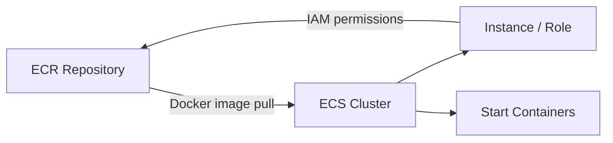
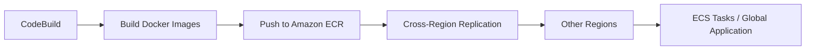
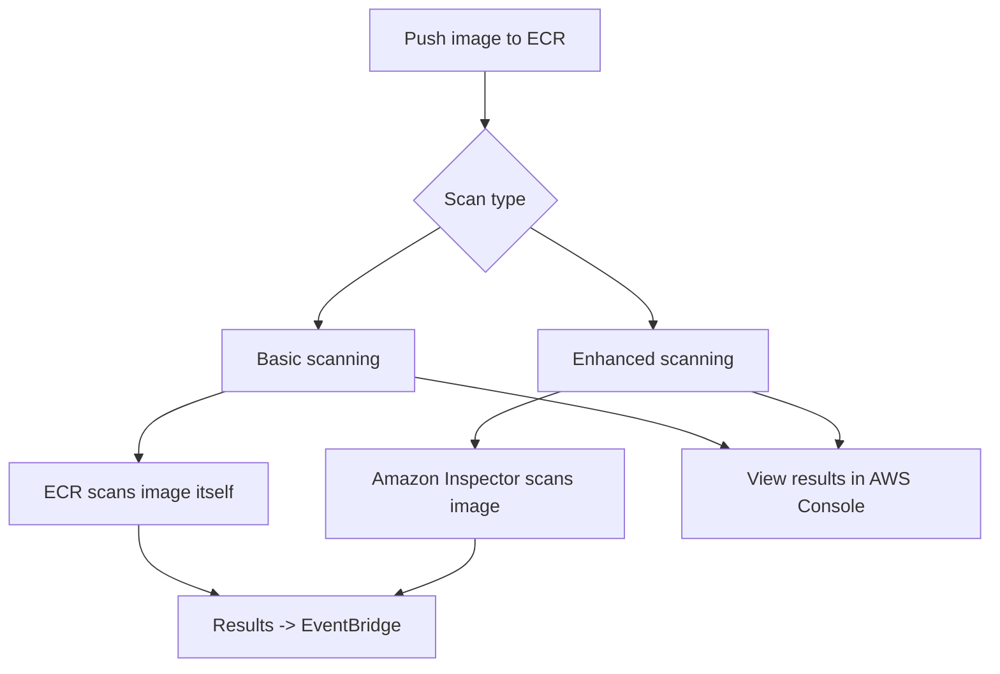

# 50. Amazon ECR - Elastic Container Registry

## 🎯 Giới thiệu
Amazon ECR (Elastic Container Registry) là dịch vụ dùng để **store** và **manage Docker images** trên AWS.

- Có 2 loại repository:
  - **Private repositories**
  - **Public repositories**
- Public images có thể được tìm thấy tại **gallery.ecr.aws**
- ECR tích hợp chặt với **ECS** để **pull Docker images** và start containers
- Quyền truy cập ECR được kiểm soát bằng **IAM**
- Nếu gặp lỗi permission, cần kiểm tra **policies**

## 1. Tích hợp với ECS và IAM 🔐
- ECS cluster có thể dùng ECR để lấy Docker images
- **Instance role** phải cho phép pull images từ ECR repository
- ECR và ECS làm việc cùng nhau để triển khai container nhanh chóng
- Access đến ECR được quản lý qua **IAM**, nên lỗi truy cập thường liên quan đến policy

## 2. Cross-Region / Cross-Account Replication 🌍
- ECR hỗ trợ:
  - **cross-Region replication**
  - **cross-account replication**
- Ví dụ flow:
  - **CodeBuild** build Docker images
  - CodeBuild **register** và **push** images vào **Amazon ECR**
  - ECR replicate images sang các Region khác nếu đã cấu hình replication
- Lợi ích:
  - Không cần build lại images ở từng Region
  - Có thể launch ECS tasks ở nhiều Region
  - Hỗ trợ xây dựng **global application**

## 3. Image Scanning và Lifecycle 🔍
- ECR có các tính năng:
  - **vulnerability scanning**
  - **versioning**
  - **image tags**
  - **image lifecycle**
- Có 2 kiểu scan:
  - **Manual scan**
  - **Automatic scan with scan on push**
- Khi push image vào ECR, image có thể được scan ngay
- Có 2 loại scanning quan trọng:
  - **Basic scanning**
    - ECR tự scan
    - Tìm các **common vulnerabilities**
    - Kết quả scan có thể được gửi thành event vào **EventBridge**
  - **Enhanced scanning**
    - Dùng **Amazon Inspector**
    - Scan sâu hơn, bao gồm:
      - **operating system vulnerabilities**
      - **programming language vulnerabilities**
    - Kết quả scan cũng có thể đẩy vào **EventBridge**
- Scan results có thể xem trực tiếp trong **AWS console**

## 📊 Bảng tóm tắt
| Tiêu chí | Mô tả |
|----------|------|
| Mục đích | Store và manage Docker images trên AWS |
| Loại repository | Private và Public |
| Public images | Có tại `gallery.ecr.aws` |
| Tích hợp | Làm việc chặt với ECS để pull images |
| Kiểm soát truy cập | Dùng IAM |
| Replication | Hỗ trợ cross-Region và cross-account replication |
| Build flow | CodeBuild build image rồi push vào ECR |
| Scanning | Basic scanning và enhanced scanning |
| Event output | Kết quả scan có thể gửi vào EventBridge |
| Console | Có thể xem scan results trực tiếp trong AWS console |

## 💡 Mẹo ghi nhớ cho kỳ thi AWS
- **ECR = Docker image registry trên AWS**
- Nhớ 3 ý trọng tâm:
  - **ECS pull image từ ECR**
  - **Access control bằng IAM**
  - **Replication + Scanning** là các feature hay được hỏi
- **Basic scanning** do ECR thực hiện
- **Enhanced scanning** dùng **Amazon Inspector**
- **scan on push** nghĩa là image được scan ngay khi push vào repository
- Nếu đề bài nói về **global application** và không muốn rebuild image ở từng Region, hãy nghĩ đến **cross-Region replication**

## ✅ Kết luận
Amazon ECR là nơi lưu trữ và quản lý Docker images trên AWS, tích hợp tốt với ECS, kiểm soát bằng IAM, hỗ trợ replication đa Region/đa account, và có các cơ chế scanning để phát hiện vulnerabilities.
