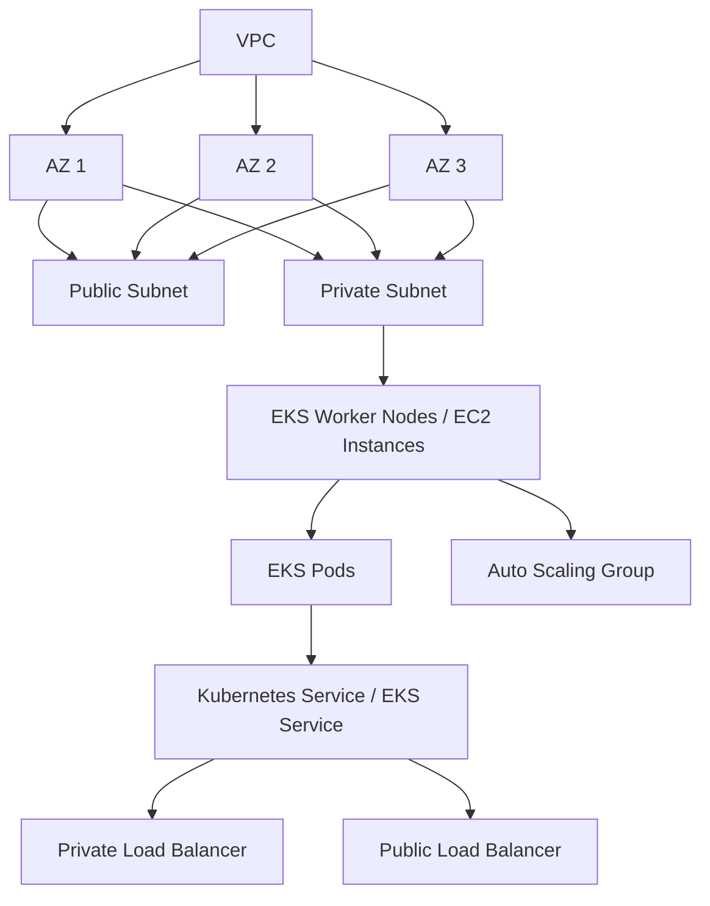

# 51. Amazon EKS - Elastic Kubernetes Service

## 🎯 Giới thiệu
Amazon EKS là dịch vụ để **launch và manage Kubernetes cluster trên AWS**.

- **EKS** = **Amazon Elastic Kubernetes Service**
- **Kubernetes** là hệ thống **open-source** dùng cho:
  - automatic deployments
  - scaling
  - management của containerized applications, thường là Docker
- EKS là **alternative to ECS**, nhưng:
  - cùng mục tiêu chạy container
  - **API khác nhau**
  - Kubernetes có lợi thế **standardization** vì được dùng ở nhiều cloud provider
- Về mặt exam, Kubernetes là **cloud agnostic**, có thể dùng trên nhiều cloud như Azure, Google Cloud, v.v.

## 1. Khi nào nên dùng EKS
Dùng Amazon EKS khi công ty đã:

- dùng **Kubernetes on-premises**
- dùng **Kubernetes ở cloud khác**
- muốn tiếp tục dùng **Kubernetes API**
- muốn AWS quản lý Kubernetes cluster

👉 Với tình huống migrate giữa các cloud, EKS có thể là lựa chọn đơn giản hơn cho containers.

## 2. Kiến trúc & cách triển khai
Trong mô hình EKS:

- Có **VPC** với **3 AZ**
- Có **public subnets** và **private subnets**
- Tạo **EKS Worker Nodes** như **EC2 instances**
- Mỗi node chạy các **EKS Pods**
- Pods tương tự **ECS tasks**, nhưng thuật ngữ **pods** gắn với Kubernetes
- Các nodes có thể được quản lý bởi **Auto Scaling group**
- Muốn expose service ra ngoài thì có thể dùng:
  - **private load balancer**
  - **public load balancer**

## 3. Các loại node và Storage
### 🖥️ Node types
Amazon EKS có 3 cách chạy node:

| Loại | Mô tả |
|------|------|
| **Managed Node Groups** | AWS tạo và quản lý nodes (EC2 instances) cho bạn, các nodes nằm trong **Auto Scaling group** do EKS service quản lý |
| **Self-managed Nodes** | Bạn tự tạo nodes, register vào EKS cluster, và tự quản lý nodes trong ASG |
| **Fargate** | Không cần quản lý node, chạy containers trực tiếp trên EKS, không phải lo maintenance |

### 🔧 Chi tiết quan trọng
- **Managed Node Groups** hỗ trợ:
  - **On-Demand**
  - **Spot Instances**
- **Self-managed nodes** cũng hỗ trợ:
  - **On-Demand**
  - **Spot Instances**
- Khi self-manage:
  - có thể dùng **Amazon EKS Optimized AMI**
  - hoặc tự build AMI riêng, nhưng phức tạp hơn
- **Fargate mode**:
  - không có node để quản lý
  - không cần maintenance

### 💾 Storage
Có thể attach data volumes cho EKS cluster bằng cách:

- khai báo **StorageClass manifest**
- sử dụng **Container Storage Interface (CSI) compliant driver**

Các storage class được nhắc tới:

- **Amazon EBS**
- **Amazon EFS**
  - là **only type of storage class** work with **Fargate**
- **Amazon FSx for Lustre**
- **Amazon FSx for NetApp ONTAP**

## 📊 Bảng tóm tắt
| Tiêu chí | Mô tả |
|----------|------|
| Dịch vụ | Amazon EKS = dịch vụ quản lý Kubernetes trên AWS |
| Mục tiêu | Run và manage containerized applications bằng Kubernetes |
| So với ECS | Cùng mục tiêu chạy container nhưng API khác; Kubernetes là open-source |
| Launch modes | **EC2 mode** và **Fargate mode** |
| Node options | Managed Node Groups, Self-managed Nodes, Fargate |
| Networking | VPC, 3 AZ, public/private subnets, load balancer |
| Storage | StorageClass + CSI driver |
| Storage hỗ trợ | EBS, EFS, FSx for Lustre, FSx for NetApp ONTAP |
| Điểm thi quan trọng | Kubernetes là cloud agnostic, phù hợp khi migrate giữa các cloud |

## 💡 Mẹo ghi nhớ cho kỳ thi AWS
- **EKS = Kubernetes trên AWS**
- Nếu đề bài nói đến **Kubernetes**, **pods**, **cloud agnostic**, hoặc cần migrate Kubernetes từ nơi khác sang AWS, nghĩ ngay đến **EKS**
- Nếu muốn:
  - AWS quản lý node -> **Managed Node Groups**
  - tự kiểm soát nhiều hơn -> **Self-managed Nodes**
  - không muốn quản lý node -> **Fargate**
- Nhớ keyword:
  - **pods** = Kubernetes
  - **StorageClass** + **CSI driver** = attach storage cho EKS
  - **EFS** là storage class duy nhất được nhắc là chạy với **Fargate**

## ✅ Kết luận
Amazon EKS là lựa chọn của AWS cho các workload dùng **Kubernetes**. Dịch vụ này phù hợp khi cần tính chuẩn hóa, cloud agnostic, hoặc khi đã có Kubernetes ở môi trường khác và muốn đưa lên AWS. Điểm cần nhớ nhất là **3 mode triển khai**: **Managed Node Groups**, **Self-managed Nodes**, và **Fargate**, cùng với các tùy chọn storage như **EBS**, **EFS**, và **FSx**.
