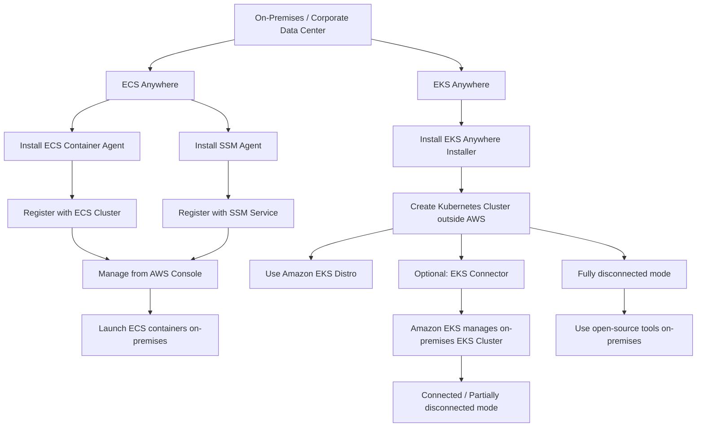

# 52. ECS Anywhere & EKS Anywhere

## 🎯 Giới thiệu
- Bài này nói về cách kết hợp **AWS container services** với **on-premises deployments**.
- Có 2 dịch vụ chính:
  - **Amazon ECS Anywhere**: chạy **ECS task** trên hạ tầng do customer quản lý.
  - **Amazon EKS Anywhere**: tạo và vận hành **Kubernetes Cluster** bên ngoài AWS.
- Điểm cần nhớ: tên gần giống nhau nhưng **concept và cách vận hành khác nhau**.

## 1. Amazon ECS Anywhere
- Cho phép chạy containers trên **customer-managed infrastructure** như:
  - **on-premises servers**
  - **VMs**
- Mục tiêu là deploy **any Amazon ECS task in any environment**.
- Cách hoạt động:
  - Dùng **ECS Service** và **ECS Control Plane** để quản lý containers on-premises.
  - Cần cài:
    - **ECS Container Agent**
    - **SSM Agent**
  - Khi cấu hình **external launch type** cho services và tasks:
    - **ECS Agent** register với **ECS Cluster**
    - **SSM Agent** register với **SSM Service**
- Có thể launch containers từ **AWS console**.
- Yêu cầu quan trọng:
  - Phải có **internet connection** ổn định tới **designated AWS region**.
- Use cases được nêu trong transcript:
  - **compliance**
  - **regulatory requirements**
  - **latency requirements**
  - chạy app ngoài AWS Regions và gần các dịch vụ khác hơn
  - ví dụ: **on-premises machine learning**, **video processing**, **data processing**

## 2. Amazon EKS Anywhere
- Cho phép tạo và vận hành **Kubernetes Cluster** được tạo **outside of AWS**.
- Tức là bạn tạo **EKS Cluster** trên **on-premises data center**.
- Sử dụng:
  - **Amazon EKS Distro**
- Ý nghĩa của **EKS Distro** trong transcript:
  - là “Amazon’s flavor of Kubernetes”
  - là release của Amazon dùng để chạy **Amazon EKS Service**
  - có thêm tools đi kèm
- Lý do dùng **EKS Distro**:
  - giảm **support costs**
  - tránh phải duy trì **redundant third-party tools**
- Cách khởi tạo:
  - phải dùng **EKS Anywhere installer**
- Điểm khác biệt quan trọng:
  - **EKS Anywhere** có thể chạy **without any connection to AWS**
- Nếu muốn kết nối vào AWS thì là **optional**:
  - dùng **EKS Connector**
  - khi đó **Amazon EKS can manage your EKS Cluster on-premises**
- Transcript nêu 2 mode:
  - **fully connected** hoặc **partially disconnected**
  - có connection giữa on-premises data center và Amazon EKS, nên có thể dùng **EKS Console** để manage cluster on-premises
  - **fully disconnected mode**: không có connection tới AWS, chỉ cài **EKS Distro** và dùng **open-source tools** on-premises để manage clusters

## 3. Mô hình kết nối và flow triển khai

- **ECS Anywhere**
  - luôn có kết nối internet tới AWS region
  - AWS console được dùng để launch containers
- **EKS Anywhere**
  - có thể **không cần kết nối AWS**
  - nếu có kết nối, dùng **EKS Connector** để quản lý từ AWS
  - nếu không có kết nối, quản lý bằng **open-source tools** on-premises

## 📊 Bảng tóm tắt
| Tiêu chí | Mô tả |
|----------|------|
| ECS Anywhere | Chạy **ECS task** trên **customer-managed infrastructure** như on-premises servers và VMs |
| ECS Anywhere Agent | Cần cài **ECS Container Agent** và **SSM Agent** |
| ECS Anywhere Connection | Cần **stable internet connection** tới **designated AWS region** |
| ECS Anywhere Use Cases | **Compliance**, **regulatory**, **latency**, chạy app gần dịch vụ khác hơn |
| EKS Anywhere | Tạo và vận hành **Kubernetes Cluster** bên ngoài AWS |
| EKS Distro | Dùng **Amazon EKS Distro** để chạy cluster on-premises |
| EKS Anywhere Installer | Dùng để khởi tạo cluster on-premises |
| EKS Connector | Thành phần **optional** để kết nối cluster vào AWS |
| EKS Anywhere Modes | **Fully connected**, **partially disconnected**, hoặc **fully disconnected** |
| Fully Disconnected | Không có connection tới AWS, dùng **open-source tools** on-premises |

## 💡 Mẹo ghi nhớ cho kỳ thi AWS
- **ECS Anywhere = ECS tasks on-premises** và **cần internet connection** tới AWS.
- **EKS Anywhere = Kubernetes on-premises** và có thể **fully disconnected**.
- Nhớ cặp keyword:
  - **ECS Anywhere**: **ECS Container Agent + SSM Agent + external launch type**
  - **EKS Anywhere**: **EKS Anywhere installer + EKS Distro + optional EKS Connector**
- Nếu đề bài nhắc tới:
  - quản lý containers on-premises bằng AWS ECS -> nghĩ đến **ECS Anywhere**
  - chạy Kubernetes cluster ngoài AWS, có thể không cần kết nối AWS -> nghĩ đến **EKS Anywhere**

## ✅ Kết luận
- **ECS Anywhere** dùng để mở rộng **ECS** ra on-premises, nhưng vẫn dựa vào kết nối tới AWS.
- **EKS Anywhere** dùng để chạy **Kubernetes** ngoài AWS, có thể vận hành **connected** hoặc **fully disconnected**.
- Điểm thi quan trọng nhất là phân biệt:
  - **ECS = task/container management**
  - **EKS = Kubernetes cluster management**
