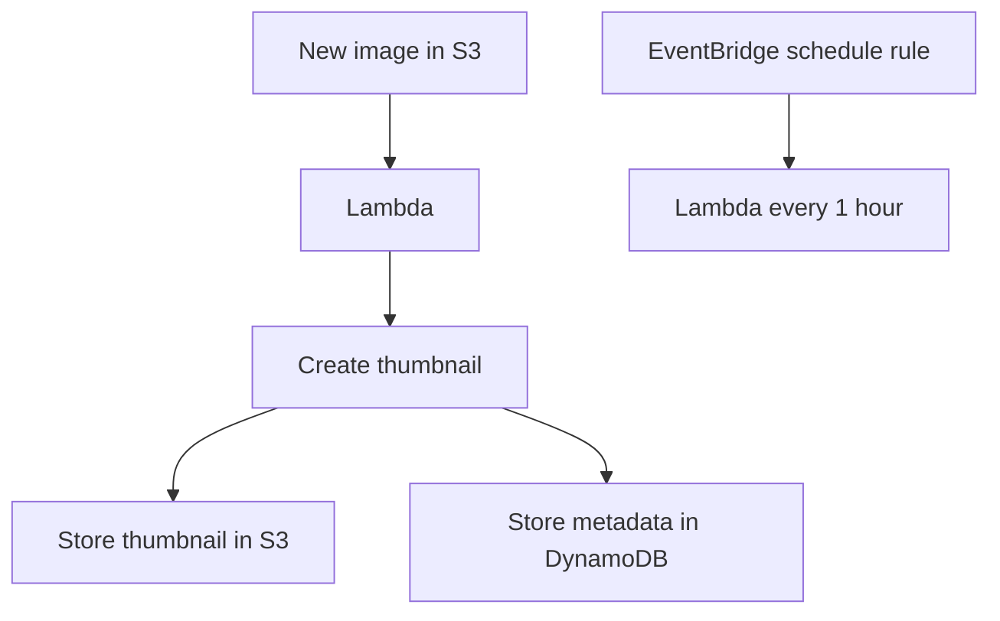
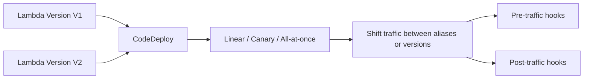

# 53. AWS Lambda - Part 1

## 🎯 Giới thiệu
AWS Lambda là dịch vụ **serverless** để chạy code theo sự kiện. Trong transcript, trọng tâm là:
- Các **integration** phổ biến của Lambda
- Các **giới hạn** quan trọng cần nhớ khi ôn thi
- Cách xử lý **concurrency**, **deployment**, và **monitoring**

## 1. 🔌 Integrations và use case phổ biến
Lambda thường được dùng để phản ứng với nhiều nguồn sự kiện khác nhau:

- **API Gateway**: invoke Lambda từ **REST API**
- **Kinesis**: đọc dữ liệu từ **Stream**
- **DynamoDB**: đọc từ **DynamoDB stream**
- **S3**: phản ứng khi có object mới được tạo
- **IoT**
- **EventBridge**: trigger theo rule hoặc theo thời gian
- **CloudWatch Logs**
- **SNS**: phản ứng với notification
- **Cognito**: dùng cho **pre-authentication** và **post-authentication hooks**
- **SQS**: đọc dữ liệu từ queue

### 🖼️ Ví dụ kiến trúc tiêu biểu
- **Serverless Thumbnail creation**
  - Có image mới trong **S3**
  - S3 trigger Lambda
  - Lambda tạo thumbnail
  - Thumbnail mới được đưa lại vào **S3**
  - Metadata có thể được ghi vào **DynamoDB**
- **Scheduled job**
  - Dùng **EventBridge**
  - Trigger Lambda mỗi 1 giờ
  - Tạo ra một kiểu **serverless cron job**

### Mermaid

## 2. ⚙️ Runtime, ngôn ngữ và giới hạn
Lambda hỗ trợ nhiều ngôn ngữ:

- **Node.js**
- **Python**
- **Java**
- **C# / .NET Core**
- **PowerShell**
- **Ruby**
- Một số ngôn ngữ khác thông qua **custom runtime API**
  - Ví dụ: **Rust**, **Golang**

### Container trên Lambda
- Lambda có thể chạy **container image**
- Khi dùng container, phải implement **Lambda Runtime API**
- Tuy nhiên, theo transcript, với **Docker image**, trong góc nhìn exam thì thường **ưu tiên ECS hoặc Fargate hơn Lambda**

### Các giới hạn cần nhớ
- **RAM tối đa**: 10 GB
- **CPU liên quan đến RAM**
  - Khoảng **2 vCPU** tại ~ **1800 MB**
  - Khoảng **6 vCPU** tại ~ **10 GB**
- **Timeout tối đa**: 15 phút
- **Temporary storage**: 10 GB
- **Deployment package**
  - **50 MB zipped**
  - **250 MB unzipped**, bao gồm layers
- **Concurrent executions**
  - Mặc định/soft limit: **1000**
- **Container image size**: 10 GB
- **Invocation payload**
  - **6 MB** khi synchronous
  - **256 KB** khi asynchronous

## 3. 🚦 Concurrency, deployment và monitoring
### Concurrency
- Lambda có thể chạy tới **1000 concurrent executions**
- Có thể đặt **reserved concurrency** ở cấp function
  - Vừa là **limit**
  - Vừa là **reserved capacity** cho function đó
- Nếu vượt giới hạn concurrency:
  - Request sẽ bị **throttle**
  - Có thể **retry**
  - Nếu cần, có thể xin **quota increase** trong **AWS Service Quotas**

### Vấn đề khi không reserve concurrency
Transcript nêu ví dụ:
- **ALB with Lambda**
- **API Gateway with Lambda**
- Người dùng gọi Lambda qua **SDK/CLI**

Nếu một nguồn như ALB tăng đột biến và chiếm hết concurrency:
- API Gateway có thể bị throttle
- SDK/CLI cũng có thể bị throttle

=> Giải pháp là **reserve concurrency** riêng cho từng nhóm quan trọng.

### Deployment với CodeDeploy
- Có thể deploy Lambda bằng **CodeDeploy**
- CodeDeploy hỗ trợ **traffic shifting** giữa:
  - 2 **Lambda aliases**
  - hoặc 2 **Lambda versions**
- Tích hợp trực tiếp với **SAM**

#### Các chiến lược traffic shifting
- **Linear**
  - Tăng traffic theo từng bước cố định sau mỗi N phút
  - Ví dụ: 10% mỗi 3 phút, hoặc 10% mỗi 10 phút
- **Canary**
  - Đẩy một phần nhỏ traffic trước
  - Ví dụ: 10% trong 5 phút
  - Nếu ổn định thì chuyển toàn bộ traffic
- **All-at-once**
  - Chuyển traffic ngay lập tức từ V1 sang V2

#### Hooks kiểm tra
- Có thể dùng:
  - **pre traffic hooks**
  - **post traffic hooks**
- Mục đích: kiểm tra health trước và sau khi shift traffic

### Monitoring
- **CloudWatch Logs**
  - Nhận execution logs
- **CloudWatch Metrics**
  - Theo dõi:
    - successful invocations
    - error rates
    - latency
    - timeouts
- Lambda cần **execution role** có quyền truy cập CloudWatch Logs

### X-Ray
- Có thể trace Lambda invocation bằng **X-Ray**
- Bật trong Lambda configuration
- Trong code, dùng cơ chế tracing qua **AWS SDK**
- Lambda function cần quyền phù hợp để dùng X-Ray

### Mermaid

## 📊 Bảng tóm tắt
| Tiêu chí | Mô tả |
|----------|------|
| Mục đích | Chạy code serverless theo event |
| Integrations | API Gateway, Kinesis, DynamoDB, S3, IoT, EventBridge, CloudWatch Logs, SNS, Cognito, SQS |
| Use case nổi bật | Thumbnail creation từ S3, scheduled job bằng EventBridge |
| Runtime | Node.js, Python, Java, C#, PowerShell, Ruby, custom runtime API |
| Container | Có hỗ trợ container image, nhưng exam thường ưu tiên ECS/Fargate cho Docker |
| Giới hạn thời gian | Timeout tối đa 15 phút |
| Giới hạn tài nguyên | RAM tối đa 10 GB, temp storage 10 GB |
| Package limit | 50 MB zipped, 250 MB unzipped gồm layers |
| Concurrency | Soft limit 1000 concurrent executions, có thể tăng |
| Payload | 6 MB synchronous, 256 KB asynchronous |
| Deployment | CodeDeploy với linear, canary, all-at-once |
| Monitoring | CloudWatch Logs, CloudWatch Metrics, X-Ray |

## 💡 Mẹo ghi nhớ cho kỳ thi AWS
- Nhớ **Lambda = event-driven serverless**
- Nhớ các integration quan trọng: **API Gateway, S3, EventBridge, DynamoDB, SQS, SNS**
- Nhớ giới hạn hay hỏi thi:
  - **15 minutes timeout**
  - **10 GB RAM**
  - **1000 concurrency**
  - **50 MB zipped / 250 MB unzipped**
  - **6 MB sync / 256 KB async**
- Nếu đề bài nói đến **Docker image** và hỏi dịch vụ phù hợp, transcript nhấn mạnh: **ECS/Fargate thường là lựa chọn ưu tiên hơn Lambda**
- Khi lo ngại bị throttle, nghĩ đến **reserved concurrency**
- Khi deploy version mới, nhớ **CodeDeploy + traffic shifting + hooks**
- Khi hỏi monitoring, nghĩ ngay tới **CloudWatch** và **X-Ray**

## ✅ Kết luận
Lambda trong transcript được trình bày như một dịch vụ serverless trung tâm cho nhiều kiểu event source. Để ôn thi hiệu quả, cần nắm:
- **Integrations**
- **Runtime và limits**
- **Concurrency control**
- **Deployment strategy**
- **Monitoring with CloudWatch và X-Ray**
