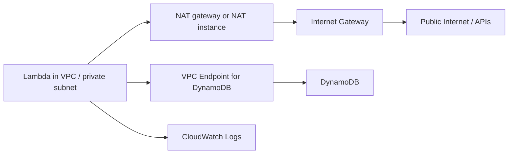
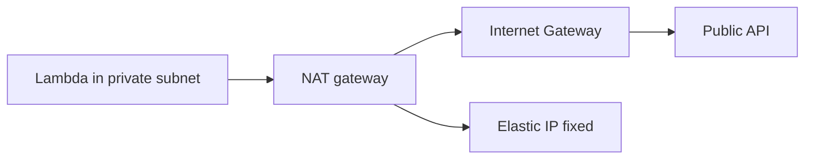
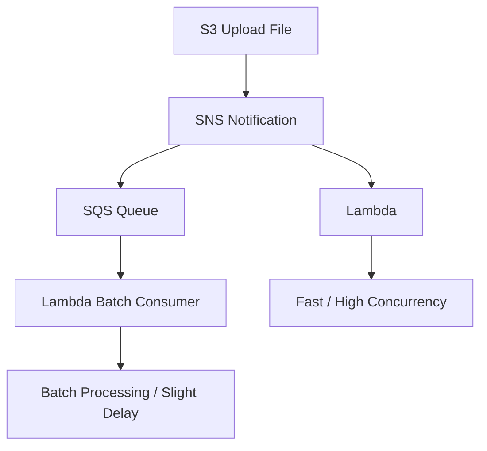

# 54. AWS Lambda - Part 2

## 🎯 Giới thiệu
- Bài này tập trung vào cách Lambda hoạt động khi:
  - Deploy trong `VPC`
  - Cần truy cập `public internet` hoặc `DynamoDB`
  - Xử lý `synchronous` và `asynchronous invocations`
  - So sánh 2 kiến trúc nhận event từ `S3` qua `SNS`, `SQS` tới `Lambda`

## 1. Lambda trong VPC 🌐
- Mặc định, Lambda được deploy trong cloud của AWS và có thể truy cập `public internet`.
- Khi Lambda cần truy cập tài nguyên private như `private RDS database` trong `private VPC / private subnet`, cần deploy Lambda trong `VPC`.
- Khi Lambda nằm trong `VPC`:
  - Lambda được gán `security group`
  - Có thể truy cập `private RDS`
- Nếu Lambda nằm trong `private subnet` và cần ra internet:
  - Dùng `NAT gateway` hoặc `NAT instance` trong `public subnet`
  - Traffic đi qua `internet gateway` để ra `public internet`
- Với `DynamoDB`:
  - Có thể đi qua `NAT gateway` rồi ra `internet gateway` để truy cập `DynamoDB`
  - Hoặc dùng `VPC endpoint for DynamoDB` để giữ traffic nội bộ
- Lưu ý quan trọng:
  - Deploy Lambda trong `public subnet` thì **không có internet access**
  - Muốn có internet access, phải dùng `private subnet` + `NAT device`
- `CloudWatch logs` của Lambda vẫn hoạt động ngay cả khi Lambda ở `private subnet` không có `NAT` hay `internet gateway`

## 2. Lambda và Fixed IP 🧭
- Nếu Lambda chạy **không có VPC setting**, nó nhận một `random public IP`.
- Khi Lambda gọi API trên internet, phía API sẽ thấy traffic đến từ `random public IP`.
- Nếu cần `fixed IP` để lọc network hoặc bảo mật chặt hơn:
  - Deploy Lambda trong `private subnet`
  - Lambda đi qua `NAT gateway`
  - `NAT gateway` gắn với `elastic IP`
- Kết quả:
  - Traffic từ Lambda ra internet sẽ được nhìn thấy từ `fixed elastic IP`
  - Có thể dùng IP này để áp dụng `network security` ở phía API

## 3. Synchronous vs Asynchronous Invocations 🔁
- `Synchronous invocation`:
  - Xảy ra khi Lambda được gọi từ `CLI`, `SDK`, hoặc `API Gateway`
  - Kết quả trả về ngay
  - Xử lý lỗi phải làm ở `client side`
  - Ví dụ: retry, exponential backoff
- `Asynchronous invocation`:
  - Xảy ra với `SNS`, `S3`, `Amazon EventBridge`
  - Lambda được invoke bất đồng bộ
  - Nếu lỗi, có thể retry tối đa `3 total`
  - Cần đảm bảo `idempotency` vì Lambda có thể chạy nhiều lần
- Với event từ `S3`:
  - Có thể dùng `dead-letter queue (DLQ)`
  - `DLQ` có thể là `SNS` hoặc `SQS` để xử lý event thất bại

## 4. Hai kiến trúc S3 - SNS - Lambda / S3 - SNS - SQS - Lambda 🏗️
- Hai kiến trúc nhìn giống nhau nhưng có trade-off khác nhau:

### Kiến trúc 1: `S3 -> SNS -> Lambda`
- Khi file được upload vào `S3`, `SNS` sẽ trigger `Lambda` ngay.
- Đặc điểm:
  - Bắt đầu rất nhanh
  - Có thể có `high concurrency`
  - Nhiều execution song song
- Nhược điểm:
  - Nếu một số xử lý không thành công, có thể mất dữ liệu nếu không dùng `DLQ`
- Phù hợp khi cần xử lý nhanh nhất có thể

### Kiến trúc 2: `S3 -> SNS -> SQS -> Lambda`
- `SQS` nhận message trước, sau đó `Lambda` consume từ queue.
- Đặc điểm:
  - Queue sẽ tích lũy message khi upload nhiều file
  - Lambda scale lên và xử lý theo `batch`
  - Mỗi Lambda có thể xử lý nhiều message, ví dụ `10 messages`
- Ưu điểm:
  - Hiệu quả hơn
  - Message thất bại vẫn được giữ trong `SQS`
- Nhược điểm:
  - Có độ trễ từ lúc upload file đến lúc Lambda xử lý xong

## 📊 Bảng tóm tắt
| Tiêu chí | Mô tả |
|----------|------|
| Lambda trong VPC | Có thể truy cập `private RDS` khi deploy trong `VPC` và được gán `security group` |
| Ra internet từ private subnet | Cần `NAT gateway` hoặc `NAT instance` |
| Truy cập DynamoDB | Có thể qua `NAT` hoặc dùng `VPC endpoint for DynamoDB` |
| Public subnet | Lambda trong `public subnet` không có internet access |
| Fixed IP | Dùng `NAT gateway` gắn `elastic IP` để Lambda ra internet với IP cố định |
| Synchronous invocation | Từ `CLI`, `SDK`, `API Gateway`; trả kết quả ngay |
| Asynchronous invocation | Từ `SNS`, `S3`, `EventBridge`; có retry và cần `idempotency` |
| DLQ | Dùng `SNS` hoặc `SQS` để giữ event lỗi |
| S3 -> SNS -> Lambda | Nhanh, concurrency cao, có nguy cơ mất dữ liệu nếu không xử lý lỗi tốt |
| S3 -> SNS -> SQS -> Lambda | Có batch processing, chậm hơn một chút nhưng giữ message tốt hơn |

## 💡 Mẹo ghi nhớ cho kỳ thi AWS
- `Private subnet + NAT` là combo quan trọng nếu Lambda cần ra internet.
- `Public subnet` không đồng nghĩa với internet access cho Lambda.
- `NAT gateway + Elastic IP` giúp Lambda có `fixed IP` khi gọi API bên ngoài.
- `CLI / SDK / API Gateway` thường là `synchronous invocation`.
- `S3 / SNS / EventBridge` là `asynchronous invocation`.
- Khi Lambda có thể bị chạy nhiều lần, nhớ từ khóa `idempotency`.
- Muốn nhanh nhất: `S3 -> SNS -> Lambda`
- Muốn ổn định và giữ message tốt hơn: `S3 -> SNS -> SQS -> Lambda`

## ✅ Kết luận
- Lambda trong `VPC` giúp truy cập tài nguyên private nhưng cần chú ý đường ra internet.
- `NAT gateway`, `Elastic IP`, và `VPC endpoint` là các điểm then chốt trong kiến trúc network của Lambda.
- Phân biệt rõ `synchronous` và `asynchronous invocations` để chọn cách xử lý lỗi phù hợp.
- Với luồng event từ `S3`, kiến trúc dùng `SQS` thường có độ trễ hơn nhưng kiểm soát message tốt hơn so với trigger trực tiếp vào `Lambda`.
