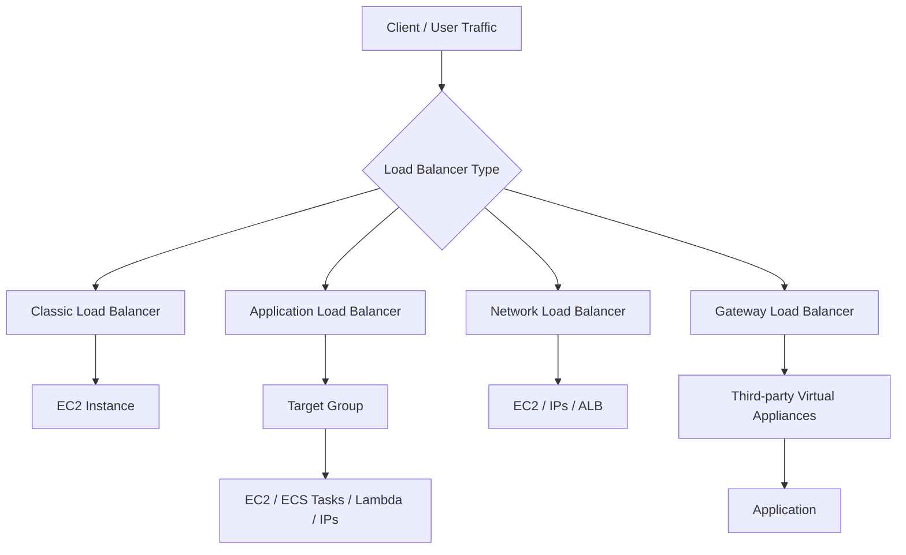

# 55. Elastic Load Balancers - Part 1

## 🎯 Giới thiệu
AWS có 4 loại managed load balancer chính:

- **Classic Load Balancer (CLB)**: thế hệ cũ
- **Application Load Balancer (ALB)**: thế hệ mới, **Layer 7**
- **Network Load Balancer (NLB)**: thế hệ mới, **Layer 4**
- **Gateway Load Balancer (GWLB)**: ra mắt năm 2020, hoạt động ở **Layer 3**

Điểm cần nhớ cho kỳ thi:
- AWS khuyến nghị dùng **load balancer thế hệ mới** thay vì CLB vì nhiều tính năng hơn và được hỗ trợ lâu dài hơn.
- Một số load balancer có thể cấu hình dạng **internal/private** hoặc **internet-facing/public**.

## 1. Classic Load Balancer (CLB) và ALB
### Classic Load Balancer
- Hỗ trợ: **HTTP, HTTPS, TCP, SSL**
- Có **health checks** ở:
  - **Layer 7** với HTTP
  - **Layer 4** với TCP, bao gồm cả SSL
- Chỉ hỗ trợ **1 SSL certificate**
  - Có thể chứa nhiều **SAN (Subject Alternative Names)**
  - Nếu muốn thêm/bớt SAN, phải cập nhật toàn bộ certificate
- Nếu cần nhiều certificate riêng biệt, phải dùng **nhiều CLB**
- Trong trường hợp **TCP to TCP traffic**, traffic đi trực tiếp tới **EC2 instance**
- Đây là cách duy nhất để làm **two-way SSL authentication** với CLB
- Mô hình luồng:
  - **Client -> CLB -> EC2**

### Application Load Balancer
- **Layer 7**, chỉ hỗ trợ **HTTP**
- Hỗ trợ:
  - **HTTP**
  - **HTTPS**
  - **WebSocket**
  - **HTTP version 2**
- Có thể load balance tới nhiều mục tiêu trong **target group**
- Hỗ trợ:
  - **EC2 instances**  
  - **ECS tasks**
  - **Lambda functions**
  - **IP addresses**
- Có thể:
  - Redirect **HTTP -> HTTPS**
  - Routing theo **path**, **headers**, **query strings**, v.v.
- Một ALB có thể route đến **multiple target groups**
- **Health check** nằm ở **target group level**
- Với **ECS**, ALB rất phù hợp nhờ **dynamic port-mapping**
- Khi target là **Lambda**, HTTP request sẽ được chuyển thành **JSON event**

## 2. Network Load Balancer (NLB)
- **Layer 4**
- Forward được **TCP** và **UDP**
- Thiết kế cho **high performance**
- Xử lý được **millions of requests per second**
- **Latency thấp hơn ALB**
  - NLB: khoảng **100 ms**
  - ALB: khoảng **400 ms**
- Có **1 static IP per Availability Zone**
- Nếu NLB public, có thể gán **Elastic IP** làm public IP

### Target của NLB
- **EC2 instances**
- **IP addresses**
  - Có thể là **on-premises servers**
  - Hoặc EC2 dùng **private IP**
- **Application Load Balancer**
  - Dùng khi muốn kết hợp:
    - tính năng **Layer 7 routing** của ALB
    - với **static IP** của NLB

### Zonal DNS name của NLB
- **Regional NLB DNS name**:
  - Trả về tất cả IP của các node NLB trong mọi AZ đã bật
- **Zonal DNS name**:
  - Trả về IP của **một node cụ thể trong một AZ**
- Mục đích:
  - giảm **latency**
  - giảm **data transfer costs**
- Khi application chạy ở nhiều AZ, cần logic để biết mình đang ở AZ nào và query đúng **zonal DNS name**

## 3. Gateway Load Balancer (GWLB)
- Dùng để **deploy, scale, manage** một fleet **third-party network virtual appliances**
- Use case:
  - **firewall**
  - **intrusion detection and prevention systems**
  - **deep packet inspection**
  - **payload manipulation**
- Hoạt động ở **Layer 3**
- Làm việc trực tiếp trên **IP packets**
- Kết hợp 2 vai trò:
  - **transparent network gateway**
  - **load balancer**

### Flow của GWLB
- Người dùng truy cập application
- Bạn deploy **GWLB**
- Bạn chỉnh **route tables**
- Traffic đi qua **GWLB**
- Target group của GWLB là các **third-party virtual appliances**
- Appliance phân tích traffic:
  - nếu hợp lệ, gửi lại GWLB
  - GWLB forward tiếp tới application

### Kỹ thuật và target
- Sử dụng **GENEVE protocol** trên port **6081**
- Target group của GWLB có thể là:
  - **EC2 instances**
  - **IP addresses**
- Các IP này phải là **private IPs**

## Mermaid

## 📊 Bảng tóm tắt
| Tiêu chí | Mô tả |
|----------|------|
| **CLB** | Thế hệ cũ, hỗ trợ HTTP/HTTPS/TCP/SSL, chỉ 1 SSL certificate, dùng được cho TCP to TCP và two-way SSL authentication |
| **ALB** | **Layer 7**, hỗ trợ HTTP/HTTPS/WebSocket, routing theo path/headers/query strings, target group đa dạng |
| **NLB** | **Layer 4**, hỗ trợ TCP/UDP, rất nhanh, static IP per AZ, phù hợp traffic hiệu năng cao |
| **GWLB** | **Layer 3**, dùng cho third-party appliances như firewall, IDS/IPS, deep packet inspection |
| **Health checks** | CLB có health check ở Layer 4/7, ALB ở target group level |
| **SSL/TLS** | CLB chỉ 1 certificate; ALB hỗ trợ **SNI** nên dùng nhiều certificate tốt hơn |
| **Target phổ biến** | ALB: EC2, ECS, Lambda, IPs. NLB: EC2, IPs, ALB. GWLB: EC2, private IPs |
| **DNS đặc biệt của NLB** | Có **regional DNS** và **zonal DNS** để tối ưu latency và chi phí |
| **Kết nối nội bộ/public** | Một số LB có thể là **internal/private** hoặc **public/internet-facing** |

## 💡 Mẹo ghi nhớ cho kỳ thi AWS
- **CLB = cũ, ít tính năng, chỉ 1 certificate**
- **ALB = HTTP layer, thông minh, route theo rules, target group đa dạng**
- **NLB = TCP/UDP, static IP, cực nhanh**
- **GWLB = bảo mật mạng, virtual appliances, Layer 3**
- Nhớ quan hệ:
  - **ALB -> Layer 7**
  - **NLB -> Layer 4**
  - **GWLB -> Layer 3**
- **ALB** phù hợp khi cần:
  - **path-based routing**
  - **host-based behavior**
  - **WebSocket**
  - **ECS dynamic port mapping**
- **NLB** phù hợp khi cần:
  - **static IP**
  - **high performance**
  - **TCP/UDP**
- **GWLB** phù hợp khi muốn đưa toàn bộ traffic qua thiết bị bảo mật bên thứ ba
- Nếu thấy từ khóa **SNI**, thường liên quan đến việc dùng **multiple SSL certificates** trên **ALB**
- Nếu thấy **zonal DNS name**, mục tiêu là tối ưu **latency** và **data transfer cost**

## ✅ Kết luận
Bài này tập trung vào 4 loại **Elastic Load Balancers** của AWS và cách phân biệt chúng theo **layer**, **protocol hỗ trợ**, **target**, và **use case**.  
Điểm thi quan trọng nhất là:
- **CLB**: legacy, đơn giản, hạn chế certificate
- **ALB**: **Layer 7**, routing linh hoạt
- **NLB**: **Layer 4**, hiệu năng cao, static IP
- **GWLB**: dùng cho **network virtual appliances** và traffic inspection
