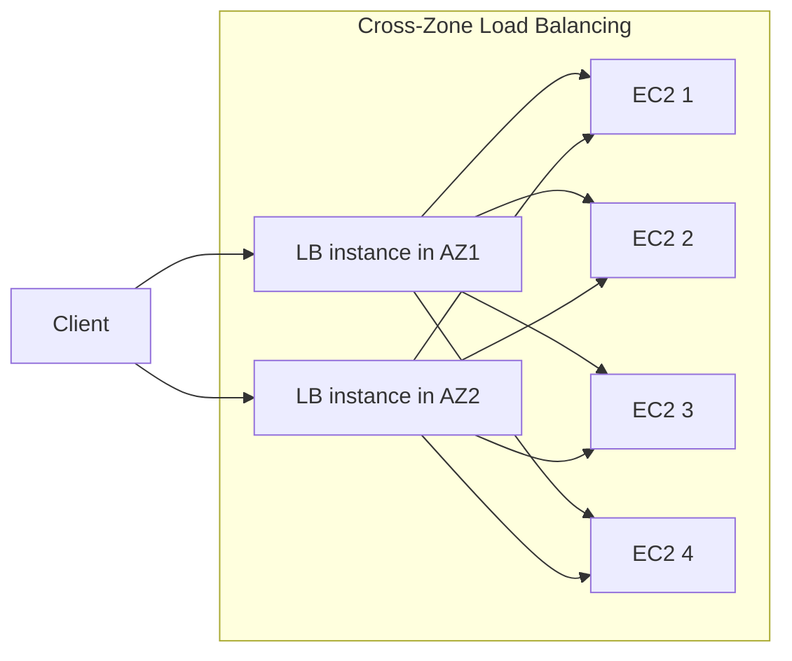

# 56. Elastic Load Balancers - Part 2

## 🎯 Giới thiệu
Bài này tập trung vào các hành vi quan trọng của Elastic Load Balancer:

- **Cross-Zone Load Balancing**
- **Sticky Sessions / Session Affinity**
- **Routing Algorithms** cho request

Mục tiêu là hiểu cách traffic được phân phối giữa các **Availability Zones (AZs)** và các **EC2 instances**, cùng với tác động của từng cơ chế lên cân bằng tải.

## 1. Cross-Zone Load Balancing 🌐
**Cross-Zone Load Balancing** cho phép mỗi **load balancer instance** phân phối traffic đều đến **tất cả registered instances** ở mọi AZ.

### Ý chính
- Client gửi traffic đến các **load balancer instances**.
- Mỗi instance của load balancer sẽ phân phối request ra toàn bộ backend instances.
- Kết quả là traffic được **chia đều trên toàn bộ EC2 instances**, không phụ thuộc AZ.

### Khi không bật Cross-Zone
- Traffic vẫn đi vào từng AZ riêng biệt.
- Mỗi **load balancer instance** chỉ phân phối request cho các EC2 instances trong cùng AZ của nó.
- Nếu số lượng EC2 instances giữa các AZ không cân bằng, một số instance sẽ nhận nhiều traffic hơn.

### Mermaid: Flow traffic

### Trạng thái theo từng loại ELB
| Load Balancer | Cross-Zone mặc định | Có thể tắt/bật | Phí inter-AZ data |
|---|---:|---:|---:|
| **CLB** | Disabled | Có thể enable | Không tính phí nếu enable |
| **ALB** | Always on | Không thể disable | Không tính phí |
| **NLB** | Disabled | Có thể enable | Có tính phí nếu enable |
| **GWLB** | Disabled | Có thể enable | Có tính phí nếu enable |

## 2. Sticky Sessions / Session Affinity 🍪
**Sticky Sessions** giúp client liên tục được gửi về **cùng một backend instance** trong các request tiếp theo.

### Ý chính
- Một client gửi request đầu tiên đến một instance backend.
- Request sau từ client đó sẽ tiếp tục đi đến **cùng instance**.
- Cơ chế này dùng **cookie** có **expiration date**.
- Khi cookie hết hạn, client có thể bị chuyển sang instance khác.

### Use case
- Giữ **session data** của user không bị mất.
- Hữu ích khi application cần user luôn gắn với cùng backend instance.

### Lưu ý
- Sticky Sessions có thể gây **imbalance load** giữa các EC2 instances.
- Một số client “sticky” quá lâu có thể làm một instance bị tải cao hơn các instance khác.

### Hỗ trợ
- Bật được trên:
  - **Classic Load Balancer (CLB)**
  - **Application Load Balancer (ALB)**

## 3. Routing Algorithms 🔀
Bài học giới thiệu các cách chọn target khi ELB nhận request.

### a. Least Outstanding Request
- Request tiếp theo sẽ được gửi đến instance có **ít pending/unfinished requests nhất**.
- Mục tiêu là ưu tiên instance đang ít bận nhất.
- Áp dụng cho:
  - **ALB**
  - **CLB**

### b. Round Robin
- Request được phân phối **lần lượt theo vòng tròn**.
- Không quan tâm instance đang có bao nhiêu outstanding requests.
- Áp dụng cho:
  - **ALB**
  - **CLB**

### c. Flow Hash Request Routing
- Dùng cho **NLB**.
- Target được chọn dựa trên hashing của:
  - protocol
  - source/destination IP address
  - source/destination port
  - TCP sequence number
- Mỗi **TCP hoặc UDP connection** sẽ được route đến **một target duy nhất** trong suốt vòng đời kết nối.
- Cách này có tính chất gần giống **sticky sessions** trên NLB.

## 📊 Bảng tóm tắt
| Tiêu chí | Mô tả |
|----------|------|
| Cross-Zone Load Balancing | Phân phối traffic từ mỗi load balancer instance đến toàn bộ EC2 instances ở mọi AZ |
| Không Cross-Zone | Traffic bị giới hạn trong từng AZ, có thể gây lệch tải nếu số instance không đều |
| Sticky Sessions | Giữ client gắn với cùng backend instance nhờ cookie có expiration |
| Least Outstanding Request | Chọn instance ít request đang chờ nhất |
| Round Robin | Phân phối request tuần tự theo vòng tròn |
| Flow Hash | NLB chọn target bằng hash từ protocol, IP, port, TCP sequence number |

## 💡 Mẹo ghi nhớ cho kỳ thi AWS
- **ALB**: Cross-Zone **luôn bật**, không tắt được.
- **CLB**: Cross-Zone **mặc định tắt**, nhưng bật lên thì **không bị phí inter-AZ** theo transcript.
- **NLB**: Cross-Zone **mặc định tắt**, bật lên thì **có phí inter-AZ**.
- **GWLB**: Cross-Zone **mặc định tắt**, bật lên thì **có phí inter-AZ**.
- **Sticky Sessions** dùng **cookie** để giữ client vào cùng backend instance.
- **Least Outstanding Request** nghĩa là gửi request đến instance **ít bận nhất**.
- **Round Robin** là kiểu chia request **lần lượt theo vòng tròn**.
- **NLB Flow Hash** gắn kết connection với một target trong suốt **life of the connection**.

## ✅ Kết luận
Bài này xoay quanh 3 ý chính:

- **Cross-Zone Load Balancing** quyết định traffic có được chia đều qua mọi AZ hay không.
- **Sticky Sessions** giúp duy trì session bằng cách giữ client vào cùng backend instance.
- **Routing Algorithms** khác nhau giữa **ALB/CLB** và **NLB**, đặc biệt **Flow Hash** là đặc trưng của **NLB**.
