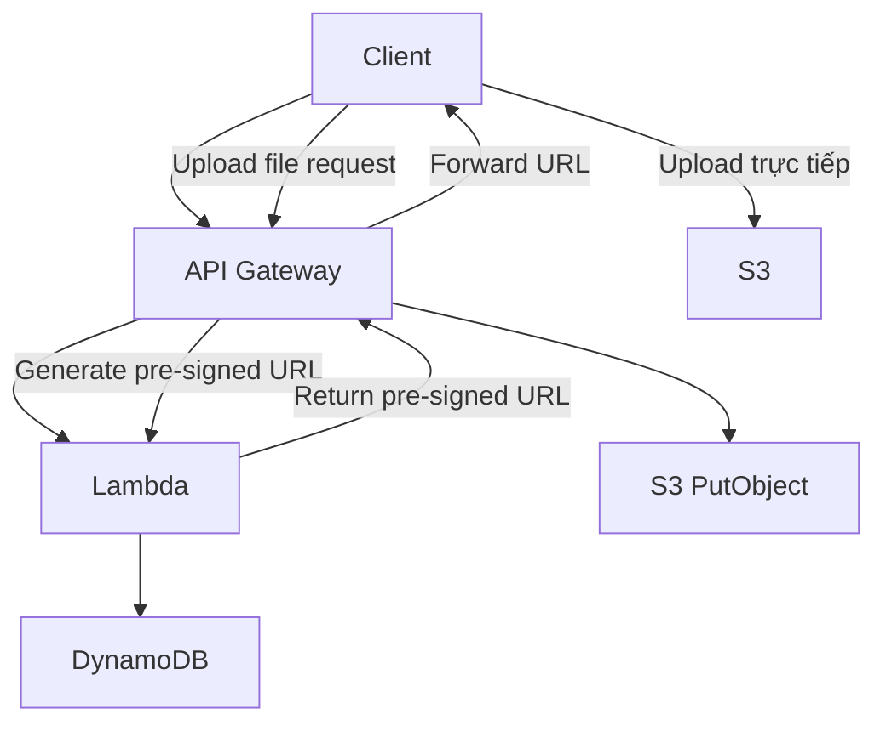

# 57. API Gateway

## 🎯 Giới thiệu
- **Amazon API Gateway** là điểm tiếp xúc đầu tiên với client, dùng để **expose REST API**.
- Thường được dùng để **proxy request tới Lambda**, nhưng cũng có thể:
  - Expose **HTTP endpoints**
  - Expose **AWS services as an API**
- Phù hợp cho kiến trúc **serverless**, ví dụ:
  - Client -> API Gateway -> Lambda -> DynamoDB
- Lý do dùng API Gateway thay vì gọi trực tiếp:
  - **API versioning**
  - **Authorization**
  - **Traffic management**: `API keys`, `usage plan`, `throttles`
  - **Scale tốt**, không phải quản lý server
  - **Request/response transformation**
  - **OpenAPI spec**: publish/import API
  - Hỗ trợ **CORS**

## 1. Integrations & Kiến trúc triển khai
- API Gateway có thể tích hợp với:
  - **HTTP integration**: phía backend là HTTP endpoint, ALB, internal HTTP API on-premise
  - **Lambda integration**: tạo REST API serverless rất phổ biến
  - **AWS service integration**: ví dụ:
    - Start **Step Functions**
    - Post message vào **SQS**
- API Gateway thường được dùng khi muốn thêm lớp trung gian để có:
  - `rate-limiting`
  - `caching`
  - `user authentication`
  - `API keys`

### Mermaid: flow request và kiến trúc upload file

- Với bài toán upload file lên **S3**:
  - Cách 1: **API Gateway proxy trực tiếp S3 PutObject**
    - Có thể làm được
    - Nhưng bị giới hạn bởi **10 MB payload size**
  - Cách 2: **API Gateway -> Lambda -> generate pre-signed URL -> client upload trực tiếp S3**
    - Tốt hơn
    - Phù hợp cho file lớn
    - Tránh giới hạn payload của API Gateway

## 2. Endpoint types, cache và limits
- API Gateway có 3 kiểu endpoint:
  - **Edge-Optimized**
    - Default
    - Request đi qua **CloudFront Edge locations**
    - Tốt cho client toàn cầu
    - API Gateway vẫn ở **1 region**
  - **Regional**
    - Dùng khi client ở cùng region
    - Có thể kết hợp thêm **CloudFront** nếu muốn kiểm soát caching/distribution
  - **Private**
    - Chỉ dùng trong **VPC**
    - Truy cập qua **ENI**
    - Cần **resource policy** để kiểm soát truy cập
- Cache API responses:
  - Mục tiêu: giảm số lần gọi backend
  - Luồng:
    - Client -> API Gateway
    - API Gateway kiểm tra **gateway cache**
    - Nếu hit thì trả ngay cho client
    - Nếu miss thì gọi backend rồi lưu lại cache
  - **TTL mặc định: 300 seconds**
  - Có thể đặt `0` hoặc cao hơn như 1 giờ
  - Cache được định nghĩa **per stage**
  - Có thể override **per method**
  - Client có thể invalidate bằng header:
    - `Cache-Control: max-age=0`
  - Có thể **flush entire cache**
  - Cache có thể **encrypted**
  - Capacity từ **0.5 GB đến 237 GB**
- Hai giới hạn rất quan trọng:
  - **Timeout tối đa 29 seconds**
  - **Max payload size 10 MB**

## 3. Deployments, security, errors, logging
- **Deployment stages**
  - API changes được deploy vào stage
  - Có thể có nhiều stage như:
    - `dev`
    - `test`
    - `prod`
  - Stage có thể rollback vì API Gateway giữ **deployment history**
  - Stage có thể trỏ tới alias của Lambda như `prod alias`, `test alias`
- **Security**
  - Có thể load **SSL certificates** lên API Gateway
  - Dùng **Route 53 CNAME**
  - **Resource policy**
    - Giống `S3 bucket policy`
    - Kiểm soát:
      - account nào được truy cập
      - IP / CIDR block nào
      - VPC hoặc VPC endpoint nào
  - **IAM Execution Roles**
    - Dùng ở API level
    - Ví dụ API Gateway cần invoke Lambda
  - **CORS**
    - Kiểm soát domain nào được gọi API
- **Authentication**
  - **IAM-based access**
    - Dùng IAM credentials trong header
    - Qua **SigV4**
  - **Lambda authorizers** (trước đây gọi là custom authorizers)
    - Dùng Lambda để verify token custom
    - Hợp với `OAuth`, `SAML`, hoặc `3rd party authentication`
  - **Cognito User Pool**
    - Client authenticate với Cognito
    - Nhận token rồi gửi vào API Gateway
    - API Gateway verify token với Cognito
    - Nếu hợp lệ thì invoke Lambda
- **Errors**
  - **4xx**: lỗi phía client
    - `400 Bad Request`
    - `403 Access Denied`
    - `429 quota exceeded / throttle`
  - **5xx**: lỗi phía server
    - `502 Bad Gateway`
      - thường do Lambda trả output sai
      - hoặc invocation out of order khi tải cao
    - `503 Service Unavailable`
      - backend không phản hồi
    - `504 Integration Failure`
      - ví dụ timeout do vượt quá **29 seconds**
- **Logging / Monitoring / Tracing**
  - **CloudWatch Logs**
    - log ở stage level
    - mức `error` hoặc `info`
    - có thể log full request/response
  - **API Gateway access logs**
    - tùy biến được
    - có thể gửi sang **Kinesis Data Firehose**
  - **CloudWatch Metrics**
    - metrics theo stage
    - có `detailed metrics`
    - ví dụ:
      - `integration latency`
      - `latency`
      - `cache hit count`
      - `cache miss count`
  - **X-Ray**
    - tracing request qua API Gateway
    - hiển thị `latency`, `errors`, ...
    - nếu bật thêm cho Lambda sẽ thấy toàn bộ luồng

## 📊 Bảng tóm tắt
| Tiêu chí | Mô tả |
|----------|------|
| Vai trò | Expose REST API cho client, thường làm điểm vào đầu tiên |
| Tích hợp | Lambda, HTTP endpoint, AWS services như Step Functions, SQS |
| Lợi ích | Versioning, authorization, throttling, caching, transformation, OpenAPI, CORS |
| Endpoint types | `Edge-Optimized`, `Regional`, `Private` |
| Cache | Theo stage, mặc định TTL 300 seconds, có thể invalidate/flush |
| Giới hạn | Timeout tối đa 29 seconds, payload tối đa 10 MB |
| Security | SSL cert, Resource policy, IAM Execution Roles, CORS |
| Authentication | IAM + SigV4, Lambda authorizers, Cognito User Pool |
| Quan sát | CloudWatch Logs, CloudWatch Metrics, X-Ray, access logs |

## 💡 Mẹo ghi nhớ cho kỳ thi AWS
- `29 seconds` và `10 MB` là 2 giới hạn rất hay bị hỏi.
- Nếu bài toán upload file lớn qua API Gateway, nhớ nghĩ đến **pre-signed URL** thay vì đẩy file trực tiếp.
- **Edge-Optimized** = qua **CloudFront Edge locations**.
- **Private API Gateway** = trong **VPC**, dùng **resource policy**.
- **IAM + SigV4** thường xuất hiện khi cần authenticate bằng AWS credentials.
- Nếu thấy `4xx` là lỗi client, `5xx` là lỗi server.
- `502 / 503 / 504` là bộ mã quan trọng cần nhớ khi làm kiến trúc với API Gateway.

## ✅ Kết luận
- **API Gateway** là lớp trung gian rất quan trọng trong kiến trúc AWS, đặc biệt với **serverless** và các API cần **security**, **throttling**, **caching**, và **scalability**.
- Khi thiết kế, phải luôn để ý:
  - **timeout 29 seconds**
  - **payload 10 MB**
  - **endpoint type**
  - **authentication method**
  - **cache và monitoring**
- Trong exam, câu hỏi thường xoay quanh việc chọn **đúng kiến trúc** cho từng giới hạn và use case cụ thể.
