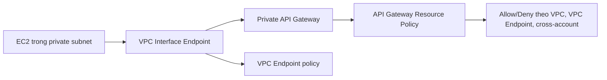

# 58. API Gateway - Part 2

## 🎯 Giới thiệu
Phần này tập trung vào 3 chủ đề chính của API Gateway:

- `Usage Plan` và `API Keys` để kiểm soát truy cập, đo lường và giới hạn client
- `WebSocket API` cho giao tiếp hai chiều, thời gian thực
- `Private APIs` để chỉ cho phép truy cập từ `VPC` qua `VPC Interface Endpoints`

## 1. Usage Plan, API Keys và throttling
- `Usage Plan` xác định:
  - Ai được truy cập một hoặc nhiều `deployed API stages` và `methods`
  - Mức độ truy cập: nhanh đến đâu, nhiều đến đâu
- `API Keys` là chuỗi `alpha numeric` bí mật, được phát cho khách hàng để định danh client
- Có thể dùng `API Keys` để:
  - Đo lường (`meter`) và theo dõi truy cập
  - Áp `throttling limits`
  - Áp `quota limits`
- `Quota limits` là tổng số request tối đa
- Có thể gặp lỗi `429 Too Many Requests`
- Đây cũng có thể là `account level throttling` trên toàn bộ API trong một `region`
- Khi gặp giới hạn này, client cần có:
  - Cơ chế `retry`
  - `exponential backoff`

## 2. WebSocket API
- `WebSocket` là giao tiếp hai chiều giữa browser và server
- Server có thể chủ động `push` dữ liệu về client
- Phù hợp cho ứng dụng `stateful` và thời gian thực như:
  - chat
  - collaboration platforms
  - multiplayer games
  - financial trading platforms
- Có thể làm việc với:
  - `Lambda`
  - `DynamoDB`
  - HTTP endpoints

```mermaid
flowchart TD
    A[Client browser] --> B[API Gateway WebSocket API]
    B --> C[Lambda onConnect]
    C --> D[(DynamoDB: lưu connection ID)]
    B --> E[Lambda sendMessage]
    E --> D
    B --> F[Lambda onDisconnect]
    F --> D
    E --> G[@connections callback URL]
    G --> A
```

- Luồng chính trong chat application:
  - Client kết nối tới API Gateway bằng `persistent connection`
  - API Gateway gọi `Lambda onConnect`
  - `Connection ID` có thể được lưu vào `DynamoDB`
  - `Lambda sendMessage` xử lý và lưu message vào `DynamoDB`
  - `Lambda onDisconnect` được gọi khi kết nối bị ngắt
- Để gửi phản hồi ngược về client, dùng `@connections`
  - Mỗi connection có `Connection ID`
  - Lambda post message vào `/@connections/connectionid`
  - API Gateway sẽ biết cần trả message về đúng client tương ứng

## 3. Private APIs và bảo mật truy cập
- `Private APIs` chỉ truy cập được từ `VPC`
- Cần dùng `VPC Interface Endpoints`
- Một `Interface Endpoint` có thể dùng để truy cập nhiều `private APIs`



- Mô hình truy cập:
  - Tạo `Interface Endpoint` trong subnet
  - `EC2 Instances` truy cập private API Gateway thông qua endpoint này
- Có 2 lớp kiểm soát truy cập:
  - `VPC Endpoint policy` trên `Interface Endpoint`
  - `API Gateway Resource Policy` gắn vào API Gateway
- `Resource Policy` có thể:
  - cho phép hoặc từ chối truy cập từ các `VPC` và `VPC Endpoints` được chọn
  - áp dụng cả cho `cross AWS accounts`
- Các điều kiện được nhắc đến:
  - `aws:SourceVpc`
  - `aws:SourceVpce`

## 📊 Bảng tóm tắt
| Tiêu chí | Mô tả |
|----------|------|
| `Usage Plan` | Xác định client nào được truy cập stage/method nào, và truy cập nhanh hay nhiều đến đâu |
| `API Keys` | Chuỗi bí mật để định danh client, đo lường truy cập và gắn giới hạn |
| `Throttling` | Giới hạn tốc độ request, có thể gặp `429 Too Many Requests` |
| `Quota` | Tổng số request tối đa trong giới hạn đã cấu hình |
| `WebSocket API` | Giao tiếp hai chiều, server có thể push dữ liệu về client |
| `@connections` | Cơ chế callback để API Gateway trả dữ liệu về đúng connection |
| `Private API` | Chỉ truy cập từ `VPC` thông qua `VPC Interface Endpoints` |
| `Security layers` | `VPC Endpoint policy` và `API Gateway Resource Policy` |

## 💡 Mẹo ghi nhớ cho kỳ thi AWS
- `Usage Plan` đi với `API Keys` để kiểm soát ai dùng API và dùng bao nhiêu
- `429 Too Many Requests` thường gắn với `throttling` hoặc giới hạn truy cập
- `WebSocket API` dùng cho bài toán cần `two-way communication` và `push` từ server
- Nhớ `@connections` là đường trả dữ liệu ngược về client trong WebSocket
- `Private API` không public, chỉ đi qua `VPC Interface Endpoint`
- Hai lớp kiểm soát quan trọng cho Private API:
  - `VPC Endpoint policy`
  - `API Gateway Resource Policy`
- Điều kiện hay gặp trong policy: `aws:SourceVpc` và `aws:SourceVpce`

## ✅ Kết luận
- `Usage Plan` và `API Keys` dùng để quản lý truy cập, giới hạn tốc độ và quota
- `WebSocket API` hỗ trợ giao tiếp hai chiều, phù hợp cho các ứng dụng real-time
- `Private APIs` tăng kiểm soát truy cập bằng cách chỉ cho phép qua `VPC Interface Endpoints` và policy
- Đây là các ý rất dễ xuất hiện trong câu hỏi thi AWS về `API Gateway`
