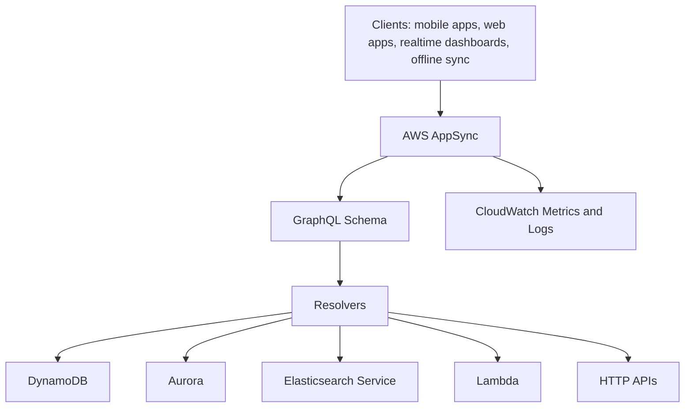
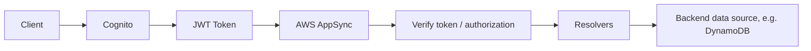

# 59. AWS AppSync

## 🎯 Giới thiệu
- **AWS AppSync** là một **managed service** dùng **GraphQL** ở backend.
- Khi thấy **GraphQL** trong đề thi, hãy nghĩ ngay đến **AppSync**.
- Mục tiêu của GraphQL là giúp ứng dụng lấy **đúng dữ liệu cần thiết**, kể cả khi cần **kết hợp dữ liệu từ nhiều nguồn**.
- AppSync hỗ trợ lấy dữ liệu từ:
  - **NoSQL data store**
  - **Relational database**
  - **HTTP APIs**
  - **DynamoDB**
  - **Aurora**
  - **Elasticsearch**
  - **Lambda** cho custom sources
- Điểm nổi bật quan trọng cho kỳ thi: AppSync có thể trả dữ liệu **real time** qua **WebSockets** hoặc **MQTT on WebSockets**.

## 1. Cách AppSync hoạt động
- Client có thể là:
  - **mobile apps**
  - **web apps**
  - **realtime dashboards**
  - hoặc dùng cho **offline synchronizations**
- Bên trong AppSync có:
  - **GraphQL schema**
  - **Resolvers**
- **Resolvers** chịu trách nhiệm lấy dữ liệu từ các nguồn backend khác nhau.
- Dữ liệu sau khi được truy xuất sẽ được gom lại và gửi về client.

## 2. Tính năng real time và offline sync
- AppSync đặc biệt mạnh ở khả năng **real time**.
- Dữ liệu có thể được trả về theo kiểu **WebSockets** hoặc **MQTT on WebSockets**.
- Đây là điểm rất dễ bị hỏi trong exam:
  - Khi cần **GraphQL**
  - Khi cần **real time data**
  - Khi cần API hỗ trợ **offline synchronization**
- Với ứng dụng mobile, AppSync còn hỗ trợ:
  - **local data access**
  - **data synchronization**

## 3. Tích hợp Cognito và authorization
- AppSync tích hợp với **Cognito** để thực hiện **authorization** theo **groups**.
- Trong **GraphQL schema**, có thể dùng `@aws_auth` để chỉ định quyền cho các Cognito groups.
- Ví dụ trong transcript:
  - **bloggers** và **readers** đều có thể thực hiện **query**
  - nhưng chỉ **bloggers** mới có quyền **mutation** để thêm post
- Flow xác thực:
  - Client authenticate với **Cognito**
  - Nhận **JWT token**
  - Gửi JWT token vào **AppSync**
  - AppSync verify token và kiểm tra quyền với Cognito
  - **Resolvers** kiểm tra nhóm Cognito của user
  - Nếu hợp lệ, AppSync truy cập backend như **DynamoDB**

## 📊 Bảng tóm tắt
| Tiêu chí | Mô tả |
|----------|------|
| Dịch vụ | **AWS AppSync** |
| Backend style | Dùng **GraphQL** |
| Mục tiêu | Lấy đúng dữ liệu cần thiết, có thể kết hợp nhiều nguồn |
| Nguồn dữ liệu | **DynamoDB**, **Aurora**, **Elasticsearch**, **Lambda**, **HTTP APIs** |
| Realtime | Có qua **WebSockets** hoặc **MQTT on WebSockets** |
| Mobile support | Có **local data access** và **data synchronization** |
| Thành phần chính | **GraphQL schema** và **Resolvers** |
| Monitoring | **CloudWatch Metrics and Logs** |
| Authorization | Tích hợp với **Cognito** và **JWT token** |

## 💡 Mẹo ghi nhớ cho kỳ thi AWS
- Thấy **GraphQL** thì nghĩ ngay đến **AppSync**.
- Thấy yêu cầu **real time data** hoặc **offline synchronization** thì cân nhắc **AppSync**.
- Nhớ rằng AppSync có thể lấy dữ liệu từ **nhiều nguồn** và gộp lại cho client.
- Khi đề cập **Cognito groups** và quyền trên **GraphQL schema**, đó là dấu hiệu của **AppSync authorization**.
- **Resolvers** là phần quyết định lấy dữ liệu từ đâu và trả thế nào về client.

## ✅ Kết luận
- **AWS AppSync** là managed service cho **GraphQL**, phù hợp khi cần **lấy đúng dữ liệu**, **kết hợp nhiều nguồn**, và **real time delivery**.
- Nó hỗ trợ tốt cho **mobile apps**, **web apps**, **realtime dashboards**, và **offline synchronization**.
- Tích hợp với **Cognito** giúp kiểm soát quyền theo **groups** ngay trong **GraphQL schema**.
