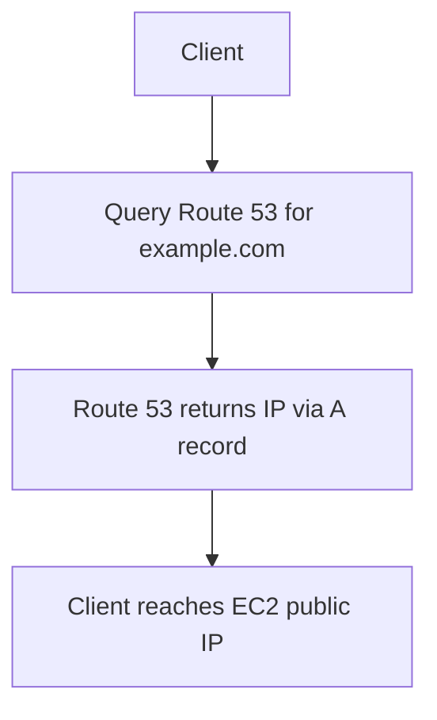
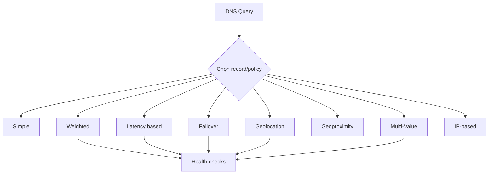

# 60. Route 53 - Part 1

## 🎯 Giới thiệu
Route 53 là dịch vụ DNS với nhiều **record types** và **routing policies** quan trọng cho kỳ thi AWS. Transcript tập trung vào cách ánh xạ hostname, cách hoạt động của **TTL**, và các kiểu định tuyến như **Weighted**, **Latency based**, **Failover**, **Geolocation**, **Geoproximity**, **Traffic Flow**, **Multi-Value**, và **IP-based routing**.

## 1. Các record types cơ bản trong Route 53
- **A record**: map hostname sang **IPv4**.
- **AAAA record**: map hostname sang **IPv6**.
- **CNAME**: map hostname sang một hostname khác.
  - Target của CNAME phải là hostname có bản ghi **A** hoặc **AAAA**.
  - **Không thể** tạo CNAME ở **Zone Apex**.
  - Ví dụ: `www.example.com` có thể dùng CNAME, nhưng `example.com` thì không.
- **Alias record**:
  - Dùng để trỏ hostname tới **AWS resource** được chỉ định.
  - Dùng được cho cả **root domain** và **non-root domain**.
  - **Free of charge**.
  - Có **native health check**.
  - Không dùng Alias cho **EC2 DNS name**.
  - Các target được nhắc tới:
    - **Elastic Load Balancer**
    - **CloudFront Distribution**
    - **API Gateway**
    - **Elastic Beanstalk environment**
    - **S3 website**
    - **VPC interface endpoint**
    - **Global Accelerator**
    - Một record khác trong cùng hosted zone
- **NS record**: name servers của **hosted zone**, dùng để kiểm soát cách traffic được route tới domain.

### Mermaid: luồng truy cập DNS đơn giản

## 2. TTL và routing policies
- Mỗi DNS record trong Route 53 có **TTL (Time To Live)**, trừ **Alias record** là ngoại lệ.
- TTL quyết định thời gian bản ghi được **cache** ở phía client.
- **TTL cao**:
  - Ít traffic hơn lên Route 53
  - Cập nhật DNS mới chậm hơn
- **TTL thấp**:
  - Traffic DNS nhiều hơn, tốn chi phí hơn
  - Record mới được cập nhật nhanh hơn
- Đây luôn là một **trade-off** giữa chi phí và tốc độ cập nhật.

### Các routing policies chính
- **Simple routing**
  - Route traffic tới **một resource**.
  - Có thể có nhiều values trong cùng record, client sẽ chọn ngẫu nhiên một value.
  - **Không** gắn với health check.
- **Weighted routing**
  - Chia tỷ lệ request theo phần trăm đến từng resource.
  - Có thể gắn với **health checks**.
  - Use cases: **load balancing giữa regions**, test application versions.
- **Latency based routing**
  - Route tới resource có **latency thấp nhất** đối với user.
  - Phụ thuộc vào latency giữa user và **AWS region**.
  - Có thể gắn với **health checks** để failover.
- **Failover routing**
  - Mô hình **active-passive**.
  - Có **primary** và **secondary disaster recovery** record.
  - Health check áp dụng cho primary; nếu primary fail thì chuyển sang secondary.
- **Geolocation routing**
  - Route theo **vị trí user**.
  - Có thể theo **continent**, **country**, hoặc **US state**.
  - Nếu trùng lặp, chọn vị trí **cụ thể nhất**.
  - Nên có **default record** nếu không match.
  - Use cases: website localization, restrict content distribution, load balancing.
- **Geoproximity routing**
  - Route theo vị trí địa lý của **users** và **resources**.
  - Dùng **bias** để tăng hoặc giảm lượng traffic:
    - Bias từ **1 đến 99**: tăng traffic tới resource
    - Bias từ **-1 đến -99**: giảm traffic tới resource
  - Resource có thể là **AWS** hoặc **non-AWS** resource.
  - Với non-AWS resource cần chỉ định **latitude/longitude**.
  - Cần dùng **Traffic Flow feature** để thiết lập.
- **Traffic flow**
  - Cho phép tạo và quản lý các routing rules **phức tạp và lớn**.
  - Là **visual editor** cho các complex routing decision trees.
  - Cấu hình được lưu thành **Traffic Flow Policies**.
  - Có thể áp dụng cho nhiều hosted zones và hỗ trợ **versioning**.
- **Multi-Value routing**
  - Dùng khi route tới **multiple resources**.
  - Trả về nhiều values/resources, nhưng chỉ các resource **healthy**.
  - Mỗi query trả về tối đa **8 healthy records**.
  - Không thay thế được **load balancer**.
- **IP-based routing**
  - Route dựa trên **client IP addresses**.
  - Dùng danh sách **CIDRs** để map IP range tới location/endpoint.
  - Use cases:
    - Tối ưu performance khi biết IP trước
    - Giảm network cost
  - Ví dụ: các CIDR khác nhau có thể map tới hai EC2 instances khác nhau.

### Mermaid: luồng chọn routing policy

## 3. Các điểm cần nhớ khi ôn thi
- **CNAME không dùng được ở Zone Apex**.
- **Alias** dùng được cho **root domain**, miễn phí, và có **native health check**.
- **TTL** là yếu tố quan trọng trong caching DNS, và **không áp dụng cho Alias record**.
- **Simple routing** là policy duy nhất trong transcript **không associated with health check**.
- **Weighted** phù hợp để chia traffic theo phần trăm.
- **Latency based** phù hợp khi ưu tiên độ trễ thấp.
- **Failover** là active-passive với primary/secondary.
- **Geolocation** route theo vị trí user.
- **Geoproximity** dùng **bias** để điều chỉnh mức độ gần xa của traffic.
- **Traffic Flow** là công cụ để quản lý routing phức tạp.
- **Multi-Value** chỉ trả về các record khỏe mạnh và tối đa **8** records.

## 📊 Bảng tóm tắt
| Tiêu chí | Mô tả |
|----------|------|
| A / AAAA | A map hostname sang IPv4, AAAA map sang IPv6 |
| CNAME | Map hostname sang hostname khác, không dùng ở Zone Apex |
| Alias | Trỏ tới AWS resource, dùng được cho root domain, miễn phí, có health check |
| TTL | Thời gian cache DNS; TTL cao giảm traffic DNS, TTL thấp cập nhật nhanh hơn |
| Simple routing | Route tới một resource; không gắn với health check |
| Weighted routing | Chia tỷ lệ request theo phần trăm; có thể gắn health check |
| Latency based | Chọn resource có latency thấp nhất với user |
| Failover | Active-passive với primary và secondary |
| Geolocation | Route theo continent/country/US state |
| Geoproximity | Dùng bias để tăng/giảm traffic theo vị trí địa lý |
| Traffic Flow | Visual editor cho routing phức tạp, có versioning |
| Multi-Value | Trả về tối đa 8 healthy records |
| IP-based routing | Route theo CIDR/IP ranges của client |

## 💡 Mẹo ghi nhớ cho kỳ thi AWS
- Nhớ câu: **CNAME không ở Zone Apex, Alias thì có**.
- **Alias** = AWS resource + root domain + free + health check.
- **TTL** càng cao thì DNS update càng chậm, càng thấp thì càng linh hoạt nhưng tốn traffic hơn.
- **Weighted** = chia % traffic.
- **Latency based** = chọn nơi phản hồi nhanh nhất.
- **Failover** = primary hỏng thì sang secondary.
- **Geolocation** = theo vị trí user.
- **Geoproximity** = theo vị trí + bias.
- **Multi-Value** = nhiều IP nhưng chỉ trả về healthy records.
- **IP-based routing** = nhìn vào **CIDR** của client.

## ✅ Kết luận
Route 53 trong transcript xoay quanh ba ý chính: **record types**, **TTL**, và **routing policies**. Nắm chắc sự khác nhau giữa **CNAME** và **Alias**, hiểu cách **TTL** ảnh hưởng tới cache, và phân biệt đúng từng routing policy là đủ để ôn phần nền tảng của Route 53 cho kỳ thi AWS.
