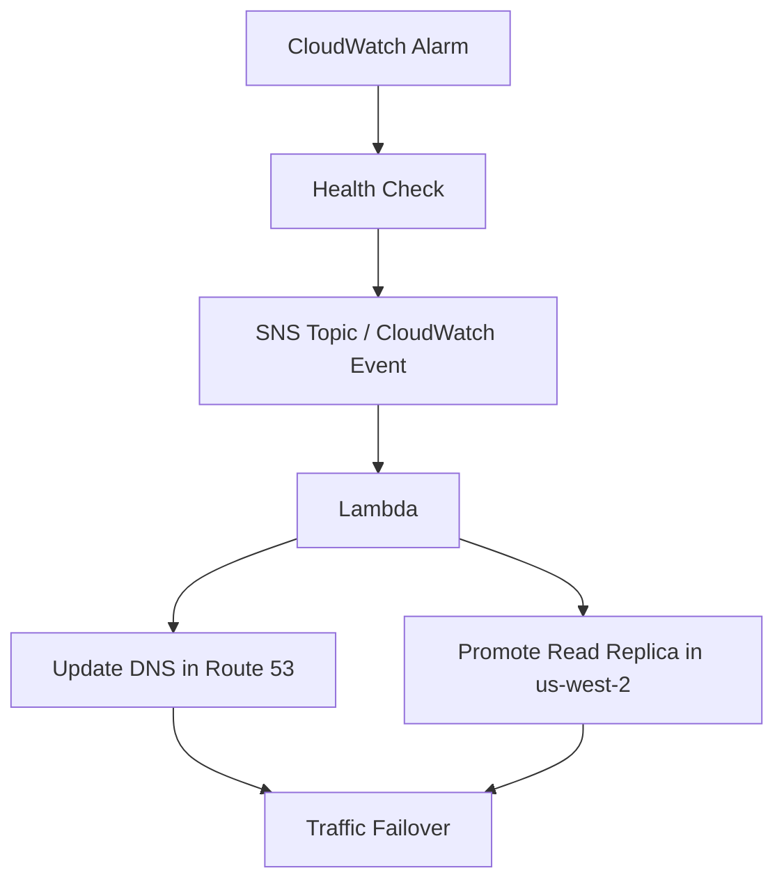

# 61. Route 53 - Part 2

## 🎯 Giới thiệu
Route 53 trong phần này tập trung vào 3 mảng chính:

- **Hosted Zones**: nơi chứa các DNS records để định tuyến traffic cho domain và subdomain.
- **Health Checks**: kiểm tra trạng thái endpoint hoặc tài nguyên để hỗ trợ **automatic DNS failover**.
- **Failover multi-region**: kết hợp **Health Check**, **CloudWatch Alarm**, **SNS / CloudWatch Event**, **Lambda** và **Route 53** để tự động chuyển hướng khi có sự cố.

## 1. Hosted Zones: Public vs Private
- **Hosted Zone** là container của các records dùng để route traffic cho domain và subdomains.
- Có 2 loại:
  - **Public Hosted Zone**
    - Internet có thể resolve.
    - Dùng cho public domain.
    - Target có thể là:
      - Public IP của **EC2 Instance**
      - Public IP của **Application Load Balancer**
      - **CloudFront distribution**
      - **S3 Bucket website**
  - **Private Hosted Zone**
    - Chỉ resolve được từ bên trong **VPC**.
    - Dùng cho **private URLs**.
    - Thường trỏ đến:
      - Private IP của **EC2 Instances**
      - Private IP của **Database Instances**

### 🔐 Private DNS trong VPC
- Nếu dùng **Private Hosted Zone** với **Private DNS** trong VPC, cần bật:
  - `enableDnsHostnames`
  - `enableDnsSupport`

### 🔒 DNSSEC
- Route 53 hỗ trợ **DNS Security Extensions (DNSSEC)**.
- Mục tiêu:
  - bảo vệ **DNS traffic**
  - xác minh **data integrity** và **origin**
  - giảm rủi ro **Man in the Middle (MITM)** trên DNS
- Route 53 hỗ trợ:
  - **DNSSEC for Domain Registration**
  - **DNSSEC Signing**
- **DNSSEC chỉ hoạt động với Public Hosted Zones**

### 🌐 Dùng với 3rd Registrar
- Có thể mua domain bên ngoài AWS nhưng vẫn dùng **Route 53** làm DNS provider.
- Cần cập nhật **NS records** tại Registrar để trỏ về AWS.

## 2. Health Checks trong Route 53
- Route 53 có **Public Health Checks**.
- Có thể gắn Health Check với một **DNS record** để tạo **automatic DNS failover**.
- Ví dụ:
  - có 2 **ALB** ở 2 region khác nhau
  - tạo 2 Health Checks để giám sát từng ALB

### Các loại Health Checks
- **Endpoint Health Checks**
  - Giám sát sức khỏe của:
    - application
    - server
    - AWS resource khác
  - Các health checkers trên toàn thế giới sẽ gửi request tới health route đã cấu hình.
  - Có khoảng **15 Health Checkers**
  - Endpoint phải là **Public Endpoint**
  - Health Check pass khi endpoint trả về:
    - **200**
    - **300**
- **Calculated Health Checks**
  - Kết hợp nhiều Health Check thành một **Parent Health Check**
  - Hỗ trợ điều kiện:
    - **OR**
    - **AND**
    - **NOT**
  - Có thể theo dõi tối đa **256 Child Health Checks**
  - Dùng khi muốn maintenance website mà không làm toàn bộ Health Checks fail
- **CloudWatch Alarm-based Health Checks**
  - Health Check monitor **CloudWatch Alarm**
  - Cho phép linh hoạt vì có thể dùng bất kỳ metric/alarm nào
  - Hữu ích cho **private resources**
  - Có thể monitor:
    - DynamoDB throttles
    - RDS alarms
    - custom metrics

### 🧪 Kiểm tra nội dung phản hồi
- Health Check có thể pass/fail dựa trên **giá trị trả về của endpoint**.
- Nếu trong **5120 bytes đầu tiên** của response có đoạn text được chỉ định thì Health Check pass.

### 🏠 Private resources không truy cập trực tiếp từ health checkers
- Health checkers nằm ngoài VPC nên không truy cập được:
  - **Private VPC resources**
  - **on-premises resources**
- Cách làm:
  - tạo **CloudWatch Metric**
  - gắn **CloudWatch Alarm**
  - cho Health Check monitor **CloudWatch Alarm** đó

## 3. Multi-region failover với RDS
- Ví dụ kiến trúc:
  - database chính ở một region
  - **Async replication** sang region khác
  - ví dụ: **us-east-1 → us-west-2**

### Hai cách giám sát
- **Cách 1**
  - dùng **EC2 Instance** để monitor database
  - expose route **/health-db**
- **Cách 2** 
  - tạo **CloudWatch Alarm**
  - link alarm vào **Health Check**
  - đây là cách được ưu tiên hơn trong transcript

### Luồng failover tự động
- Khi **Health Check** tắt:
  - nó được link tới **CloudWatch Alarm**
  - alarm kích hoạt **SNS Topic** hoặc **CloudWatch Event**
  - trigger **Lambda**
  - Lambda update **DNS** trong **Route 53**
  - đồng thời promote **Read Replica** ở **us-west-2**
- Kết quả:
  - đạt được **automated failover** bằng **Health Checks + Route 53**

### Mermaid flow

## 📊 Bảng tóm tắt
| Tiêu chí | Mô tả |
|----------|------|
| Hosted Zone | Container chứa DNS records để route traffic cho domain và subdomains |
| Public Hosted Zone | Publicly resolvable, dùng cho public domain và các target public như EC2, ALB, CloudFront, S3 website |
| Private Hosted Zone | Chỉ resolve trong VPC, dùng cho private IP của EC2 và database |
| Private DNS trong VPC | Cần bật `enableDnsHostnames` và `enableDnsSupport` |
| DNSSEC | Bảo vệ DNS traffic, xác minh integrity và origin, chỉ dùng với Public Hosted Zones |
| 3rd Registrar | Mua domain ngoài AWS nhưng vẫn dùng Route 53 bằng cách cập nhật NS records |
| Public Health Check | Giám sát public endpoint, pass khi trả về 200/300 |
| Calculated Health Check | Kết hợp nhiều health check bằng OR/AND/NOT, tối đa 256 children |
| CloudWatch-based Health Check | Dùng cho private resources qua CloudWatch Alarm |
| Automated Failover | Health Check → Alarm/Event → Lambda → update Route 53 DNS → promote replica |

## 💡 Mẹo ghi nhớ cho kỳ thi AWS
- **Public = Internet**, **Private = VPC**.
- Với **Private Hosted Zone**, nhớ 2 setting quan trọng: `enableDnsHostnames` và `enableDnsSupport`.
- **DNSSEC** trong transcript chỉ áp dụng cho **Public Hosted Zones**.
- **Public Health Check** chỉ kiểm tra được **public endpoint** và mong đợi **200/300**.
- **Calculated Health Check**:
  - nhớ 3 toán tử: **OR, AND, NOT**
  - nhớ giới hạn **256 children**
- Với tài nguyên **private**, không kiểm tra trực tiếp từ health checker bên ngoài VPC, mà đi qua **CloudWatch Alarm**.
- Flow failover cần nhớ theo chuỗi:
  - **Health Check → Alarm/Event → Lambda → Route 53 → Read Replica promotion**

## ✅ Kết luận
Route 53 Part 2 tập trung vào cách phân biệt **Public Hosted Zone** và **Private Hosted Zone**, cách dùng **DNSSEC**, và quan trọng nhất là cơ chế **Health Check** để triển khai **automatic DNS failover**. Với bài thi AWS, phần cần nhớ nhất là loại hosted zone, điều kiện của health check, và flow failover multi-region qua **CloudWatch**, **Lambda** và **Route 53**.
