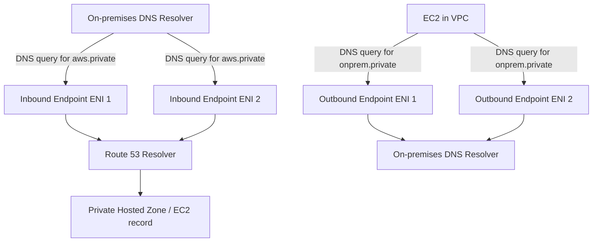

# 62. Route 53 - Resolvers & Hybrid DNS

## 🎯 Giới thiệu
- Bài này nói về **Hybrid DNS** trong AWS, một chủ đề rất hay xuất hiện trong exam.
- Mục tiêu là cho phép **DNS queries** đi qua lại giữa:
  - **AWS VPC**
  - **private networks** khác
  - **on-premises** thông qua **Direct Connect** hoặc **AWS VPN**
  - hoặc **PeeredVPC**

## 1. Route 53 Resolver mặc định
- Trong VPC, **Route 53 resolver** mặc định có thể tự trả lời DNS cho:
  - DNS name của **EC2 instances**
  - record trong **private hosted zone**
  - record từ **public hosted zone** hoặc các public DNS names trên internet
- Nghĩa là, với các tài nguyên nội bộ trong AWS, resolver đã xử lý được khá nhiều trường hợp sẵn.

## 2. Inbound endpoint và Outbound endpoint
- Khi cần resolve DNS giữa AWS và mạng private bên ngoài, ta dùng **resolver endpoints**:
  - **Inbound endpoint**: cho phép DNS resolver bên ngoài gửi query vào **Route 53 resolver** trong AWS
  - **Outbound endpoint**: cho phép **Route 53 resolver** gửi query ra DNS resolver bên ngoài, thường là **on-premises**
- Hai endpoint này:
  - được gắn với **một hoặc nhiều VPC** trong cùng region
  - được tạo ở **2 Availability Zones** để đảm bảo **high availability**
  - hỗ trợ khoảng **10,000 queries per second per IP address**
  - nếu cần thêm throughput thì thêm **IP addresses**
- Đây là **managed resolver endpoints** của AWS, không cần tự vận hành DNS resolver riêng như trước đây.

### Mermaid: luồng Hybrid DNS

## 3. Resolver rules và cách chọn rule
- Với **outbound endpoint**, AWS dùng **resolver rules** để quyết định query nào sẽ được forward.
- Có các kiểu rule được nhắc tới:
  - **Forwarding rules**: forward DNS queries theo domain cụ thể tới target IP
  - **System rule**: dùng để override behavior cho một subdomain nào đó
  - **Auto-defined system rules**: cho các domain nội bộ, ví dụ:
    - `compute.amazonaws.com`
    - `EC2.internal`
- Khi có **nhiều rule match**, Route 53 resolver sẽ chọn **most specific match**.
- **Resolver rules** có thể được **share across accounts** bằng **AWS RAM**.
- Điều này cho phép:
  - quản lý rules tập trung trong một account
  - nhiều VPC cùng dùng chung rule để forward DNS tới target IP đã định nghĩa

## 📊 Bảng tóm tắt
| Tiêu chí | Mô tả |
|----------|------|
| Mục đích | Kết nối DNS giữa **AWS** và **on-premises / private networks** |
| Route 53 Resolver mặc định | Trả lời DNS cho **EC2**, **private hosted zone**, và các public DNS names |
| Inbound endpoint | Nhận DNS query từ bên ngoài vào AWS |
| Outbound endpoint | Forward DNS query từ AWS ra DNS resolver on-premises |
| Tính sẵn sàng | Mỗi endpoint có **2 ENIs**, đặt ở **2 AZs** |
| Hiệu năng | Khoảng **10,000 qps / IP address** |
| Rule xử lý | Chọn **most specific match** khi nhiều rule cùng khớp |
| Chia sẻ | Có thể share **resolver rules** qua **AWS RAM** |

## 💡 Mẹo ghi nhớ cho kỳ thi AWS
- Nhớ cặp từ khóa:
  - **Inbound = outside -> AWS**
  - **Outbound = AWS -> outside**
- **Inbound endpoint** dùng khi on-premises cần resolve tài nguyên trong AWS.
- **Outbound endpoint** dùng khi EC2/VPC cần resolve tên trong on-premises.
- **Resolver rules** gắn với outbound, dùng **conditional forwarding**.
- Có nhiều rule match thì chọn **most specific**.
- **RAM** có thể share resolver rules across accounts.
- Câu hỏi exam thường xoay quanh việc:
  - DNS đi chiều nào
  - dùng **endpoint** nào
  - có cần **resolver rules** hay không

## ✅ Kết luận
- **Hybrid DNS** trên AWS dùng **Route 53 Resolver endpoints** để kết nối DNS giữa AWS và on-premises.
- **Inbound endpoint** và **Outbound endpoint** thường được dùng cùng nhau để hỗ trợ cả hai chiều query.
- **Resolver rules** là phần quan trọng để forward query đúng đích, và có thể được quản lý tập trung qua **AWS RAM**.
