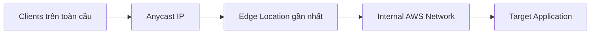

# 63. AWS Global Accelerator

## 🎯 Giới thiệu
- **AWS Global Accelerator** là dịch vụ giúp bạn tận dụng **internal network của AWS** để route traffic đến application.
- Khi tạo accelerator, AWS sẽ cấp **2 Anycast IP** cho application.
- Traffic đi từ client đến **Edge location** gần nhất, sau đó được chuyển tiếp vào application bằng **private/internal AWS network**.
- Mục tiêu chính:
  - Tăng tốc độ truy cập
  - Cải thiện độ ổn định
  - Hỗ trợ **fast regional failover**

## 1. Cách hoạt động của Global Accelerator

- Client sử dụng **Anycast IP** để đi tới **Edge location**.
- Từ Edge location, traffic được chuyển **privately** qua mạng AWS vào endpoint mong muốn.
- Ví dụ trong transcript:
  - Application ở **India**
  - Client ở **Australia, America, Europe**
  - Tất cả vẫn đi qua Anycast IP rồi vào Edge location gần nhất trước khi vào application.

## 2. Target, hiệu năng và failover
- Global Accelerator có thể trỏ đến các target:
  - **Elastic IPs**
  - **EC2 instances**
  - **ALB**
  - **NLB**
- Target có thể là **public hoặc private**.
- Lợi ích chính:
  - **IP preservation** cho clients, trừ trường hợp **Elastic IP endpoints**
  - **Consistent performance** nhờ **intelligent routing** theo **lowest latency**
  - **Fast regional failover**
- Hai Anycast IP sẽ tồn tại trong suốt lifecycle của Global Accelerator, nên IP **không đổi** và tránh vấn đề **client cache**.

## 3. Health checks, bảo mật và use cases
- Global Accelerator thực hiện **health checks** cho application.
- Nếu endpoint unhealthy, failover thường xảy ra trong **less than one minute**.
- Đây là lựa chọn tốt cho **disaster recovery** vì có:
  - Health checks
  - Fast recovery time
- Về security:
  - Chỉ cần whitelist **2 external Anycast IP**
  - Có **DDoS protection** nhờ **AWS Shield**

## 4. Global Accelerator vs CloudFront
- Điểm giống:
  - Cùng dùng **global network of AWS**
  - Cùng tận dụng **Edge locations**
  - Đều tích hợp với **AWS Shield** cho DDoS protection
- Điểm khác:
  - **CloudFront**:
    - Dùng để deliver **cached content at the Edge**
    - Phù hợp cho **images, videos**
    - Cũng hỗ trợ **dynamic content**, như **API acceleration** và **dynamic site delivery**
  - **Global Accelerator**:
    - Tối ưu **overall performance**
    - Không chỉ cho **HTTP**
    - Còn hỗ trợ **TCP** và **UDP**
    - Proxy packets trực tiếp từ Edge location vào application

## 📊 Bảng tóm tắt
| Tiêu chí | Mô tả |
|----------|------|
| Mục đích | Tăng tốc và cải thiện độ ổn định khi truy cập application qua mạng nội bộ AWS |
| Cơ chế | Dùng **2 Anycast IP**, route qua **Edge location** rồi vào **internal AWS network** |
| Target hỗ trợ | **Elastic IPs**, **EC2**, **ALB**, **NLB** |
| IP preservation | Có, trừ **Elastic IP endpoints** |
| Hiệu năng | **Intelligent routing** theo **lowest latency** |
| Failover | **Fast regional failover**, thường **less than one minute** |
| Bảo mật | Chỉ cần whitelist 2 Anycast IP, có **AWS Shield** |
| So với CloudFront | CloudFront thiên về **cached content at the Edge**; Global Accelerator thiên về **performance** và **non-HTTP** |

## 💡 Mẹo ghi nhớ cho kỳ thi AWS
- **Global Accelerator = Anycast IP + Edge location + AWS internal network**
- Nhớ 3 ý chính:
  - **Performance**
  - **Fast failover**
  - **Static IP-like entry point**
- Nếu đề bài nhắc đến:
  - **UDP**
  - **gaming**
  - **MQTT**
  - **VoIP**
  - **deterministic fast regional failover**
  thì nghĩ ngay đến **Global Accelerator**.
- Nếu bài toán là **cached content at the Edge** như images/videos, hoặc **API acceleration**, thì phù hợp hơn với **CloudFront**.

## ✅ Kết luận
- **AWS Global Accelerator** giúp tối ưu đường đi của traffic bằng **Anycast IP** và **Edge locations**, sau đó chuyển vào application qua **internal AWS network**.
- Dịch vụ này phù hợp khi cần:
  - **consistent performance**
  - **fast regional failover**
  - **IP preservation**
  - hỗ trợ **HTTP, TCP, UDP**
- Trong thi AWS, hãy nhớ phân biệt rõ:
  - **CloudFront**: cache content at the Edge
  - **Global Accelerator**: tăng hiệu năng tổng thể và failover nhanh cho nhiều loại traffic hơn
