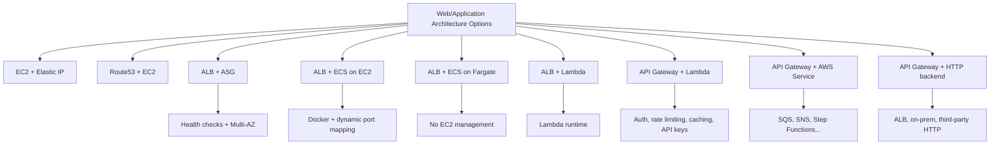

# 64. Comparison of Solutions Architecture

## 🎯 Giới thiệu
Bài này so sánh các lựa chọn kiến trúc cho **web layer** và **application layer** trên AWS, từ mô hình ít quản lý đến **fully serverless**.

Mục tiêu chính:
- Hiểu khi nào nên dùng từng kiến trúc
- Nắm trade-off về **scaling**, **failover**, **latency**, **cost**, và **management overhead**
- Ghi nhớ các điểm hay gặp trong câu hỏi thi AWS

## 1. EC2, Route53 và failover cơ bản
### EC2 + Elastic IP
- User truy cập một **public EC2 instance** có **Elastic IP**
- Khi failover, **Elastic IP** được chuyển sang **standby EC2**
- Ưu điểm:
  - Failover nhanh
  - Client không thấy thay đổi vì vẫn dùng cùng Elastic IP
  - Hữu ích khi client chỉ resolve được bằng **static public IP**
  - Chi phí thấp
- Nhược điểm:
  - **Không scale**
  - Chỉ có một EC2 phục vụ traffic tại một thời điểm

### Route53 + nhiều EC2
- Dùng **DNS-based load balancing**
- User query **Route53** và nhận **A record**
- Có thể dùng nhiều EC2 để scale horizontal
- Nhược điểm:
  - Nếu một instance bị terminate, một số user có thể không reach được app
  - **TTL** khiến thông tin DNS có thể bị stale
  - Health check và DNS re-resolve không cập nhật tức thì
- Client có thể cần logic để retry DNS resolution khi hostname fail

## 2. ALB, ASG, ECS và Fargate
### ALB + ASG
- Mô hình rất phổ biến: **Route53 Alias Record -> ALB -> EC2 instances trong ASG**
- Đặc điểm:
  - **Health checks**
  - **Multi-AZ**
  - Scale tốt
  - Instance mới vào service khá nhanh nhờ ALB route traffic trực tiếp
- Điểm cần nhớ:
  - Time to scale vẫn chậm vì phải chờ EC2 boot và **user data bootstrap**
  - Có thể dùng **AMI** đã chuẩn bị sẵn để giảm thời gian scale
  - **ALB** elastic nhưng không chịu được spike cực lớn ngay lập tức
  - Có thể cần **pre-warm**
  - Nếu instance quá tải, request có thể bị rớt và client phải retry
  - **CloudWatch** có thể dùng cho scaling ASG
  - **Cross-Zone Load Balancing** giúp phân phối đều giữa AZ
  - Gợi ý target utilization cho ASG: khoảng **40% - 70%**

### ALB + ECS on EC2
- Giống ALB + ASG về mặt properties
- Khác ở chỗ:
  - App chạy dưới dạng **ECS tasks** trên EC2
  - App phải chạy trên **Docker**
  - Có thể dùng **dynamic port mapping**
  - Tăng utilization của EC2 instance
- Nhược điểm quan trọng:
  - Khó orchestrate **ECS service auto-scaling** cùng với **ASG auto-scaling**
  - Có thể phải cấu hình **2 bộ scaling rules**

### ALB + ECS on Fargate
- Bỏ hoàn toàn **ASG** và **EC2 management**
- Tasks chạy trên **AWS network** tự động
- Đặc điểm:
  - App vẫn chạy trên **Docker**
  - **Service auto-scaling** dễ hơn
  - Time to be in service rất nhanh vì không cần launch EC2
- Lưu ý:
  - Vẫn bị giới hạn bởi **ALB** khi có spike request rất lớn
  - Phần được “serverless” ở đây là **application tier**
  - ALB được mô tả là **managed**, không phải serverless theo nghĩa scaling hoàn hảo

## 3. Serverless: Lambda và API Gateway
### ALB + Lambda
- **ALB target group** có thể là **Lambda**
- Phù hợp khi muốn expose Lambda qua HTTP/HTTPS mà không dùng toàn bộ features của API Gateway
- Đặc điểm:
  - Scaling seamless nhờ Lambda runtime
  - Có thể tiết kiệm chi phí lớn hơn so với một số lựa chọn khác
  - Có thể kết hợp với **WAF** trên ALB
  - Hợp cho **hybrid microservices**
  - Có thể mix **ECS** cho một số request và **Lambda** cho request khác
- Giới hạn:
  - Bị ràng buộc bởi **Lambda runtime**
  - Nếu workload phù hợp Docker hơn thì ECS có thể là lựa chọn tốt hơn

### API Gateway + Lambda
- **Fully serverless**
- Trả tiền theo request
- Có các tính năng:
  - Authentication
  - Rate limiting
  - Caching
  - API keys
  - **X-Ray** integration để tracing
- Lưu ý giới hạn mềm:
  - **10,000 requests/second**
  - **1,000 concurrent executions**
  - Cả hai đều có thể tăng
- Nhược điểm:
  - **Lambda Cold Start** có thể tăng latency, nhất là khi chain nhiều lớp kiến trúc

### API Gateway + AWS Service
- API Gateway có thể tích hợp trực tiếp với **AWS Service** như:
  - **SQS**
  - **SNS**
  - **Step Functions**
- Kiến trúc được khuyến nghị:
  - Client -> API Gateway -> AWS Service trực tiếp
- Tốt hơn kiểu:
  - Client -> API Gateway -> Lambda -> SQS
- Lý do:
  - Latency thấp hơn
  - Rẻ hơn
  - Không tốn Lambda concurrency
  - Không cần custom code để maintain
  - Phù hợp với mục tiêu API Gateway là expose AWS API securely
- Lưu ý:
  - **API Gateway payload limit** là **10 MB**
  - Có thể thành vấn đề nếu dùng làm proxy cho **S3**

### API Gateway + HTTP backend
- Dùng để đặt các tính năng của API Gateway lên trên một **custom HTTP backend**
- Backend có thể là:
  - **ALB**
  - **on-premise server**
  - **third-party HTTP service**
- Mục đích:
  - Có authentication, rate control, API keys, caching, v.v.

## 📊 Bảng tóm tắt
| Tiêu chí | Mô tả |
|----------|------|
| EC2 + Elastic IP | Quick failover, static IP, rẻ, nhưng không scale |
| Route53 + EC2 | Scale bằng DNS, nhiều instance, nhưng chịu ảnh hưởng bởi TTL |
| ALB + ASG | Classic scalable architecture, health checks, Multi-AZ, scale tốt |
| ALB + ECS on EC2 | Giống ALB + ASG nhưng chạy app trong Docker task, khó đồng bộ scaling |
| ALB + ECS on Fargate | Không quản lý EC2, service auto-scaling dễ, launch nhanh |
| ALB + Lambda | Expose Lambda qua HTTP/HTTPS, hợp hybrid microservices, ít feature hơn API Gateway |
| API Gateway + Lambda | Fully serverless, nhiều feature, có tracing, nhưng có cold start và soft limits |
| API Gateway + AWS Service | Truy cập trực tiếp SQS/SNS/Step Functions, rẻ hơn, ít latency hơn |
| API Gateway + HTTP backend | Thêm feature API Gateway lên backend HTTP tùy ý, gồm ALB và on-prem |

## 💡 Mẹo ghi nhớ cho kỳ thi AWS
- **Elastic IP**: nhớ ngay đến **quick failover** nhưng **không scale**
- **Route53 + EC2**: nhớ đến **DNS-based load balancing** và ảnh hưởng của **TTL**
- **ALB + ASG**: kiến trúc kinh điển cho **scale ngang**, có **health checks** và **Multi-AZ**
- **ECS on EC2**: thêm **Docker** và **dynamic port mapping**, nhưng scaling phức tạp hơn
- **Fargate**: nhớ “**no EC2 management**”
- **ALB + Lambda**: hợp khi muốn HTTP frontend cho Lambda, có thể kết hợp **WAF**
- **API Gateway + Lambda**: mạnh về **authentication, caching, API keys, rate limiting, X-Ray**
- **API Gateway + AWS Service**: ưu tiên **direct integration** thay vì đi qua Lambda nếu mục tiêu là SQS/SNS/Step Functions
- **API Gateway payload limit**: nhớ con số **10 MB**
- **ALB scaling**: không phải lúc nào cũng chịu được spike cực lớn ngay lập tức, có thể cần **pre-warm**
- **ASG target utilization**: con số gợi ý là **40% - 70%**

## ✅ Kết luận
Bài này nhấn mạnh cách chọn kiến trúc theo mức độ quản lý và khả năng scale:
- Muốn đơn giản và có failover nhanh: **EC2 + Elastic IP**
- Muốn scale web stateless: **Route53 + nhiều EC2**
- Muốn kiến trúc chuẩn AWS, dễ scale: **ALB + ASG**
- Muốn giảm quản lý EC2: **ECS on Fargate**
- Muốn serverless và ít vận hành: **API Gateway + Lambda**
- Muốn tích hợp trực tiếp với AWS services: **API Gateway + AWS Service**
