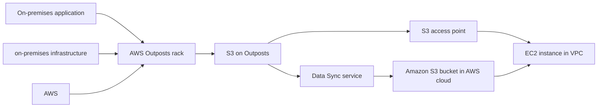

# 65. AWS Outposts

## 🎯 Giới thiệu
- **AWS Outposts** là giải pháp dành cho **hybrid cloud**: doanh nghiệp giữ **on-premises infrastructure** song song với **AWS cloud infrastructure**.
- Mục tiêu của Outposts là mang **AWS infrastructure services, API, và tools** xuống **on-premises data center**, để làm việc gần giống như trong cloud.
- AWS sẽ **đưa rack Outposts đến, cài đặt và quản lý** trong môi trường on-premises của bạn.
- Điểm khác biệt quan trọng:
  - Với AWS cloud, AWS chịu trách nhiệm hạ tầng vật lý.
  - Với **EC2 running on Outposts trong data center của bạn**, bạn chịu trách nhiệm về **physical security** của rack.

## 1. Lợi ích chính của AWS Outposts
- **Low latency** khi truy cập hệ thống on-premises.
- **Local data processing**: dữ liệu có thể không cần rời khỏi on-premises.
- **Data residency**: dữ liệu nằm trong chính data center của bạn.
- Hỗ trợ lộ trình migration:
  - từ **on-premises -> Outposts**
  - sau đó từ **Outposts -> AWS cloud**
- Đây là **fully managed service** do AWS quản lý.
- Các service có thể chạy trên Outposts được nhắc trong transcript:
  - **Amazon EC2**
  - **Amazon EBS**
  - **Amazon S3**
  - **Amazon EKS**
  - **Amazon ECS**
  - **Amazon RDS**
  - **Amazon EMR**

## 2. Ví dụ với Amazon S3 trên Outposts
- Bạn dùng **S3 APIs** để **store** và **retrieve** data **locally** trên **AWS Outposts**.
- Mục đích:
  - giữ dữ liệu gần ứng dụng on-premises
  - giảm **data transfers** lên **AWS regions**
- Có một storage class riêng cho Outposts là **S3 Outposts**.
- Mặc định, encryption scheme trên Outposts là **SSE-S3**.
- Cách truy cập dữ liệu từ Outposts:
  - tạo **S3 access point** trên **S3 on Outposts**
  - từ đó **EC2 instance trong VPC** có thể truy cập qua access point
- Một lựa chọn khác:
  - dùng **data sync service** để đồng bộ dữ liệu lên **Amazon S3 bucket** trên cloud
  - sau đó instance truy cập dữ liệu trực tiếp từ bucket đó

## 3. Luồng hoạt động tổng quan

## 📊 Bảng tóm tắt
| Tiêu chí | Mô tả |
|----------|------|
| Khái niệm | Giải pháp **hybrid cloud** mang AWS services xuống on-premises |
| Thành phần | **Outposts racks** được AWS cài đặt và quản lý |
| Trách nhiệm | Người dùng chịu **physical security** của rack trong data center |
| Lợi ích | **Low latency**, **local data processing**, **data residency**, dễ migrate |
| Tính chất | **Fully managed service** |
| Service hỗ trợ | **EC2, EBS, S3, EKS, ECS, RDS, EMR** |
| S3 trên Outposts | Dùng **S3 APIs**, storage class **S3 Outposts**, mặc định **SSE-S3** |
| Cách truy cập dữ liệu | Qua **S3 access point** hoặc đồng bộ bằng **Data Sync** lên S3 bucket |

## 💡 Mẹo ghi nhớ cho kỳ thi AWS
- Nhớ rằng **Outposts = AWS services on-premises**.
- Từ khóa cần nhớ:
  - **hybrid cloud**
  - **fully managed**
  - **low latency**
  - **data residency**
  - **physical security**
- Với **S3 on Outposts**:
  - dùng **S3 APIs**
  - storage class là **S3 Outposts**
  - encryption mặc định là **SSE-S3**
- Nếu đề bài hỏi về triển khai AWS gần hệ thống nội bộ, cần nghĩ đến **Outposts**.
- Nếu cần truy cập S3 on Outposts từ VPC, nhớ đến **S3 access point**.

## ✅ Kết luận
- **AWS Outposts** giúp doanh nghiệp mở rộng **AWS infrastructure services** xuống **on-premises** mà vẫn giữ trải nghiệm gần giống cloud.
- Đây là giải pháp phù hợp khi cần **low latency**, **data residency**, và triển khai **hybrid cloud**.
- Với S3 trên Outposts, bạn có thể lưu trữ dữ liệu cục bộ, truy cập qua **S3 access point**, hoặc đồng bộ lên **Amazon S3** trong cloud khi cần.
