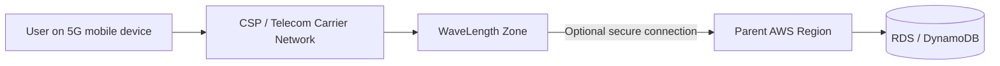

# 66. AWS WaveLength

## 🎯 Giới thiệu
AWS WaveLength là mô hình **infrastructure deployment** được đặt **ngay trong datacenters của telecommunications providers** ở **edge của 5G networks**.

- Mục tiêu chính: đưa application đến rất gần end user để đạt **ultra-low latency**
- Khi thấy đề bài nhắc đến **5G**, khả năng cao đáp án liên quan đến **WaveLength**
- Đây là giải pháp phù hợp cho các use case cần phản hồi cực nhanh ở edge

## 1. WaveLength Zone là gì?
- Là nơi AWS services được triển khai **trực tiếp tại edge** trong mạng 5G của nhà mạng
- Có thể deploy một số dịch vụ như:
  - **EC2 instances**
  - **EBS volumes**
  - **VPC**
- Việc triển khai này diễn ra thông qua **carrier gateway**

## 2. Cách hoạt động và kết nối
- User trên thiết bị di động truy cập ứng dụng ở **WaveLength Zone**
- Vì ứng dụng nằm ngay tại edge nên độ trễ rất thấp
- Traffic trong ví dụ này **không rời khỏi CSP network**
- Tuy nhiên, WaveLength Zone vẫn có thể kết nối an toàn tới **parent region**
- Ví dụ: EC2 trong WaveLength Zone có thể truy cập database như **RDS** hoặc **DynamoDB** ở AWS Region chính

## 3. Use cases tiêu biểu
WaveLength phù hợp cho các bài toán cần **rất gần người dùng** và **độ trễ cực thấp**:

- **Smart Cities**
- **ML-assisted diagnostics**
- **Connected Vehicles**
- **Interactive Live Video Streams**
- **AR and VR**
- **Real-time Gaming**

## 📊 Bảng tóm tắt
| Tiêu chí | Mô tả |
|----------|------|
| Vị trí triển khai | Edge trong datacenters của telecommunications providers |
| Gắn với công nghệ nào | 5G networks |
| Mục tiêu | Ultra-low latency cho application |
| Dịch vụ có thể deploy | EC2, EBS, VPC |
| Kết nối | Có thể kết nối lên parent region khi cần |
| Traffic | Có thể không rời khỏi CSP network |
| Từ khóa thi AWS | 5G, edge, low latency, WaveLength |

## 💡 Mẹo ghi nhớ cho kỳ thi AWS
- Thấy **5G** là nghĩ ngay đến **WaveLength**
- Thấy yêu cầu **ultra-low latency** và **edge deployment** thì WaveLength là ứng viên mạnh
- Nhớ rằng WaveLength chạy **trong mạng của nhà mạng**, không phải kiểu triển khai AWS Region truyền thống
- Nếu câu hỏi nói đến **application ở gần user mobile**, **real-time**, **AR/VR**, **gaming** thì hãy cân nhắc WaveLength

## ✅ Kết luận
AWS WaveLength là giải pháp triển khai application ở **edge của 5G network** để đạt **ultra-low latency**. Nó phù hợp với các use case cần phản hồi cực nhanh và có thể kết nối đến **parent AWS Region** khi cần truy cập dịch vụ như **RDS** hoặc **DynamoDB**.
