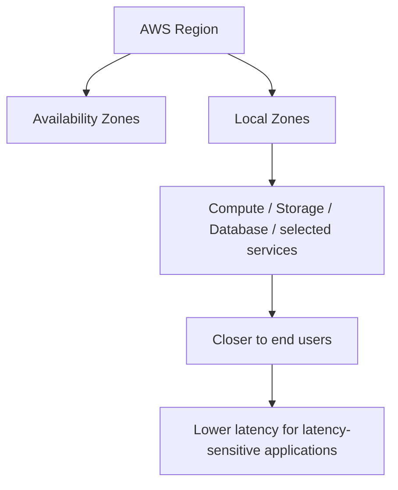
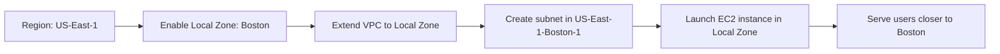

# 67. AWS Local Zones

## 🎯 Giới thiệu
AWS Local Zones là một cách mở rộng `AWS Region` ra gần hơn với người dùng cuối để chạy các ứng dụng nhạy cảm với độ trễ (`latency sensitive applications`).

- Ý tưởng chính: đưa `compute`, `storage`, `database` và một số service được chọn đến gần end users hơn.
- Đây là một phần của hệ thống `Availability Zones` và `Regions`, nhưng được mở rộng thêm bằng các `local zones`.
- Mục tiêu chính trong bài giảng: giảm độ trễ khi phục vụ người dùng ở một khu vực cụ thể.

## 1. Local Zones là gì?
- `Local Zones` là các location bổ sung mà bạn có thể gắn vào một `AWS Region`.
- Chúng giúp mở rộng region ra một hoặc nhiều “zone” bổ sung.
- Trong ví dụ của bài giảng:
  - `US-East-1` có các `AZ` mặc định.
  - Có thể thêm `local zones` như `Boston`, `Chicago`, `Dallas`, `Houston`, `Miami`, ...

### Các service tương thích được nhắc đến
- `EC2`
- `RDS`
- `ECS`
- `EBS`
- `ElastiCache`
- `Direct Connect`
- và các service khác được chọn

## 2. Cách hoạt động
- Bạn bắt đầu từ một `Region`, sau đó bật một `Local Zone` cụ thể.
- `VPC` có thể được mở rộng để đi xuyên qua `AZs` và `Local Zones`.
- Khi đã bật `Local Zone`, bạn có thể launch `EC2 instance` vào zone đó.
- Bài giảng minh họa:
  - `Europe/Ireland` chỉ có các `AZ` mặc định, không có `Local Zone`.
  - `US-East-1` có nhiều lựa chọn hơn, bao gồm `Local Zones` và `Wavelength Zones`.
  - Bật `US-East-1-Boston-1` để phục vụ người dùng ở Boston với độ trễ thấp hơn.

### Luồng triển khai

## 3. Những điểm cần nhớ khi ôn thi
- `Local Zones` dùng để đưa tài nguyên AWS gần end users hơn.
- Phù hợp với `latency sensitive applications`.
- Có thể dùng với `EC2` và nhiều service khác.
- Có thể bật `Local Zone` trong console bằng cách quản lý `zone group`.
- Sau khi bật, bạn có thể tạo `subnet` gắn với `Local Zone` đó.
- Phần cấu hình `subnet` và `CIDR block` trong demo được nói là khá advanced, không cần quá sa đà nếu chỉ ôn phần khái niệm.

## 📊 Bảng tóm tắt
| Tiêu chí | Mô tả |
|----------|------|
| Mục đích | Đưa AWS services gần người dùng cuối hơn |
| Tác dụng chính | Giảm `latency` cho ứng dụng nhạy cảm độ trễ |
| Mô hình | Mở rộng `AWS Region` bằng `Local Zones` |
| Dịch vụ liên quan | `EC2`, `RDS`, `ECS`, `EBS`, `ElastiCache`, `Direct Connect` |
| Cách dùng | Bật `Local Zone`, mở rộng `VPC`, tạo `subnet`, launch resource |
| Điểm thi cần nhớ | `Local Zones` = gần user hơn, phục vụ use case cần độ trễ thấp |

## 💡 Mẹo ghi nhớ cho kỳ thi AWS
- `Local Zones` = **Region mở rộng ra gần người dùng**.
- Gặp cụm từ **`low-latency`** hoặc **`latency sensitive`** thì nghĩ ngay đến `Local Zones`.
- Nếu đề bài nói `EC2` cần chạy gần một thành phố cụ thể, `Local Zones` là keyword quan trọng.
- Nhớ luồng: **Region -> Enable Local Zone -> Extend VPC -> Create subnet -> Launch EC2**.

## ✅ Kết luận
`AWS Local Zones` là cơ chế mở rộng `AWS Region` đến gần end users hơn để hỗ trợ các ứng dụng cần độ trễ thấp. Trong bài giảng, điểm cốt lõi là: bạn có thể bật một `Local Zone`, mở rộng `VPC` vào đó, rồi launch `EC2` instance để phục vụ người dùng gần hơn.
