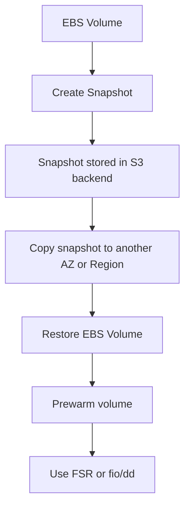

# 68. EBS & Local Instance Store

## 🎯 Giới thiệu
- Bài này so sánh **EBS volumes** với **EC2 instance store**.
- Trọng tâm:
  - EBS là **network drive** và có tính **persistent**
  - EC2 instance store là **physical disk** gắn trực tiếp vào host và là **ephemeral storage**
- Các chủ đề chính:
  - **EBS volume types**
  - **Snapshots, AMI, Fast Snapshot Restore (FSR)**
  - **Amazon Data Lifecycle Manager (DLM), encryption, multi-attach**
  - **EC2 instance store vs EBS**

## 1. EBS Volumes: Khái niệm và đặc tính
- **EBS volumes** là **network drives**
- Mặc định chỉ attach cho **1 EC2 instance tại một thời điểm**
  - Ngoại lệ: **EBS multi-attach**
- EBS gắn với **một specific AZ**
  - Muốn chuyển sang AZ khác thì phải:
    - tạo **snapshot**
    - restore sang AZ mới
- Có thể **resize** volume nhưng chỉ **tăng lên**
  - Không cần detach để tăng size
- Nên chọn **EBS-optimized EC2 instance type** để đạt **maximum throughput**

### Các loại EBS volume
- **gp2, gp3**
  - **General Purpose SSD**
  - Cân bằng **price/performance**
  - Phù hợp đa số workload
- **io1, io2 Block Express**
  - Hiệu năng rất cao
  - **Very high throughput**, **very low latency**
- **st1**
  - **Low-cost HDD**
  - Phù hợp workload **frequently accessed** và **throughput-intensive**
  - Thường là **sequential reads**
- **sc1**
  - **Cold storage**
  - Phù hợp workload **less frequently accessed**

### Thuộc tính EBS quan trọng
- **Size**
- **Throughput**
- **IOPS** = **IO Operations Per Second**

### Boot volumes
- Nếu EBS dùng làm **boot volume** cho OS của EC2 thì chỉ có thể là:
  - **gp2**
  - **gp3**
  - **io1**
  - **io2**

## 2. Snapshots, Restore, DLM, Encryption, Multi-Attach
### Snapshots
- Dùng để **transfer EBS volumes between AZ**
- Là **incremental**
  - Chỉ backup các block đã thay đổi
- Backup snapshot sẽ dùng **IO**
  - Có thể làm giảm performance nếu volume đang bị read nhiều
- Snapshot được lưu ở **S3 backend**
  - Nhưng **không có direct access**
- Không bắt buộc detach volume khi snapshot
  - Nhưng **recommended** để tránh **inconsistent state**
- Có thể **copy snapshot across region**
  - Hữu ích cho **disaster recovery**

### AMI từ snapshot
- Có thể tạo **Amazon Machine Images (AMI)** từ snapshot
- Thường dùng khi **bootstrap application** rồi tạo AMI

### Restore và prewarm
- Khi restore EBS volume lớn, cần **prewarm**
  - Nghĩa là đọc toàn bộ blocks để đạt performance tối đa
- Có 2 cách:
  - **Fast Snapshot Restore (FSR)**
    - AWS đọc toàn bộ snapshot trước
    - Giúp volume restore ra đã được prewarmed
  - Cách cũ:
    - Attach restored volume vào EC2
    - Chạy **fio** hoặc **dd** để đọc toàn bộ volume

### Amazon Data Lifecycle Manager (DLM)
- Dùng để tự động hóa:
  - **creation**
  - **retention**
  - **deletion**
  - của **EBS snapshots** và **EBS-backed AMI**
- Có thể:
  - lên lịch backup
  - copy snapshot giữa accounts
  - xóa backup cũ theo policy
- Dùng **resource tags** để chọn tài nguyên cần backup
  - Ví dụ tag **environment=prod**
- Có thể tag:
  - **EBS volume**
  - hoặc **EC2 instance**
- Hạn chế:
  - Không quản lý được snapshot/AMI tạo **bên ngoài DLM**
  - Không dùng để quản lý **instance-store backed AMIs**

### DLM vs AWS Backup
- **DLM**
  - Dùng khi muốn tự động hóa riêng cho **EBS snapshots**
- **AWS Backup**
  - Dùng để quản lý và giám sát backup của **nhiều AWS services** từ một nơi
- Khác nhau chủ yếu ở:
  - **scope**
  - **ease of management**

### EBS Encryption
- Mặc định **new EBS volumes are not encrypted**
- Có thể bật **account-level setting** để:
  - tự động encrypt **new EBS volumes**
  - tự động encrypt **snapshots**
- Lưu ý:
  - Setting này phải bật theo **per-region basis**

### EBS Multi-Attach
- Chỉ có trên **io1** và **io2**
- Cho phép cùng một **EBS volume** attach vào **multiple EC2 instances**
  - Trong **same AZ**
- Mỗi instance có **full read and write permissions**
- Chỉ phù hợp cho use case đặc biệt:
  - cần **higher application availability**
  - cần quản lý **concurrent write operations**
- File system dùng cho feature này là loại **cluster aware**

### Mermaid: Snapshot & Restore Flow

## 3. EC2 Instance Store: Đặc tính và so sánh với EBS
### EC2 Instance Store là gì
- Không phải **network disk**
- Là **physical disk** gắn trực tiếp vào physical server của EC2
- Vì gắn trực tiếp nên có:
  - **very high IOPS**
  - **high read/write performance**
- Vẫn là **block storage**
  - nhưng khác EBS ở chỗ:
    - **EBS** = network drive
    - **Instance store** = physical device

### Đặc tính của instance store
- Có thể có size lớn, ví dụ:
  - đến khoảng **7.5 TB**
  - nếu striping song song có thể tới **60 TB**
- **Cannot be increased in size**
- Nếu EC2 instance:
  - **fails**
  - hoặc **shut down**
  - thì dữ liệu sẽ mất
- Là **ephemeral storage**

### Khi nào nên dùng
- Rất tốt cho:
  - **buffer**
  - **cache**
  - **scratch data**
  - **temporary content**
- Nếu **reboot** EC2 instance thì dữ liệu vẫn còn
- Nếu **stop** hoặc **terminate** thì dữ liệu bị mất
- Vì là ephemeral nên cần có cơ chế **backup** nếu muốn giữ dữ liệu

### So sánh nhanh với EBS
| Tiêu chí | EBS | EC2 Instance Store |
|----------|-----|--------------------|
| Loại storage | Network drive | Physical disk |
| Tính chất | Persistent | Ephemeral |
| Resize | Có thể tăng size | Không thể resize |
| Mất dữ liệu khi instance dừng/terminate | Không | Có |
| Hiệu năng IOPS | Cao, tùy type | Rất cao, có thể lên đến millions |
| Use case | OS disk, data lâu dài | cache, buffer, temporary data |

## 📊 Bảng tóm tắt
| Tiêu chí | Mô tả |
|----------|------|
| EBS | Network drive, attach 1 instance một lúc, persistent |
| AZ scope | EBS gắn với specific AZ |
| Volume types | gp2/gp3, io1/io2, st1, sc1 |
| Boot volume | Chỉ gp2, gp3, io1, io2 |
| Snapshots | Incremental, lưu ở S3 backend, copy được cross-AZ/cross-region |
| FSR | Prewarm snapshot trước khi restore |
| DLM | Tự động tạo, giữ, xóa snapshot và EBS-backed AMI |
| Encryption | Có thể bật mặc định ở account level theo từng region |
| Multi-Attach | io1/io2, cùng volume attach nhiều EC2 trong same AZ |
| Instance Store | Physical disk, ephemeral, hiệu năng rất cao nhưng mất dữ liệu khi stop/terminate |

## 💡 Mẹo ghi nhớ cho kỳ thi AWS
- **EBS = Network + Persistent**
- **Instance Store = Physical + Ephemeral**
- **Snapshot = Incremental + S3 backend**
- **FSR = Fast Snapshot Restore để prewarm**
- **DLM = automate EBS snapshot/AMI lifecycle**
- **Multi-Attach = io1/io2 only**
- **Boot volume = gp2/gp3/io1/io2**
- Khi thấy câu hỏi về:
  - **data lâu dài** → nghĩ tới **EBS**
  - **cache / scratch / temporary** → nghĩ tới **Instance Store**
  - **backup tự động cho EBS** → nghĩ tới **DLM**
  - **restore nhanh snapshot lớn** → nghĩ tới **FSR**

## ✅ Kết luận
- **EBS** phù hợp khi cần **persistent storage**, backup, snapshot, resize và dùng cho OS/data lâu dài.
- **EC2 instance store** phù hợp khi cần **IO rất cao** cho dữ liệu tạm thời, chấp nhận mất dữ liệu khi instance dừng hoặc terminate.
- Với bài thi AWS, hãy nhớ kỹ các điểm phân biệt về **network vs physical**, **persistent vs ephemeral**, và các feature như **snapshot, FSR, DLM, encryption, multi-attach**.
