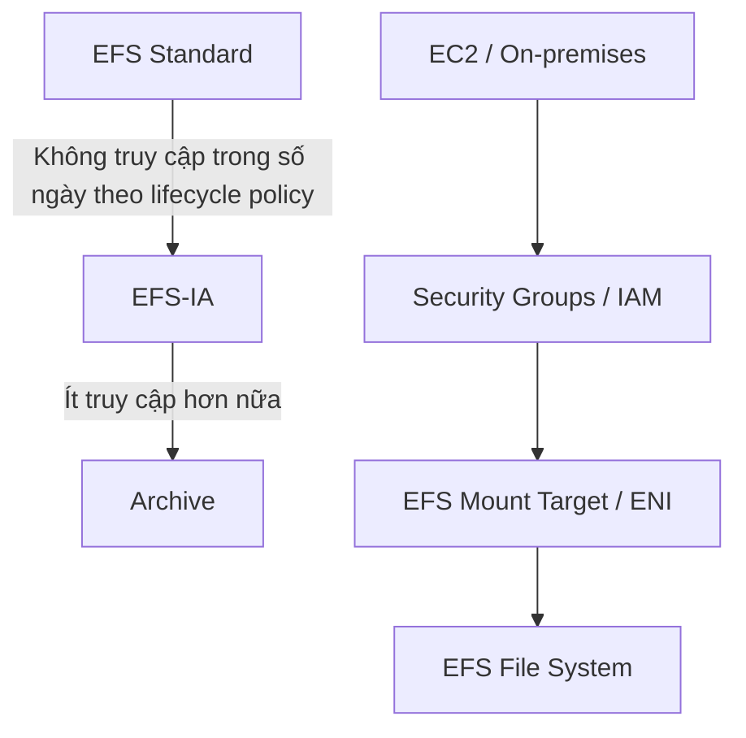

# 69. Amazon EFS

## 🎯 Giới thiệu
- **Amazon EFS (Elastic File System)** là một **managed network file system / NFS**.
- Điểm mạnh chính:
  - Có thể **mount trên nhiều EC2 instances cùng lúc**.
  - Hỗ trợ các EC2 nằm trong **cùng Region nhưng khác Availability Zones (AZs)**.
  - Cũng có thể dùng cho **on-premises servers** nếu kết nối AWS bằng **Direct Connect** hoặc **VPN**.
- EFS có đặc tính:
  - **Highly available**
  - **Scalable**
  - Tính phí theo **gigabyte used**
- So với **EBS**:
  - EFS: trả tiền theo **usage**
  - EBS: trả tiền theo **provisioned capacity**
- EFS là **POSIX-compliant**, có **standard file API**, phù hợp với **Linux**.
- **Windows does not work with EFS**.
- EFS dùng **NFSv4.1 protocol**.
- Để kiểm soát truy cập:
  - Dùng **security groups**
  - Có **encryption at rest using KMS**
  - Có thể gắn vào **one VPC**
  - Mỗi AZ có **one mount target / one ENI**

## 1. Kiến trúc, kết nối và use cases
- EFS phù hợp cho:
  - **Content management**
  - **Web data serving**
  - **Data sharing**
  - **WordPress**
- EC2 ở nhiều AZ có thể cùng mount một EFS nếu **security groups** được cấu hình đúng.
- Với **on-premises servers**:
  - Cần kết nối với AWS qua **Direct Connect** hoặc **VPN**
  - Khi mount EFS, server on-premises cần dùng **IPv4 của ENI**
  - **Không dùng DNS** cho on-premises mounting
- EFS có thể kết hợp với:
  - **VPC peering**
  - **Direct Connect**
  - **site-to-site VPN**
- EFS có các **ENIs redundant across multiple AZs**.

## 2. Performance, throughput và storage classes
- EFS có khả năng mở rộng:
  - **Thousands of concurrent NFS clients**
  - **10 gigabytes+ throughput**
  - Tăng tới **Petabyte-scale** tự động
- **Performance mode** được chọn khi tạo EFS:
  - **General Purpose**: mặc định, phù hợp cho **latency-sensitive use cases** như web server, CMS
  - **Max I/O**: latency cao hơn nhưng **higher throughput**, **highly parallel**, phù hợp cho **big data** hoặc **media processing**
- **Throughput mode**:
  - **Bursting**
    - Throughput tăng theo dung lượng storage
  - **Provisioned**
    - Tách throughput khỏi storage size
    - Có thể set throughput cố định независимо dung lượng
  - **Elastic**
    - Tự động scale up/down theo workload
    - Phù hợp với **unpredictable workloads**
- **Storage classes / tiers**:
  - **Standard**: dữ liệu truy cập thường xuyên
  - **EFS-IA**: truy cập không thường xuyên, **storage rẻ hơn** nhưng **có phí retrieve**
  - **Archive**: dữ liệu rất hiếm khi truy cập
- **Lifecycle policies**:
  - Tự động chuyển file giữa các tier sau một số ngày
  - Ví dụ: file không được truy cập trong **60 days** có thể chuyển từ **Standard** sang **EFS-IA**
- **Availability / durability**:
  - **Standard**: phù hợp cho **multi-AZ**, tốt cho production workloads
  - **One Zone**: chỉ dùng **one AZ**, phù hợp cho development hoặc chi phí thấp hơn
  - Có cả **One Zone-IA**
- Dùng đúng storage class có thể đạt tới **90% cost savings**

### Mermaid: lifecycle và access flow

## 3. Security, Access Points và DR
- **Access Points** giúp:
  - Quản lý application access dễ hơn
  - Tăng security cho NFS environments
- Với Access Points, có thể:
  - Định nghĩa **user** và **group** trên POSIX file system
  - Giới hạn truy cập vào **một directory cụ thể**
  - Chỉ định **different root directory**
- Truy cập Access Point có thể bị giới hạn bằng **IAM policies**
- Ví dụ trong transcript:
  - Một Access Point với **UID 1001 / GID 1001** và path là `/config` chỉ cho phép truy cập vào thư mục **config**
  - Một Access Point khác với **UID 1002 / GID 1002** chỉ cho phép truy cập vào **data folder**
- EFS cũng có **file system policies**:
  - Tương tự **S3 bucket policies**
  - Là **resource-based policies**
  - Mặc định là **full access to all clients**
  - Có thể giới hạn quyền như chỉ cho **mount** và **write**
  - Có thể bắt buộc **secure transport**
- **Cross-region replication**:
  - Replicate dữ liệu từ một EFS file system sang **another AWS Region**
  - Áp dụng cho **existing** và **new file systems**
  - Ví dụ: từ **us-east-1** sang **eu-west-2**
  - Cung cấp **RPO/RTO of minutes**
  - **Không ảnh hưởng provisioned throughput**
  - Chạy ở backend
- Use case của cross-region replication:
  - **Compliance**
  - **Business continuity**
  - **Disaster recovery** với file system bản sao ở region khác

## 📊 Bảng tóm tắt
| Tiêu chí | Mô tả |
|----------|------|
| Loại dịch vụ | Managed network file system / NFS |
| Đối tượng sử dụng | Nhiều EC2 instances, on-premises servers |
| Hệ điều hành phù hợp | Linux, POSIX-compliant |
| Không hỗ trợ | Windows |
| Protocol | NFSv4.1 |
| Bảo mật | Security groups, IAM, file system policies, KMS encryption at rest |
| Mount target | One ENI per AZ |
| Performance mode | General Purpose, Max I/O |
| Throughput mode | Bursting, Provisioned, Elastic |
| Storage tiers | Standard, EFS-IA, Archive |
| Availability | Standard multi-AZ, One Zone, One Zone-IA |
| Quản lý truy cập | EFS Access Points |
| DR | Cross-region replication |
| Tính phí | Theo gigabyte used |

## 💡 Mẹo ghi nhớ cho kỳ thi AWS
- **EFS = NFS cho EC2**, nhớ điểm mấu chốt là **mount nhiều instances cùng lúc**.
- **EFS = Linux / POSIX**, nên **Windows không dùng được**.
- **EFS dùng security groups**, không phải kiểu storage gắn trực tiếp như EBS.
- **General Purpose** cho latency-sensitive, **Max I/O** cho throughput cao và parallel workloads.
- **Bursting / Provisioned / Elastic** là 3 kiểu **throughput mode** cần phân biệt rõ.
- **Standard / EFS-IA / Archive** là các **storage tiers** gắn với **lifecycle policies**.
- **One Zone** là lựa chọn rẻ hơn cho nhu cầu không cần multi-AZ.
- **Access Points + IAM policies** là phần rất dễ ra thi: giới hạn user/group và directory.
- **Cross-region replication** phục vụ **compliance** và **business continuity**, với **RPO/RTO of minutes**.

## ✅ Kết luận
- Amazon EFS là dịch vụ **shared file storage** được quản lý hoàn toàn, tối ưu cho **EC2 nhiều AZ** và cả **on-premises** khi kết nối qua **Direct Connect/VPN**.
- Điểm cần nhớ nhất để ôn thi:
  - **NFSv4.1**
  - **Linux / POSIX**
  - **Security groups + KMS**
  - **Performance modes**
  - **Throughput modes**
  - **Storage tiers + lifecycle policies**
  - **Access Points + IAM**
  - **Cross-region replication**
