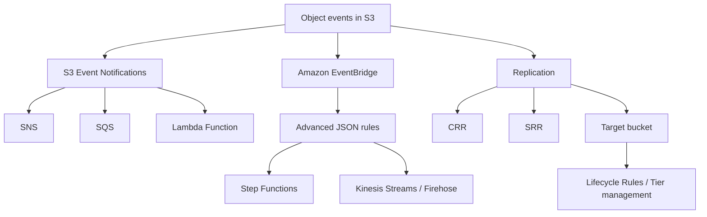

# 70. Amazon S3

## 🎯 Giới thiệu
Amazon S3 là dịch vụ **object storage** dạng **serverless**, có:
- **Unlimited storage**
- **Pay as you go**
- Phù hợp với **static content**

Cách truy cập object là qua **key**. S3:
- **Không có indexing facility**  
- **Không phải file system**
- **Không mount native được trên EC2**

Nếu cần indexing, transcript gợi ý dùng **DynamoDB**.

## 1. 🧱 Bản chất và các anti-pattern
S3 rất mạnh, nhưng **không phù hợp** cho các trường hợp sau:
- Nhiều **small files**
- Cần **POSIX file system** → dùng **EFS**
- Cần **file locking**
- Cần **search feature** hoặc **queries**
- Cần **rapidly sharing data**
- Website có nhiều **dynamic content**

### S3 Storage Classes
Các storage class được nhắc đến:
- **Standard**
- **Intelligent-Tiering**
- **Standard-IA**
- **One Zone-IA**
- **Glacier Instant Retrieval**
- **Glacier Flexible Retrieval**
- **Glacier Deep Archive**

Bạn có thể **transition objects** giữa các tier hoặc **delete** bằng **S3 Lifecycle Policies**.

## 2. 🔁 Replication, Event Notifications và EventBridge
### S3 Replication
Replication của S3:
- Cần bật **versioning** trên bucket
- Có 2 loại:
  - **CRR** = Cross Region Replication
  - **SRR** = Same Region Replication

Ý chính:
- Object trong một bucket có thể được replicate sang bucket khác rất nhanh
- Có thể kết hợp với **Lifecycle Rules** ở **target bucket**
- **Default replication không tính đến tiers**
  - Vì vậy tiers và Lifecycle Rules phải được quản lý trực tiếp ở target bucket

Lợi ích:
- Giảm **latency** khi truy cập dữ liệu global
- Hỗ trợ **disaster recovery**
- Hỗ trợ **security**

### S3 Replication Time Control (S3 RTC)
- Đảm bảo đa số object được replicate trong **seconds**
- **99.99%** object được replicate trong **15 minutes**
- Nếu có object vượt quá ngưỡng 15 phút:
  - sẽ có **alarm**
  - dựa trên **CloudWatch Alarm** và **metric**

Phù hợp cho nhu cầu:
- **compliance**
- **digital recovery**

### S3 Event Notifications
S3 có thể phản ứng với các event như:
- **S3:ObjectCreated**
- **S3:ObjectRemoved**
- **S3:ObjectRestore**
- **S3:Replication**

Đặc điểm:
- Có thể filter theo **object name**  
- Ví dụ use case: tự động tạo **thumbnails** cho ảnh upload lên S3
- Notification thường đến trong **seconds**, đôi khi mất **1 minute hoặc lâu hơn**
- Có thể trigger:
  - **SNS**
  - **SQS**
  - **Lambda Function**

### EventBridge enhancement
S3 Event Notifications có thể tích hợp với **Amazon EventBridge**:
- Toàn bộ S3 events có thể được share sang EventBridge
- Cho phép rule phức tạp hơn
- Có thể gửi đến hơn **18 AWS service destinations**
- Hỗ trợ:
  - **advanced filtering** bằng **JSON rules**
  - filter theo **metadata**, **object size**, **object name**
  - **multiple destinations** cho một rule
  - gửi sang **Step Functions**
  - gửi trực tiếp vào **Kinesis Streams** hoặc **Firehose**
- Tăng:
  - **visibility** qua archive
  - khả năng **replay events**
  - độ **reliable delivery**

### Mermaid: Event / Replication Flow

## 3. ⚡ Performance, Multipart Upload và Lifecycle cleanup
### Baseline performance
Mặc định, S3:
- Tự động scale đến **high request rate**
- Độ trễ lấy byte đầu tiên khoảng **100-200 ms**

Mỗi **prefix** trong bucket có thể đạt tối thiểu:
- **3,500 PUT/COPY/POST/DELETE per second**
- **5,500 GET/HEAD per second**

### Prefix là gì?
Transcript giải thích prefix theo đường dẫn object:
- `bucket/folder1/sub1/file` → prefix: `/folder1/sub1/`
- `bucket/folder1/sub2/file` → prefix: `/folder1/sub2/`
- Nếu file nằm trong directory number one → prefix là `one`
- Nếu file nằm trong prefix number two → prefix là `two`

Ý nghĩa:
- Nếu chia tải đọc/ghi ra nhiều prefix khác nhau, hiệu năng sẽ tăng
- Ví dụ 4 prefix có thể đạt **22,000 GET/HEAD requests per second** nếu phân phối đều

### Multi-Part Upload
Khuyến nghị:
- Dùng cho file **over 100 MB**
- **Bắt buộc** cho file **over 5 GB**

Cách hoạt động:
- Chia file lớn thành nhiều part
- Upload **parallel**
- Nếu một part lỗi, chỉ cần retry part đó
- Khi hoàn tất, S3 sẽ reconstruct file từ các parts

### S3 Transfer Acceleration
Mục tiêu:
- Tăng tốc upload bằng cách gửi file trước đến **AWS edge location**
- Sau đó edge location chuyển data đến S3 bucket ở target region qua **AWS internal network**

Điểm đáng nhớ:
- Dùng tốt cho upload xuyên vùng xa
- Có thể kết hợp với **Multi-Part Upload**

### S3 Byte-Range Fetches
Dùng cho download:
- Chia file thành các **byte ranges**
- Thực hiện nhiều GET song song theo range

Lợi ích:
- Tăng tốc download
- Tăng resilience khi một request fail
- Có thể lấy **partial data**
- Ví dụ: lấy **header** hoặc vài byte đầu của file để tiết kiệm cost và bandwidth

### Lifecycle cho incomplete multipart uploads
Nếu Multi-Part Upload bị bỏ dở:
- Có thể còn các part “treo” trong bucket
- Dùng **S3 Lifecycle Policy** để:
  - nếu upload bị abort và parts không được chạm tới trong ví dụ **7 days**
  - thì **abort Multi-Part Upload**
  - và **delete** các parts

Transcript cũng nhắc có thể dùng **CLI API call** để list và complete Multi-Part Uploads.

## 📊 Bảng tóm tắt
| Tiêu chí | Mô tả |
|----------|------|
| Loại dịch vụ | **Object storage**, **serverless** |
| Tính phí | **Pay as you go** |
| Khả năng lưu trữ | **Unlimited storage** |
| Truy cập object | Qua **key** |
| Không phù hợp | Nhiều small files, POSIX file system, file locking, search/queries, dynamic content |
| File system thay thế | **EFS** cho POSIX |
| Indexing | Có thể dùng **DynamoDB** |
| Storage classes | Standard, Intelligent-Tiering, Standard-IA, One Zone-IA, Glacier tiers |
| Replication | Cần **versioning**, gồm **CRR** và **SRR** |
| RTC | **99.99%** object replicate trong **15 minutes** |
| Notifications | **SNS**, **SQS**, **Lambda**, hoặc **EventBridge** |
| Performance theo prefix | 3,500 PUT/COPY/POST/DELETE và 5,500 GET/HEAD mỗi prefix |
| Upload tối ưu | **Multi-Part Upload**, **Transfer Acceleration** |
| Download tối ưu | **Byte-Range Fetches** |
| Cleanup | **Lifecycle Policy** để abort incomplete multipart upload |

## 💡 Mẹo ghi nhớ cho kỳ thi AWS
- **S3 = object storage, không phải file system**
- **Không dùng S3 cho POSIX, file locking, search**
- Muốn replication thì nhớ: **versioning first**
- **CRR** = cross region, **SRR** = same region
- **S3 RTC** = mục tiêu **15 minutes** cho 99.99% object
- Muốn event linh hoạt hơn thì nhớ **EventBridge**
- Muốn tăng throughput thì nhớ **prefix**
- File lớn:
  - > **100 MB**: nên dùng **Multi-Part Upload**
  - > **5 GB**: phải dùng **Multi-Part Upload**
- Download một phần file thì nghĩ đến **Byte-Range Fetches**
- Upload xa region thì nghĩ đến **Transfer Acceleration**

## ✅ Kết luận
Amazon S3 là dịch vụ **object storage** serverless rất mạnh cho static content, replication, event-driven integration và tối ưu hiệu năng theo prefix. Khi ôn thi, cần nhớ rõ các điểm: **not a file system**, **versioning for replication**, **EventBridge enhancement**, **Multi-Part Upload**, **Transfer Acceleration**, và **Byte-Range Fetches**.
