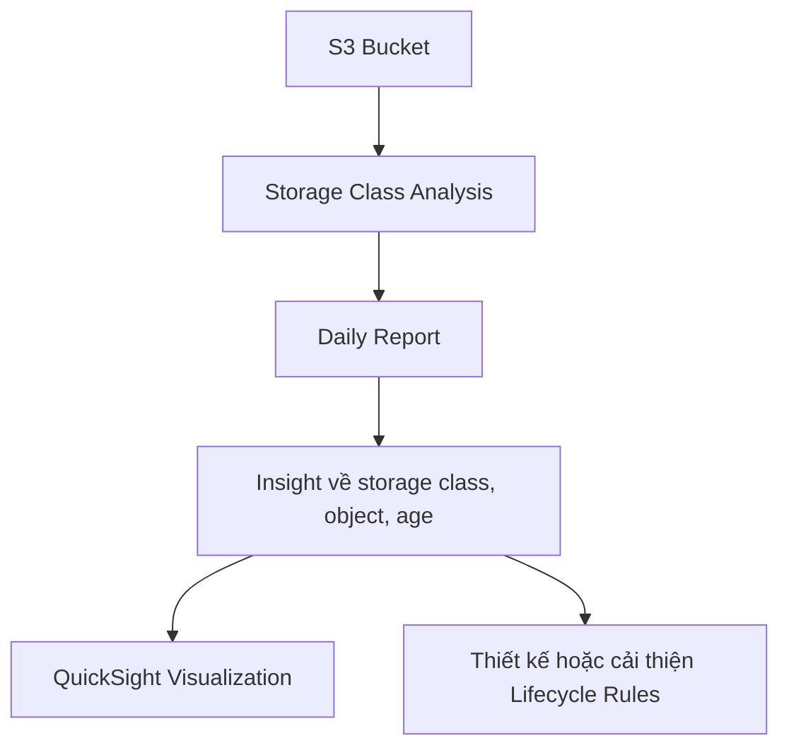

# 71. Amazon S3 - Storage Class Analysis

## 🎯 Giới thiệu
- `Storage Class Analysis` là một feature trong `Amazon S3`.
- Trong kỳ thi, có thể xuất hiện với tên ngắn là `Storage Class Analysis`.
- Mục đích chính:
  - Giúp quyết định khi nào nên `transition` objects sang storage class phù hợp.
  - Hỗ trợ tối ưu `Lifecycle Rules`.

## 1. Storage Class Analysis hoạt động như thế nào
- Feature này cung cấp recommendation để chuyển dữ liệu giữa:
  - `Standard`
  - `Standard IA`
- Không áp dụng cho:
  - `One-Zone IA`
  - `Glacier`
- Report được cập nhật hằng ngày.
- Có thể mất khoảng `24 to 48 hours` để bắt đầu thấy dữ liệu phân tích trong S3 bucket.

## 2. Kết quả và trực quan hóa
- Sau một thời gian, S3 sẽ tạo report để cung cấp insight về:
  - storage class nào đang được dùng
  - object nào nằm ở đâu trong bucket
  - `age` của objects, và các thông tin tương tự
- Dữ liệu này có thể được visualize trong `Amazon QuickSight`.
- `QuickSight` có tích hợp với dataset này.

## 3. Ý nghĩa trong thực tế ôn thi
- `Storage Class Analysis` là bước khởi đầu tốt để:
  - xây dựng `Lifecycle Rules`
  - cải thiện các rule hiện có
  - tìm ra `sweet spot` cho việc transition dữ liệu

## 🔁 Mermaid Flow

## 📊 Bảng tóm tắt
| Tiêu chí | Mô tả |
|----------|------|
| Tên gọi trong exam | `Storage Class Analysis` |
| Mục đích | Gợi ý thời điểm `transition` objects sang storage class phù hợp |
| Storage class được hỗ trợ | `Standard`, `Standard IA` |
| Không hỗ trợ | `One-Zone IA`, `Glacier` |
| Tần suất cập nhật | Hằng ngày |
| Thời gian bắt đầu thấy dữ liệu | Khoảng `24 to 48 hours` |
| Tích hợp trực quan hóa | `Amazon QuickSight` |
| Giá trị thực tiễn | Hỗ trợ xây dựng và tối ưu `Lifecycle Rules` |

## 💡 Mẹo ghi nhớ cho kỳ thi AWS
- Nhớ cặp chính: `Storage Class Analysis` = công cụ để quyết định `transition`.
- Chỉ dùng cho `Standard` và `Standard IA`.
- Không nhầm với `One-Zone IA` và `Glacier` vì không được hỗ trợ.
- Nếu thấy câu hỏi về báo cáo phân tích để tối ưu `Lifecycle Rules`, nghĩ ngay đến `Storage Class Analysis`.
- Dữ liệu không xuất hiện ngay lập tức, cần chờ `24 to 48 hours`.

## ✅ Kết luận
- `Amazon S3 Storage Class Analysis` giúp phân tích mức sử dụng storage class trong bucket và đưa ra recommendation để tối ưu việc chuyển đổi dữ liệu.
- Đây là công cụ hữu ích để thiết kế hoặc cải thiện `Lifecycle Rules`, đặc biệt khi kết hợp với `QuickSight` để trực quan hóa dữ liệu.
