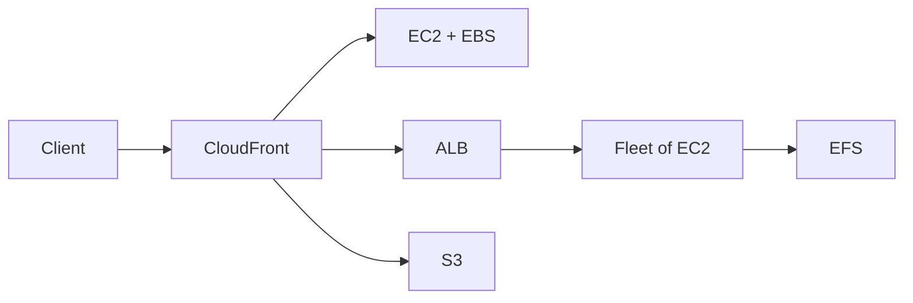
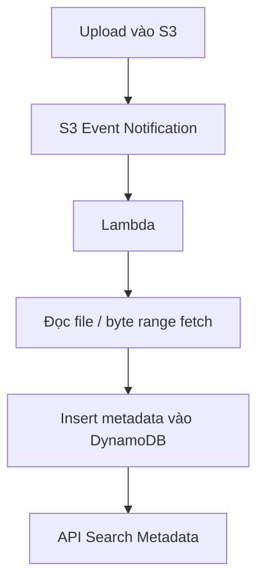
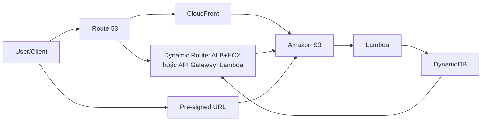

# 73. S3 Solution Architecture

## 🎯 Giới thiệu
Bài này nói về cách thiết kế **solution architecture với Amazon S3** trong các tình huống thực tế, đặc biệt là:
- Cách **expose static objects** cho client
- Cách **search/index** dữ liệu trong S3
- Cách **tách dynamic content và static content** để tối ưu kiến trúc

Trọng tâm của bài là: **S3 rất phù hợp cho static content**, còn **DynamoDB + Lambda** thường được dùng để hỗ trợ việc index và truy xuất metadata.

## 1. Kiến trúc phục vụ static objects trong S3
Có nhiều cách để phục vụ static objects, từ đơn giản đến tối ưu hơn:

- **Cách đơn giản nhất**:
  - Dùng một **public EC2 instance**
  - Dữ liệu lưu trên **EBS** hoặc **instance store**
  - Ưu điểm: rẻ, hoạt động được
  - Nhược điểm: **không scale tốt**, **không highly available**

- **Cách global hơn**:
  - Đặt **CloudFront** phía trước **EC2 + EBS**
  - CloudFront cache dữ liệu trên **global edge network**
  - Giúp client ở nhiều khu vực truy cập gần hơn
  - Tuy nhiên nếu **EC2 fail** và nội dung **không có trong cache**, CloudFront sẽ báo unavailable

- **Kiến trúc đầy đủ hơn**:
  - **CloudFront → Application Load Balancer → fleet of EC2 instances**
  - Các EC2 instance cần dùng chung dữ liệu
  - **EBS không phù hợp** trong case này
  - Dùng **EFS** như một **network file system**
  - EFS được mô tả là:
    - **POSIX compliant**
    - Chỉ dùng cho **Linux**
    - **Scale tốt**
  - Nhưng kiến trúc này được nhắc là **khá expensive**

- **Cách được xem là rất tốt cho static content**:
  - **CloudFront trực tiếp phía trước S3**
  - Phù hợp khi:
    - Static objects trong S3 khá lớn
    - Không cần cập nhật thường xuyên
  - Đây là cách được nhấn mạnh là **preferred way** trong bài

## 2. Index object trong S3 bằng DynamoDB
Một điểm quan trọng: **S3 không có indexing facility**, nên **không thể search trực tiếp trong bucket để tìm object**.

Cách làm được đề xuất:
- Khi có **write vào S3**
- **S3 event notifications** kích hoạt **Lambda**
- Lambda:
  - Đọc một phần file hoặc toàn bộ file
  - Thường dùng **byte range fetch** để đọc một phần
  - Sau đó insert **metadata / information** vào **DynamoDB table**

Lợi ích:
- Có thể tạo **API** để search metadata
- Có thể search theo:
  - **date**
  - **total search used by a customer**
  - **attribute**
  - **date range**
- **DynamoDB + Lambda** được mô tả là một combo rất tốt để hỗ trợ search cho S3

## 3. Tách dynamic content và static content
Một best practice được nhấn mạnh là **separate dynamic content from static content**.

### Dynamic content
- Đi qua **Route 53** để được redirect tới route động
- Có thể là:
  - **ALB + EC2**
  - **API Gateway + Lambda**
  - Tùy architecture cụ thể
- Đặc điểm:
  - Có thể có **little to no caching**
  - Phục vụ dữ liệu **fresh**, **small data**
- Có thể dùng:
  - **DynamoDB** làm database layer
  - **DynamoDB** làm caching/session layer

### Static content
- Đi qua **CDN layer** như **CloudFront**
- Mục tiêu:
  - Cache ở **edge**
  - **Save cost**
  - **Improve performance**
- Phù hợp cho:
  - **HTML files**
  - **big files**
  - **videos**
- Static content nên được lưu ở tầng **scale rất tốt**, như **Amazon S3**

### Mối liên hệ giữa dynamic và static
- Dynamic content có thể **upload file trực tiếp lên S3**
- Lambda có thể phản ứng với **S3 bucket changes**
- Lambda có thể **index data vào DynamoDB**
- DynamoDB này có thể hỗ trợ lại cho **dynamic route**

### Truy cập S3
- Không nhất thiết phải đi qua **CloudFront** để vào S3
- Nếu **không set up OAI**
- Có thể dùng **pre-signed URL** để truy cập S3 trực tiếp
- Điều này hữu ích khi cần:
  - Upload file hiệu quả hơn
  - Download file nhanh hơn
  - Không cần proxy trung gian

## 📊 Bảng tóm tắt
| Tiêu chí | Mô tả |
|----------|------|
| Static objects | Có nhiều cách phục vụ: EC2+EBS, CloudFront+EC2, CloudFront+ALB+EC2+EFS, hoặc CloudFront trực tiếp với S3 |
| Khả năng scale | CloudFront + S3 là hướng rất tốt cho static content lớn và ít thay đổi |
| Search trong S3 | S3 không có indexing facility, nên cần index ra DynamoDB |
| Event processing | S3 event notifications có thể trigger Lambda để đọc file và ghi metadata vào DynamoDB |
| Dynamic vs static | Nên tách rõ: dynamic đi qua route động, static đi qua CDN như CloudFront |
| Truy cập S3 | Có thể dùng pre-signed URL nếu không đi qua CloudFront/OAI |

## 💡 Mẹo ghi nhớ cho kỳ thi AWS
- **S3 không search được trực tiếp** → muốn search thì **index sang DynamoDB**
- **S3 + CloudFront** là combo rất hợp cho **static content**
- **CloudFront + EC2/EBS** chỉ là một bước cải thiện, nhưng chưa hoàn hảo nếu backend fail
- **EFS** dùng khi nhiều EC2 cần **share files**
- **Dynamic content** thường đi qua **Route 53 → ALB/EC2** hoặc **API Gateway + Lambda**
- **Static content** nên được cache qua **CloudFront** và lưu ở **S3**
- **Pre-signed URL** là cách truy cập trực tiếp S3 khi không cần đi qua CloudFront
- **Lambda + S3 event + DynamoDB** là pattern quan trọng để hỗ trợ index/search metadata

## ✅ Kết luận
Kiến trúc S3 trong bài này xoay quanh 3 ý chính:
- Chọn đúng cách phục vụ **static objects** tùy yêu cầu scale và availability
- Dùng **Lambda + DynamoDB** để bù cho việc S3 **không có indexing**
- Luôn cân nhắc **tách dynamic content và static content** để tối ưu hiệu năng, chi phí và kiến trúc

Điểm cần nhớ nhất: **CloudFront + S3** rất mạnh cho static content, còn **DynamoDB + Lambda** giúp biến S3 thành hệ thống dễ search và dễ mở rộng hơn.
