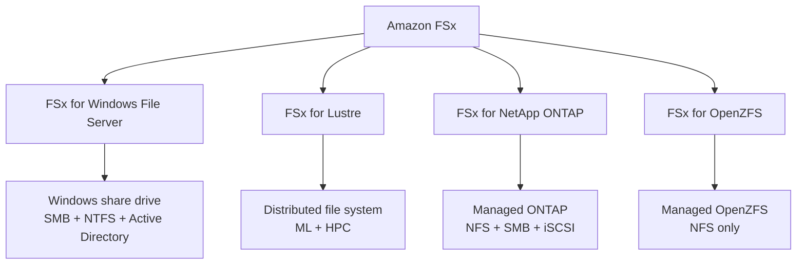

# 74. Amazon FSx

## 🎯 Giới thiệu
- **Amazon FSx** là dịch vụ **fully managed** để chạy các **third-party high-performance file systems** trên AWS.
- Có thể hiểu đơn giản: nếu **RDS** là dịch vụ managed cho database, thì **FSx** là dịch vụ managed cho **file system**.
- Trong bài này cần nắm 4 loại chính:
  - **FSx for Windows File Server**
  - **FSx for Lustre**
  - **FSx for NetApp ONTAP**
  - **FSx for OpenZFS**

## 1. FSx for Windows File Server 🪟
- Là **fully managed Windows File Server share drive**.
- Hỗ trợ:
  - **SMB protocol**
  - **Windows NTFS**
  - **Microsoft Active Directory** để quản lý security cho user
  - **ACLs**
  - **user quotas**
- Điểm cần nhớ:
  - Dù dành cho Windows, vẫn có thể **mount trên Linux EC2 instances**.
  - Có thể dùng **Microsoft DFS (Distributed File System)** để nối FSx với **on-premises Windows File Server**.
- Hiệu năng:
  - Scale tới **tens of GB/s**
  - **millions of IOPS**
  - **hundreds of petabytes**
- Storage:
  - **SSD**: workload cần latency thấp như databases, media processing, data analytics
  - **HDD**: rẻ hơn, phù hợp workload rộng hơn như home directory hoặc CMS
- Kết nối và HA:
  - Có thể truy cập từ **on-premises** qua **private connection**
  - Có thể cấu hình **Multi-AZ** để tăng availability
- Backup:
  - **Daily backup to Amazon S3** để phục vụ disaster recovery

## 2. FSx for Lustre ⚡
- **Lustre** = distributed file system cho **large-scale computing**.
- Keyword quan trọng để nhận ra use case:
  - **machine learning**
  - **high-performance computing (HPC)**
- Ví dụ workload:
  - video processing
  - financial modeling
  - electronic design automation
- Hiệu năng:
  - Scale tới **hundreds of GB/s**
  - **millions of IOPS**
  - **sub-millisecond latency**
- Storage:
  - **SSD**: low latency, IOPS-intensive, small/random file operations
  - **HDD**: throughput-intensive, large/sequential file operations
  - **SSD đắt hơn HDD**
- Tích hợp với **Amazon S3**:
  - Có thể **read S3 as a file system through FSx**
  - Có thể **write output từ FSx back to S3**
- Có thể dùng từ **on-premises servers** qua **VPN** hoặc **Direct Connect**

### Deployment options của FSx for Lustre
- **Scratch file system**
  - Dùng cho **temporary storage**
  - **Không replicate data**
  - Nếu underlying server fail, có thể mất file
  - Đổi lại có **very high burst**
  - **6x performance** so với persistent file system
  - Ví dụ throughput: **200 MB/s per TB**
  - Phù hợp **short-term processing** và tối ưu cost
  - Có thể có **optional S3 buckets** làm data repository
- **Persistent file system**
  - Dùng cho **long-term storage**
  - Data được **replicated within the same AZ**
  - Nếu underlying server fail, file được thay thế **transparently within minutes**
  - Phù hợp **long-term processing** và **storage of sensitive data**
  - FSx for Lustre vẫn chỉ nằm trong **one single AZ**

## 3. FSx for NetApp ONTAP 🗂️
- Là **managed NetApp ONTAP file system** trên AWS.
- Hỗ trợ protocol:
  - **NFS**
  - **SMB**
  - **iSCSI**
- Use case chính:
  - Migrate workloads đang chạy trên **ONTAP**
  - Hoặc trên **NAS on-premises** lên AWS
- Broad compatibility:
  - **Linux**
  - **Windows**
  - **macOS**
  - **VMware Cloud on AWS**
  - **WorkSpaces**
  - **AppStream**
  - **EC2**
  - **ECS**
  - **EKS**
- Tính năng nổi bật:
  - **Auto-scaling**: storage tự shrink/grow
  - **Replication**
  - **Snapshots**
  - **Data compression**
  - **Data de-duplication**
  - **Point-in-time instantaneous cloning**
- Điểm thi cần nhớ:
  - Rất hợp khi cần **clone nhanh** để test workload hoặc tạo **staging file system**

## 4. FSx for OpenZFS 🧬
- Là **managed OpenZFS file system** trên AWS.
- Chỉ hỗ trợ **NFS protocol** trên nhiều version.
- Use case chính:
  - Migrate workload đang chạy trên **ZFS** nội bộ lên AWS
- Broad compatibility:
  - **Linux**
  - **Mac**
  - **Windows**
- Hiệu năng:
  - Tới **1 million IOPS**
  - **less than 0.5 millisecond latency**
- Tính năng:
  - **Snapshots**
  - **Compression**
  - **Low cost**
  - **Point-in-time instantaneous cloning**
- Điểm khác biệt:
  - **Không có data de-duplication**

## 📊 Bảng tóm tắt
| Tiêu chí | Mô tả |
|----------|------|
| Mục đích chung | Fully managed file system trên AWS |
| FSx for Windows File Server | SMB, NTFS, Active Directory, ACLs, quotas, có thể mount trên Linux EC2 |
| FSx for Lustre | Dành cho ML/HPC, throughput rất cao, tích hợp chặt với S3 |
| Scratch Lustre | Temporary, không replicate, performance cao hơn persistent |
| Persistent Lustre | Long-term, replicate trong cùng AZ, thay thế file trong vài phút nếu lỗi server |
| FSx for NetApp ONTAP | NFS/SMB/iSCSI, auto-scaling, snapshots, compression, de-duplication, instantaneous cloning |
| FSx for OpenZFS | NFS only, 1M IOPS, <0.5 ms latency, snapshots, compression, cloning, không có de-duplication |
| Backup/DR | Windows File Server backup daily to S3 |
| Kết nối on-premises | Windows File Server qua private connection; Lustre qua VPN/Direct Connect |

## 💡 Mẹo ghi nhớ cho kỳ thi AWS
- **Windows = SMB + NTFS + Active Directory**
- **Lustre = ML/HPC + S3 integration**
- **Scratch = temporary, no replication, best burst**
- **Persistent = long-term, replicated within same AZ**
- **NetApp ONTAP = NFS + SMB + iSCSI, nhiều tính năng enterprise**
- **OpenZFS = NFS only, high performance, no de-duplication**
- Khi đề bài nhắc:
  - **Windows file sharing** -> nghĩ đến **FSx for Windows File Server**
  - **HPC / ML / video processing** -> nghĩ đến **FSx for Lustre**
  - **Migrate ONTAP/NAS workloads** -> nghĩ đến **FSx for NetApp ONTAP**
  - **Migrate ZFS workloads** -> nghĩ đến **FSx for OpenZFS**

## ✅ Kết luận
- **Amazon FSx** là nhóm dịch vụ managed file system trên AWS, phù hợp cho nhiều loại workload chuyên biệt.
- Cần nhớ rõ từng biến thể, protocol hỗ trợ, use case, và các điểm khác biệt quan trọng như:
  - **SMB vs NFS**
  - **Scratch vs Persistent**
  - **Replication, snapshots, cloning, de-duplication**
- Trong kỳ thi AWS, thường phải chọn đúng **FSx variant** dựa trên **protocol**, **performance**, và **use case**.
