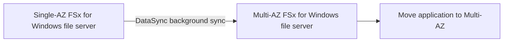
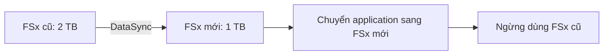
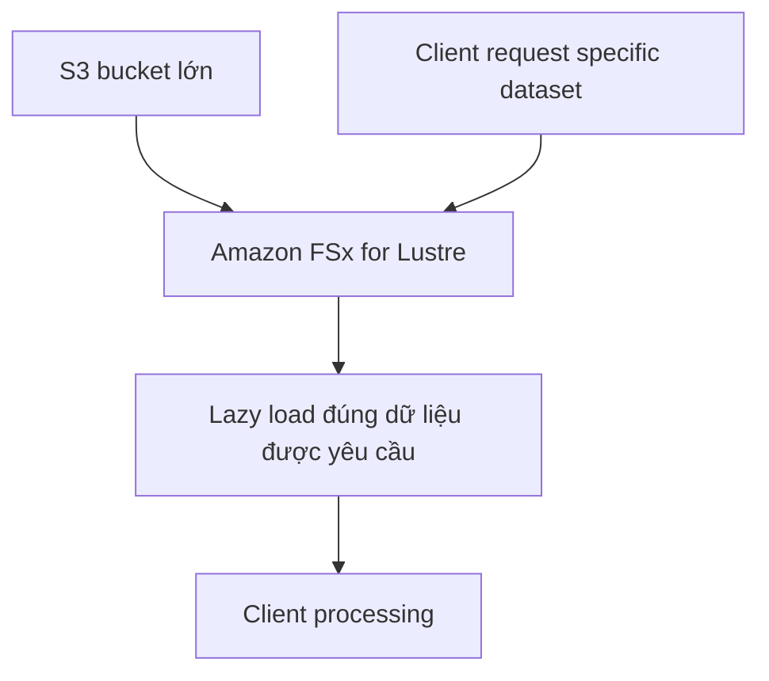

# 75. Amazon FSx - Solution Architectures

## 🎯 Giới thiệu
Bài này nói về các **solution architectures** phổ biến của **Amazon FSx**, tập trung vào 2 chủ đề chính:
- Cách **migrate** giữa các cấu hình FSx khác nhau
- Cách **FSx for Lustre** xử lý dữ liệu với **S3** bằng **data lazy loading**

---

## 1. Migrate từ single-AZ FSx for Windows file server sang multi-AZ
Không có cách **upgrade trực tiếp** từ **single-AZ** lên **multi-AZ**, nên phải đi theo quy trình chuyển đổi.

### Cách 1: Giữ khả dụng, chuyển chậm hơn
- Tạo trước một **multi-AZ FSx for Windows file server**
- Dùng **DataSync** để copy dữ liệu từ **single-AZ** sang **multi-AZ**
- Hệ thống vẫn **up** trong lúc đồng bộ dữ liệu chạy ở background
- Khi đã sẵn sàng thì chuyển ứng dụng sang dùng **multi-AZ**

### Cách 2: Nhanh hơn nhưng có downtime
- Tạo **backup** của Windows file server đầu tiên
- **Shut down** file server cũ
- **Restore** sang một **multi-AZ** file server

### Ý chính cần nhớ
- Cách 1: **không downtime**, nhưng **chậm hơn**
- Cách 2: **có downtime**, nhưng **nhanh hơn**

---

## 2. Decrease FSx volume size
Một điểm quan trọng:  
- Khi **restore from backup**, chỉ có thể restore về **same size volume**
- Với file system, bạn chỉ có thể **increase capacity**
- Bạn **không thể decrease** capacity trực tiếp

### Cách xử lý
- Tạo một **FSx** mới có **size nhỏ hơn**
- Dùng **DataSync** để sync dữ liệu sang FSx mới
- Khi dữ liệu đã đồng bộ xong, chuyển application sang dùng FSx mới
- Ngừng dùng file system cũ

Ví dụ trong transcript:
- Có FSx cũ **2 TB**
- Thực tế chỉ dùng khoảng **500 GB**
- Muốn migrate sang **1 TB**
- Giải pháp là tạo FSx **1 TB**, sync dữ liệu bằng **DataSync**, rồi chuyển app sang đó

### Ý chính cần nhớ
- **Không giảm size trực tiếp** trên FSx file system
- Muốn giảm dung lượng thực tế thì phải **create new smaller FSx** rồi **migrate data**

---

## 3. FSx for Lustre và data lazy loading
Một feature quan trọng của **FSx for Lustre** là **data lazy loading**.

### Cách hoạt động
- Nếu **S3** là input data source cho workload trên Lustre
- Hệ thống **không cần download toàn bộ dataset trước**
- Khi client yêu cầu **một dataset cụ thể**, FSx for Lustre mới tải phần dữ liệu đó về
- Dữ liệu chỉ được load khi cần, không load lại nếu đã có sẵn và chưa thay đổi

### Lợi ích được nêu trong transcript
- Có thể bắt đầu **data processing** ngay
- Giảm **cost**
- Giảm **latency**
- Dữ liệu được load **only once** khi cần thiết

### Ý chính cần nhớ
- **Lazy loading** = chỉ load dữ liệu khi client request
- Phù hợp khi có dữ liệu lớn trong **S3**, kể cả dataset rất lớn

---

## 📊 Bảng tóm tắt
| Tiêu chí | Mô tả |
|----------|------|
| Migrate single-AZ → multi-AZ | Không upgrade trực tiếp; tạo multi-AZ mới rồi dùng **DataSync**, hoặc backup + restore |
| Tính khả dụng khi migrate | Dùng **DataSync** thì hệ thống vẫn up trong background |
| Downtime khi migrate | Backup, shut down, restore sang multi-AZ sẽ có downtime |
| Giảm dung lượng FSx | Không giảm trực tiếp; phải tạo FSx mới nhỏ hơn rồi migrate dữ liệu |
| Restore từ backup | Chỉ restore về **same size volume** |
| FSx for Lustre | Có **data lazy loading** với **S3** |
| Lazy loading | Chỉ tải dữ liệu khi client request dataset cụ thể |
| Lợi ích lazy loading | Giảm cost, giảm latency, bắt đầu xử lý ngay |

---

## 💡 Mẹo ghi nhớ cho kỳ thi AWS
- **FSx không giảm size trực tiếp**: muốn nhỏ hơn thì **create new smaller FSx + DataSync**
- **Single-AZ lên multi-AZ**: không có upgrade trực tiếp
- **DataSync** thường xuất hiện khi muốn **migrate mà vẫn giữ availability**
- **Backup + restore** thường nhanh hơn nhưng đổi lại có **downtime**
- **FSx for Lustre + S3**: nhớ ngay keyword **data lazy loading**
- Lazy loading nghĩa là **chỉ tải khi được request**, không download toàn bộ trước

---

## ✅ Kết luận
Trong transcript này, các điểm cần nhớ nhất là:
- Migrate **single-AZ FSx for Windows file server** sang **multi-AZ** bằng **DataSync** hoặc **backup/restore**
- **Không thể decrease capacity trực tiếp** của FSx file system
- **FSx for Lustre** có **data lazy loading** với **S3**, giúp xử lý nhanh hơn và giảm chi phí
