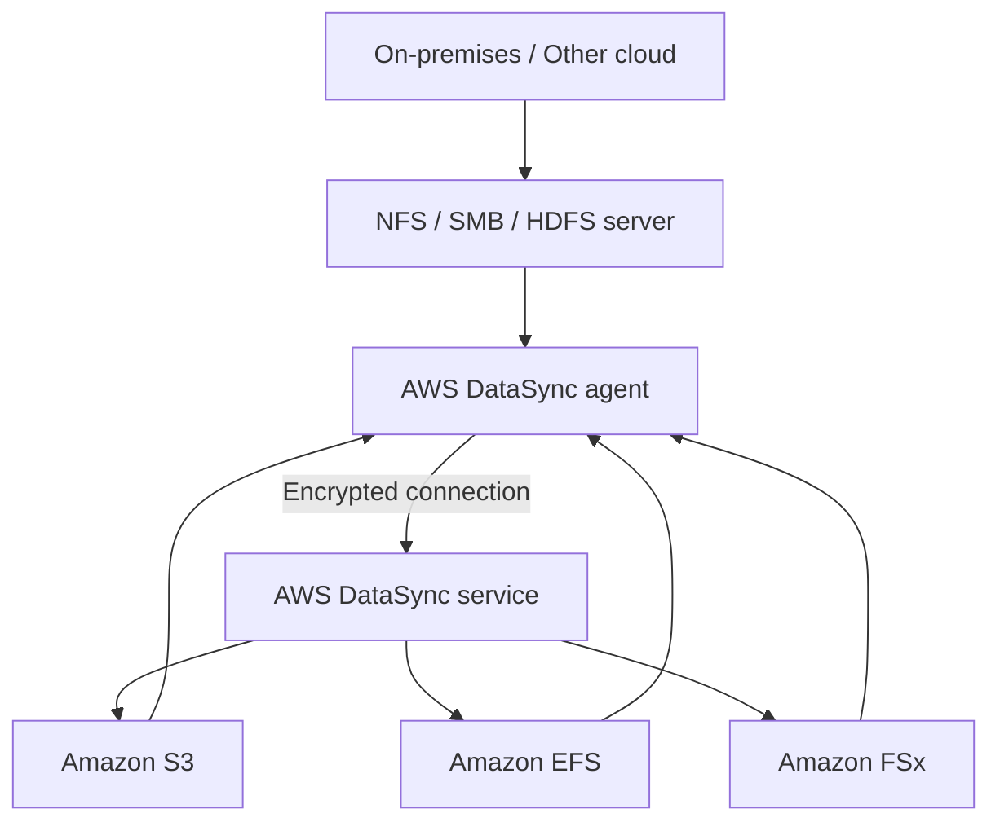

# 76. AWS DataSync

## 🎯 Giới thiệu
AWS DataSync là service dùng để **synchronize / transfer dữ liệu dung lượng lớn** giữa nhiều nơi, đặc biệt là:
- **On-premises** hoặc **other cloud** vào AWS
- Giữa các **AWS storage services** với nhau

Điểm trọng tâm của bài:
- DataSync **không phải continuous replication**
- DataSync chạy theo **schedule** như:
  - hourly
  - daily
  - weekly
- Có thể **preserve metadata** và **file permissions**
- Khi kết nối với **NFS** hoặc **SMB** server, cần **DataSync agent**

---

## 1. DataSync dùng để làm gì? 📦
- Đồng bộ dữ liệu số lượng lớn giữa các môi trường
- Hỗ trợ chuyển dữ liệu:
  - từ **on-premises** vào AWS
  - từ **other cloud** vào AWS
  - giữa các dịch vụ lưu trữ của AWS với nhau
  - từ AWS quay ngược về **on-premises**

Các protocol có thể dùng để kết nối:
- **NFS**
- **SMB**
- **HDFS**
- và các protocol khác được nhắc trong transcript

---

## 2. Kiến trúc và request flow 🧭
- Với **NFS/SMB on-premises**:
  - Cài **AWS DataSync agent** tại on-premises
  - Agent kết nối tới server NFS/SMB
  - Agent tạo kết nối **encrypted** tới DataSync service
- Từ DataSync service, dữ liệu có thể được đồng bộ tới:
  - **Amazon S3**
  - **Amazon EFS**
  - **Amazon FSx**
- Đồng bộ có thể đi:
  - **on-premises -> AWS**
  - **AWS -> on-premises**
  - **AWS storage service -> AWS storage service**

---

## 3. Tính năng cần nhớ cho kỳ thi 🧠
### Preserve metadata và permissions
- DataSync giữ lại:
  - **file permissions**
  - **metadata**
- Điều này gắn với:
  - **NFS POSIX file system**
  - **SMB permissions**
- Đây là điểm rất dễ ra đề, đặc biệt khi câu hỏi hỏi service nào **preserve metadata** khi di chuyển file

### Hỗ trợ storage classes
- Đồng bộ tới **Amazon S3**
- Bao gồm **any storage classes**
- Transcript có nhắc cả **Glacier**

### Hiệu năng và giới hạn băng thông
- Một **DataSync agent** có thể chạy một task
- Có thể đạt tới **10 Gbps**
- Có thể đặt **bandwidth limit** nếu không muốn dùng hết network

### Không continuous
- Replication tasks là **scheduled**
- Không chạy liên tục
- Có thể set lịch **hourly / daily / weekly**

---

## 📊 Bảng tóm tắt
| Tiêu chí | Mô tả |
|----------|------|
| Mục đích | Synchronize / transfer dữ liệu dung lượng lớn |
| Nguồn dữ liệu | On-premises, other cloud, hoặc AWS services |
| Đích dữ liệu | Amazon S3, Amazon EFS, Amazon FSx |
| Protocol | NFS, SMB, HDFS và các protocol khác được nhắc trong transcript |
| Agent | Cần agent khi kết nối với NFS/SMB on-premises hoặc other cloud |
| Lịch chạy | Scheduled, không continuous |
| Tần suất | Hourly, daily, weekly |
| Metadata | Preserves metadata |
| Permissions | Preserves file permissions |
| Hiệu năng | Một agent có thể chạy một task, tới 10 Gbps |
| Bandwidth control | Có thể giới hạn băng thông |

---

## 💡 Mẹo ghi nhớ cho kỳ thi AWS
- **DataSync = data synchronization**
- Nhớ 3 ý dễ hỏi nhất:
  - **Scheduled**, không continuous
  - **Preserve metadata + permissions**
  - **Agent chỉ cần cho NFS/SMB on-premises hoặc other cloud**
- Nếu đề bài hỏi:
  - chuyển dữ liệu lớn
  - giữ metadata
  - chạy theo lịch
  - từ on-premises lên AWS  
  thì nghĩ ngay tới **AWS DataSync**

---

## ✅ Kết luận
AWS DataSync là service dùng để **đồng bộ dữ liệu lớn** giữa **on-premises, other cloud và AWS storage services**. Điểm quan trọng nhất để ôn thi là:
- cần **agent** cho kết nối NFS/SMB ngoài AWS
- chạy theo **schedule**
- có thể **preserve metadata và permissions**
- hỗ trợ **S3, EFS, FSx** và nhiều luồng đồng bộ hai chiều
