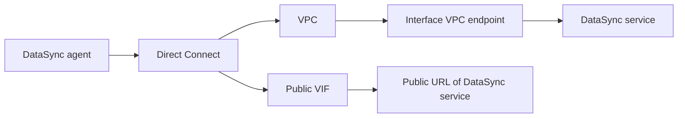

# 77. AWS DataSync - Solution Architecture

## 🎯 Giới thiệu
- Bài này nói về cách truy cập **AWS DataSync** theo hướng **private** khi đã có kết nối **Direct Connect**.
- Trọng tâm là luồng kết nối từ **DataSync agent** đến **DataSync service** thông qua **VPC**.
- Transcript nhấn mạnh 2 lựa chọn:
  - Dùng **public VIF** và đi qua **public URL** của DataSync service.
  - Dùng **VPC interface endpoint** + **PrivateLink** để đi theo đường **private**.

## 1. Truy cập DataSync qua Direct Connect
- Khi có **Direct Connect**, **DataSync agent** có thể kết nối vào hạ tầng của bạn.
- Để truy cập **private**, luồng kết nối cần đi qua **VPC**.
- Mục tiêu là tránh đi qua đường **public URL** của DataSync service.

## 2. Hai cách kết nối được nêu trong transcript
### Public VIF
- Agent đi theo hướng:
  - **Direct Connect** → ra ngoài theo **public URL** của **DataSync service**
- Cách này “vòng qua” **VPC**.
- Transcript nói rõ đây có thể không phải lựa chọn mong muốn nếu cần private access.

### Private kết nối qua VPC Endpoint
- Cần tạo:
  - **VPC interface endpoint**
  - **PrivateLink**
- Sau đó thiết lập **private VIF** giữa **Direct Connect** và **PrivateLink**.
- Luồng kết nối sẽ là:
  - **DataSync agent** → **Direct Connect** → **VPC** → **interface VPC endpoint** → **DataSync service**

## 3. Luồng kiến trúc tổng quát

## 📊 Bảng tóm tắt
| Tiêu chí | Mô tả |
|----------|------|
| Mục tiêu | Truy cập **DataSync** theo cách **private** |
| Thành phần chính | **DataSync agent**, **Direct Connect**, **VPC**, **VPC interface endpoint**, **PrivateLink** |
| Phương án 1 | Dùng **public VIF** và đi qua **public URL** của DataSync service |
| Phương án 2 | Dùng **VPC interface endpoint** + **PrivateLink** để tạo luồng private |
| Luồng private | **Agent** → **Direct Connect** → **VPC** → **interface endpoint** → **DataSync service** |

## 💡 Mẹo ghi nhớ cho kỳ thi AWS
- Nhớ rằng nếu muốn **private access** cho **DataSync** qua **Direct Connect**, transcript yêu cầu đi qua **VPC**.
- Cặp từ khóa cần nhớ:
  - **public VIF** = đi qua **public URL**
  - **private VIF** = đi qua **VPC interface endpoint** + **PrivateLink**
- Khi gặp câu hỏi về **DataSync + Direct Connect + private access**, hãy nghĩ ngay đến:
  - **VPC interface endpoint**
  - **PrivateLink**

## ✅ Kết luận
- Transcript mô tả kiến trúc truy cập **AWS DataSync** từ **Direct Connect**.
- Nếu dùng **public VIF**, kết nối sẽ đi qua **public URL** của service.
- Nếu muốn **private**, cần tạo **VPC interface endpoint** và **PrivateLink** để **DataSync agent** đi theo luồng private qua **VPC**.
