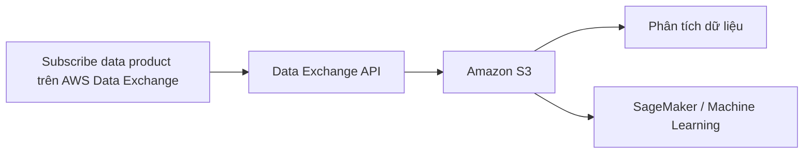

# 78. AWS Data Exchange

## 🎯 Giới thiệu
AWS Data Exchange là dịch vụ giúp bạn **tìm kiếm và đăng ký (subscribe) dữ liệu bên thứ ba trên cloud**.  
Mục tiêu chính là lấy các **dataset** từ nhà cung cấp dữ liệu và dùng trực tiếp trong AWS để **phân tích** hoặc **machine learning**.

### 🧩 Ví dụ nguồn dữ liệu được nhắc đến
- **Reuters**: dữ liệu tin tức đa ngôn ngữ
- **Change Healthcare**: dữ liệu giao dịch healthcare và claims
- **Dun & Bradstreet**: dữ liệu doanh nghiệp toàn cầu
- **Foursquare**: dữ liệu khách hàng và địa điểm thương mại toàn cầu

## 1. Cách hoạt động của AWS Data Exchange
- Bạn **subscribe** vào một data product.
- Sau đó dùng **Data Exchange API** để nạp dữ liệu trực tiếp vào **Amazon S3**.
- Từ **S3**, bạn có thể dùng các dịch vụ khác để:
  - phân tích dữ liệu
  - làm **machine learning** với **SageMaker**

## 2. Tính năng quan trọng
### 🔎 Browse catalog
- Có chức năng **browse catalog search**
- Cho phép tìm trong khoảng **gần 4,000 data products**

### 🗄️ Data Exchange for Redshift
- Subscribe dữ liệu bên thứ ba từ Data Exchange
- Load trực tiếp vào **Amazon Redshift**
- Có thể **query dữ liệu ngay trong Redshift**
- Chiều ngược lại cũng có thể làm được:
  - nếu bạn có dữ liệu trong **Amazon Redshift**
  - bạn có thể **license** dữ liệu đó qua **AWS Data Exchange**

### 🔌 Data Exchange for APIs
- Tìm và subscribe các **third-party APIs**
- Sử dụng qua **AWS SDK**
- Có tính nhất quán với:
  - **AWS-native authentication**
  - **governance**

## 3. Ý nghĩa thực tế cho kỳ thi AWS
- Data Exchange là dịch vụ để **mua/đăng ký dữ liệu bên ngoài** trong AWS
- Dữ liệu có thể đi vào **S3** hoặc **Redshift**
- Sau đó dùng cho **analytics** hoặc **ML**
- Có thể làm việc với cả **data products** lẫn **APIs**
- Hỗ trợ quy trình sử dụng dữ liệu trong AWS một cách thống nhất

## 📊 Bảng tóm tắt
| Tiêu chí | Mô tả |
|----------|------|
| Mục đích | Tìm kiếm và subscribe third-party data trên AWS |
| Nguồn dữ liệu | Reuters, Change Healthcare, Dun & Bradstreet, Foursquare |
| Đích nạp dữ liệu | Amazon S3, Amazon Redshift |
| Ứng dụng | Phân tích dữ liệu, machine learning với SageMaker |
| Tính năng nổi bật | Browse catalog, Data Exchange for Redshift, Data Exchange for APIs |
| API | Dùng Data Exchange API và AWS SDK |
| Governance | AWS-native authentication và governance |

## 💡 Mẹo ghi nhớ cho kỳ thi AWS
- **Data Exchange = mua/subscribe dữ liệu bên thứ ba**
- **S3** là điểm đích phổ biến để load dữ liệu rồi mới phân tích
- **Redshift** có thể nhận dữ liệu từ Data Exchange và query trực tiếp
- **Chiều ngược lại cũng có thể**: dữ liệu từ Redshift có thể được license qua Data Exchange
- **APIs** trong Data Exchange được dùng qua **AWS SDK** với authentication/governance theo chuẩn AWS

## ✅ Kết luận
AWS Data Exchange giúp bạn **khám phá, subscribe và sử dụng third-party data** ngay trong AWS.  
Dữ liệu có thể được đưa vào **S3** hoặc **Redshift**, rồi dùng cho **analytics**, **ML**, hoặc tích hợp qua **APIs** với cơ chế quản trị thống nhất.
