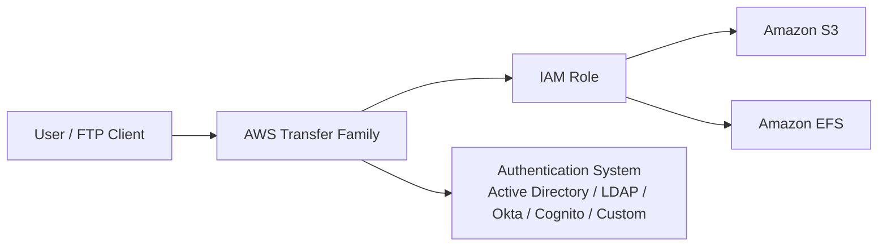

# 79. AWS Transfer Family

## 🎯 Giới thiệu
AWS Transfer Family là dịch vụ dùng để **send data in/out of Amazon S3 hoặc EFS** thông qua **FTP protocol**, thay vì phải dùng **S3 APIs** hoặc **EFS network file system**.

- Hỗ trợ 3 giao thức:
  - **FTP**: không mã hóa
  - **FTPS**: FTP over SSL, có mã hóa
  - **SFTP**: Secure File Transfer Protocol, có mã hóa
- Dữ liệu có thể **upload vào S3 hoặc EFS**
- Dịch vụ có hạ tầng **fully managed**, **scalable**, **reliable**, **highly available**
- Thanh toán:
  - theo **provisioned endpoints per hour**
  - cộng thêm phí theo **gigabytes of data transferred in and out**

## 1. Use Case và Authentication
AWS Transfer Family phù hợp khi bạn muốn có một **FTP interface** vào **Amazon S3** hoặc **EFS**.

- Dùng cho:
  - chia sẻ files
  - public datasets
  - CRM
  - ERP
- Credential của user có thể:
  - được quản lý ngay trong service
  - hoặc tích hợp với hệ thống xác thực sẵn có như:
    - **Microsoft Active Directory**
    - **LDAP**
    - **Okta**
    - **Amazon Cognito**
    - **custom source**
- Khi transfer file, service sẽ dùng **IAM Role** để đọc/ghi với **S3** hoặc **EFS**
- Việc này diễn ra **transparently**, không cần setup phức tạp

## 2. Endpoint Types
Transcript nêu 3 kiểu endpoint chính, đây là phần rất dễ ra thi.

### Public Endpoint
- Endpoint nằm trên cloud và internet có thể truy cập
- **Public IP** do AWS quản lý
- IP này **có thể thay đổi theo thời gian**
- Khuyến nghị dùng **DNS name** của endpoint
- Không thể dựa vào **allow list theo source IP** vì IP public không cố định

### VPC Endpoint with Internal Access
- Endpoint được triển khai trong **VPC**
- **EC2 instances** trong VPC truy cập riêng tư được
- **Corporate Data Center** qua **VPN** hoặc **Direct Connect** cũng truy cập được
- Có **static private IPs**
- Có thể dùng **security group** hoặc **Network ACLs** để kiểm soát truy cập

### VPC Endpoint with Internet-Facing Access
- Vẫn triển khai trong **VPC**
- Vừa hỗ trợ truy cập riêng tư từ:
  - EC2 trong VPC
  - Corporate Data Center
- Vừa có thể public ra internet bằng **elastic IP**
- Vì bạn tự attach **elastic IP**, nên có thể kiểm soát truy cập internet bằng **security groups**

## 3. Điểm Cần Nhớ Khi Thi
- **FTP** là unencrypted
- **FTPS** và **SFTP** là encrypted in flight
- Transfer Family dùng để đưa dữ liệu vào/ra **S3** hoặc **EFS** qua FTP-style interface
- Dịch vụ có 3 endpoint patterns:
  - **Public Endpoint**
  - **VPC Endpoint with Internal Access**
  - **VPC Endpoint with Internet-Facing Access**
- Chọn endpoint đúng rất quan trọng vì đề thi có thể hỏi theo hướng **security** và **network accessibility**

## 📊 Bảng tóm tắt
| Tiêu chí | Mô tả |
|----------|------|
| Mục đích | Truyền dữ liệu vào/ra **S3** hoặc **EFS** qua **FTP protocol** |
| Giao thức hỗ trợ | **FTP**, **FTPS**, **SFTP** |
| Mã hóa | **FTP** không mã hóa; **FTPS/SFTP** mã hóa in flight |
| Hạ tầng | **Fully managed**, **scalable**, **reliable**, **highly available** |
| Thanh toán | Theo **endpoint per hour** và **data transferred** |
| Authentication | Internal credentials hoặc tích hợp **AD/LDAP/Okta/Cognito/custom** |
| IAM | Dùng **IAM Role** để truy cập **S3/EFS** |
| Endpoint types | **Public**, **VPC Internal**, **VPC Internet-Facing** |

## 💡 Mẹo ghi nhớ cho kỳ thi AWS
- Nhớ rằng **Transfer Family = FTP/SFTP/FTPS vào S3 hoặc EFS**
- Nếu đề bài nói “không muốn dùng S3 APIs hoặc EFS network file system”, hãy nghĩ ngay đến **AWS Transfer Family**
- Nếu cần truy cập qua internet nhưng IP public có thể thay đổi, chọn **Public Endpoint** và dùng **DNS name**
- Nếu cần **static private IP** và kiểm soát bằng **security group / NACL**, chọn **VPC Endpoint with Internal Access**
- Nếu cần cả private access lẫn internet access qua **elastic IP**, chọn **VPC Endpoint with Internet-Facing Access**

## ✅ Kết luận
AWS Transfer Family là dịch vụ phù hợp khi cần cung cấp **FTP-style access** vào **Amazon S3** hoặc **EFS** một cách **fully managed**. Điểm quan trọng nhất để ôn thi là nắm rõ **3 protocol**, **cách authentication**, và đặc biệt là **3 kiểu endpoint** cùng tác động của chúng lên **security** và **network access**.
