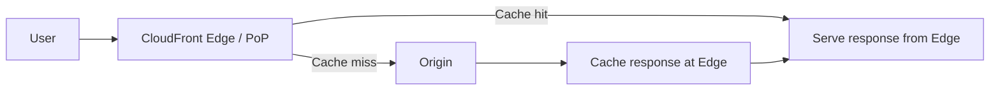
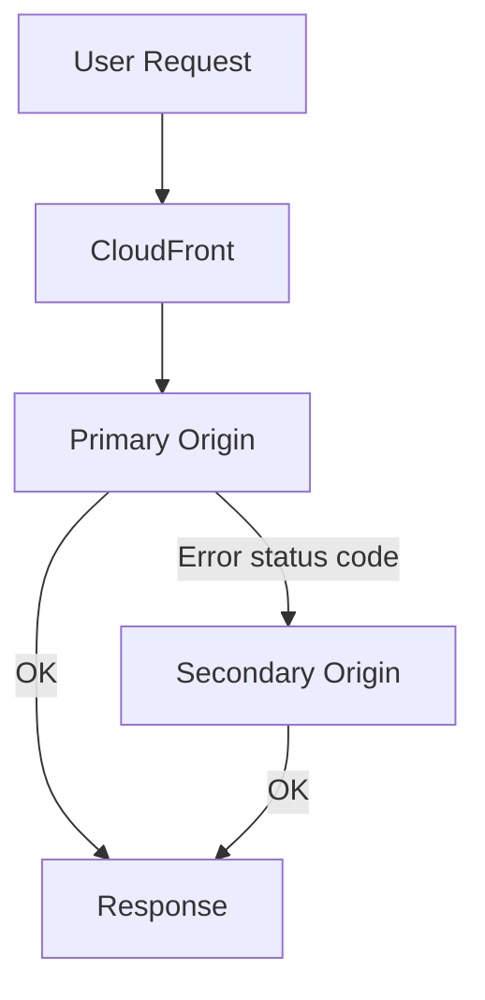

# 81. CloudFront - Part 1

## 🎯 Giới thiệu
- **Amazon CloudFront** là một **Content Delivery Network (CDN)**.
- Mục tiêu chính là **cải thiện read performance** bằng cách **cache content tại edge**.
- CloudFront có:
  - Hơn **200 points of presence** trên toàn cầu
  - Khả năng **chống DDoS** nhờ phân tán ở edge
  - Tích hợp với **Shield, WAF, Route 53**
- Về giao tiếp:
  - Bên ngoài CloudFront, application được expose qua **HTTPS**
  - Bên trong có thể dùng **HTTP hoặc HTTPS**
  - Có hỗ trợ **WebSocket protocol**

## 1. Luồng request và cơ chế cache 📡
- Khi user gửi request, CloudFront sẽ đưa request tới **edge location** gần nhất.
- Nếu **cache hit**:
  - Nội dung được trả trực tiếp từ edge
  - Không cần quay về origin
- Nếu **cache miss**:
  - Edge location sẽ request về **origin**
  - Sau đó response được **cache lại** tại edge cho các request sau
- Lợi ích chính:
  - **Giảm latency**
  - **Giảm số lượng request** tới origin như S3 bucket

## 2. Các loại origin trong CloudFront 🧩
- **S3 bucket**
  - Dùng để phân phối files từ S3 ra web
  - Cũng có thể dùng để upload từ web về S3 thông qua CloudFront như một **ingress**
  - Bảo mật được giữ bằng **CloudFront Origin Access Control (OAC)**
- **MediaStore / MediaPackage endpoint**
  - Dùng để deliver **VOD** hoặc **live streaming**
  - Phù hợp với **AWS Media Services**
- **VPC Origin**
  - Dùng cho application nằm trong **VPC private subnets**
  - Có thể phân phối content từ:
    - **Application Load Balancer (ALB)**
    - **Network Load Balancer (NLB)**
    - **EC2 instances**
  - Tất cả đều ở private network
- **Custom origin**
  - Là origin dựa trên **HTTP**
  - Dùng cho các backend public, ví dụ:
    - **API Gateway**
    - **S3 static website hosting**
    - Bất kỳ **public HTTP backend** nào trong hoặc ngoài AWS

### So sánh nhanh với S3 Cross Region Replication
| Tiêu chí | CloudFront | S3 Cross Region Replication |
|----------|------------|-----------------------------|
| Mục tiêu | CDN, cache ở edge | Replicate dữ liệu giữa các region |
| Phạm vi | Global Edge network | Theo từng region bạn cấu hình |
| Cập nhật | Cache có TTL, ví dụ một ngày | Near real time |
| Quyền truy cập | Phục vụ content qua edge | Read only |
| Use case | Static content cần có mặt ở khắp nơi | Dynamic content cần low latency ở vài region |

## 3. Bảo mật và High Availability 🔐
- Với **S3 as origin**:
  - CloudFront và S3 có tích hợp chặt chẽ qua **OAC**
  - Mục tiêu là chỉ cho phép CloudFront truy cập origin
- Với **EC2 hoặc ALB public origin**:
  - **EC2 instance** hoặc **ALB** phải là public để edge location truy cập được
  - Có thể giới hạn **security group** chỉ cho phép **public IPs của CloudFront edge locations**
- Để ngăn truy cập trực tiếp vào origin:
  - Dùng **custom HTTP header**
  - CloudFront thêm một header bí mật vào mọi request
  - Origin chỉ forward request nếu header và value đúng
  - Nếu user truy cập trực tiếp, request sẽ bị reject vì thiếu header
- Có thể tăng thêm bảo mật bằng cách:
  - Giới hạn network access cho origin bằng **security groups**
  - Chỉ cho phép **CloudFront public IP addresses**
- **Origin groups**
  - Dùng để tăng **high availability** và **failover**
  - Gồm:
    - **Primary origin**
    - **Secondary origin**
  - Nếu primary lỗi, request sẽ được chuyển sang secondary
  - Có thể **cross AWS region**, phù hợp cho **disaster recovery**
- Với **S3 buckets**:
  - Có thể dùng origin groups để tạo **region-level high availability**
  - Kết hợp với **replication** giữa hai bucket để secondary có dữ liệu gần như đồng bộ

## 📊 Bảng tóm tắt
| Tiêu chí | Mô tả |
|----------|------|
| Bản chất | CloudFront là **CDN** |
| Điểm mạnh | **Cache at edge**, giảm latency, giảm tải origin |
| Phạm vi toàn cầu | Hơn **200 PoP** trên toàn cầu |
| Bảo vệ | Tích hợp **Shield, WAF, Route 53**, hỗ trợ chống **DDoS** |
| Origin phổ biến | **S3**, **MediaStore/MediaPackage**, **VPC Origin**, **Custom origin** |
| Bảo mật origin | **OAC**, **custom HTTP header**, **security group** giới hạn IP của CloudFront |
| HA / Failover | **Origin groups** với **primary/secondary origin** |
| Điểm cần nhớ khi thi | Phân biệt **CloudFront** với **S3 CRR** |

## 💡 Mẹo ghi nhớ cho kỳ thi AWS
- **CloudFront = cache ở edge** để tăng tốc đọc nội dung.
- **OAC** là điểm gợi nhớ cho **S3 private origin** với CloudFront.
- Nếu thấy **VOD/live streaming**, nghĩ tới **MediaStore/MediaPackage**.
- Nếu origin nằm trong **private subnets**, nghĩ tới **VPC Origin**.
- Nếu muốn chặn truy cập trực tiếp vào origin, nhớ **custom HTTP header**.
- Nếu đề bài nói **failover giữa 2 origin**, chọn **origin groups**.
- Đừng nhầm:
  - **CloudFront** = CDN, cache toàn cầu
  - **S3 CRR** = replicate giữa regions, read only, near real time

## ✅ Kết luận
- CloudFront là dịch vụ **CDN** giúp cải thiện hiệu năng bằng cách **cache content tại edge**.
- Dịch vụ này hỗ trợ nhiều kiểu origin như **S3**, **private VPC origin**, **custom HTTP origin**, và origin cho **media streaming**.
- Về exam, ba ý quan trọng nhất là:
  - **Cache và global edge network**
  - **Bảo mật origin bằng OAC/custom header**
  - **High availability bằng origin groups**
