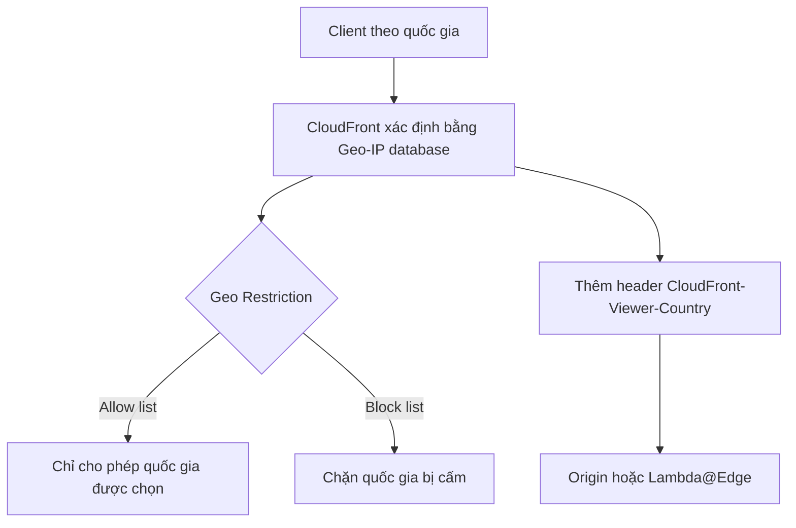
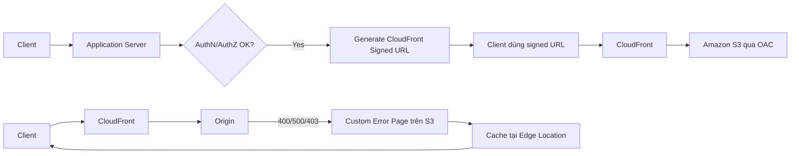

# 82. CloudFront - Part 2

## 🎯 Giới thiệu
Trong phần này, CloudFront tập trung vào các cơ chế kiểm soát truy cập, tối ưu chi phí theo vị trí địa lý, signed URL để bảo vệ nội dung, và custom error pages để cải thiện trải nghiệm người dùng khi origin trả lỗi.

## 1. Geo Restriction và Geo-based Content 🌍
- **Geo restriction** dùng để giới hạn ai có thể truy cập CloudFront distribution.
- Có 2 kiểu:
  - **Allow list**: chỉ cho phép user từ các quốc gia được chỉ định.
  - **Block list**: chặn user từ các quốc gia bị cấm hoặc không muốn truy cập origin.
- Quốc gia của client được xác định bằng **third-party Geo-IP database** trong CloudFront.
- Use case chính:
  - **Copyright laws** để kiểm soát quyền truy cập nội dung.
- CloudFront tự động thêm header:
  - **`CloudFront-Viewer-Country`**
- Header này có thể được dùng bởi:
  - origin
  - hoặc function như **Lambda@Edge**
- Ngoài restriction, bạn còn có thể tùy biến nội dung theo geolocation.

## 2. Pricing và Price Classes 💰
- Edge Locations ở nhiều nơi trên thế giới, nên chi phí data theo location có thể khác nhau.
- Theo transcript:
  - **rẻ nhất**: US, Mexico, Canada
  - **đắt nhất**: India
- CloudFront có **3 Price Classes** để giảm chi phí:
  - **Price Class All**: tất cả regions, performance tốt nhất nhưng cost cao nhất
  - **Price Class 200**: nhiều regions, nhưng loại trừ các regions đắt nhất
  - **Price Class 100**: chỉ giữ các regions rẻ nhất
- Mục tiêu của Price Classes:
  - giảm số lượng Edge Locations
  - giảm chi phí

## 3. Signed URL và Custom Error Pages 🔐
### Signed URL
- Mục đích:
  - cấp quyền truy cập nội dung có thời hạn trên CloudFront
- Quy trình:
  - client không truy cập trực tiếp nội dung protected
  - client gọi application server
  - application server xác thực và ủy quyền
  - nếu hợp lệ, application server tạo **signed URL** bằng SDK
  - client dùng signed URL để truy cập trực tiếp CloudFront
- Trường hợp điển hình:
  - CloudFront tích hợp với **Amazon S3** thông qua **OAC**
  - origin không public
  - chỉ file được cấp quyền mới truy cập được
- Điểm khác giữa **CloudFront signed URL** và **S3 pre-signed URL**:
  - CloudFront signed URL:
    - dùng cho path bất kỳ, không chỉ S3
    - có **account-wide key-pair**
    - chỉ **root account** quản lý key-pair này
    - có thể filter theo **IP**, **path**, **date**
    - có **expiration**
    - có thể tận dụng cache ở Edge Location
  - S3 pre-signed URL:
    - tạo request như chính người ký URL
    - dùng **IAM key** của signing IAM principal
    - có thời hạn giới hạn
    - dùng để **upload** và **download**

### Custom Error Pages
- Khi origin trả về lỗi như **400** hoặc **500**, CloudFront có thể trả về **custom error pages** cho viewer.
- Custom error pages có thể:
  - được lưu trên **S3 bucket**
  - được cache bằng **caching minimum TTL**
- Ví dụ flow:
  - request đến CloudFront
  - CloudFront forward đến origin
  - origin trả lỗi
  - thay vì trả trực tiếp lỗi gốc cho client, CloudFront trả custom error page
  - file lỗi như **403 HTML** có thể được đưa vào cache tại Edge Location rồi trả về client

## 📊 Bảng tóm tắt
| Tiêu chí | Mô tả |
|----------|------|
| Geo Restriction | Dùng allow list hoặc block list để kiểm soát quốc gia được truy cập CloudFront |
| Geo-IP | CloudFront xác định quốc gia bằng third-party Geo-IP database |
| Geo Header | CloudFront thêm `CloudFront-Viewer-Country` cho origin hoặc Lambda@Edge |
| Price Class | `All`, `200`, `100` để cân bằng performance và cost |
| Signed URL | Cho phép truy cập nội dung có thời hạn, do application server tạo |
| CloudFront vs S3 URL | CloudFront signed URL áp dụng cho path bất kỳ; S3 pre-signed URL gắn với IAM key và request của người ký |
| Custom Error Pages | Trả trang lỗi tùy biến khi origin trả 400/500, có thể cache từ S3 |

## 💡 Mẹo ghi nhớ cho kỳ thi AWS
- **Geo restriction** = chặn/cho phép theo **country**
- **CloudFront-Viewer-Country** = header quan trọng để tùy biến theo vị trí
- **Price Class**:
  - `All` = nhiều Edge Locations nhất
  - `200` = bỏ bớt region đắt nhất
  - `100` = rẻ nhất
- **CloudFront signed URL** dùng để bảo vệ nội dung qua CloudFront, không chỉ riêng S3
- **S3 pre-signed URL** là cách tạo request như người ký URL
- **Custom error page** có thể cache ở Edge Location thay vì trả lỗi gốc từ origin

## ✅ Kết luận
CloudFront trong phần này tập trung vào 4 ý chính: kiểm soát truy cập theo quốc gia, tối ưu chi phí bằng Price Classes, bảo vệ nội dung bằng signed URL, và xử lý lỗi bằng custom error pages. Khi ôn thi, hãy nhớ rõ sự khác nhau giữa **CloudFront signed URL** và **S3 pre-signed URL**, cùng vai trò của **CloudFront-Viewer-Country** và **Price Class**.
