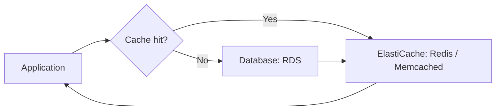

# 85. Amazon ElastiCache

## 🎯 Giới thiệu
- **Amazon ElastiCache** là dịch vụ managed để **quản lý Redis hoặc Memcached**, tương tự như cách **RDS** quản lý database.
- Đây là **in-memory cache** với:
  - **high performance**
  - **low latency**
- Mục tiêu chính:
  - Giảm tải cho database trong **read-intensive workloads**
  - Lưu các dữ liệu **thường xuyên được truy vấn** hoặc **tốn chi phí tính toán**
  - Giúp ứng dụng trở nên **stateless**, đặc biệt với **session store**

## 1. ElastiCache dùng để làm gì? 🚀
- Dùng làm **DB cache** cho dữ liệu hot:
  - dữ liệu được truy vấn thường xuyên
  - dữ liệu khó/tốn công tính toán
- Khi ứng dụng được refactor để dùng cache:
  - nếu **cache hit**: lấy dữ liệu từ **ElastiCache**
  - nếu **cache miss**: đọc từ **RDS**, sau đó ghi vào cache
- Cần có **cache invalidation strategy** để đảm bảo dữ liệu trong cache luôn là dữ liệu mới nhất
- Nếu không xử lý tốt, có thể xảy ra **consistency problem** giữa cache và RDS
- Transcript nhấn mạnh đây là một vấn đề khó, đặc biệt trong **notifications**

## 2. Pattern sử dụng phổ biến 🧩
### Lazy loading
- Ứng dụng query cache trước
- Nếu không có dữ liệu trong cache:
  - đọc từ database
  - ghi lại vào cache
- Lợi ích:
  - giảm số query lên **RDS**
  - hữu ích khi có **hot keys** hoặc dữ liệu bị đọc rất nhiều

### User session store
- Dùng ElastiCache để lưu **session data**
- Tình huống:
  - ứng dụng chạy trên nhiều **EC2 instances**
  - traffic đi qua **load balancer**
  - không bật **session stickiness**
- Khi user chuyển sang instance khác:
  - ứng dụng vẫn lấy được session từ ElastiCache
  - biết user là ai, trạng thái đăng nhập ra sao
- Kết quả:
  - đạt được **statelessness** trong kiến trúc

## 3. Redis vs Memcached ⚖️

| Tiêu chí | Redis | Memcached |
|----------|-------|-----------|
| Tính chất chính | Highly available | Partitioning / data sharding |
| Multi AZ / Auto-Failover | Có | Không được nhấn mạnh như Redis |
| Replication | Có replication | Không phải dùng cho replication |
| Read scaling | Có **Read Replicas** | Không nhấn mạnh theo kiểu Redis |
| Persistence | Có thể persistent data | Không persistent cache |
| Backup / Restore | Có, nếu bật **AOF** thì có thể khôi phục dữ liệu | Chỉ có cho **serverless version**, không phải self-managed |
| Kiến trúc | Gần giống database hơn | **Multi-threaded** |
| Khi mất node | Có cơ chế HA tốt hơn | Mất node là mất dữ liệu trên node đó |
| Mô hình dữ liệu | Replication | **Sharding** / partitioning |

### Redis
- Có **Multi AZ with Auto-Failover**
- Có thể tạo **Read Replicas** để scale reads và tăng high availability
- Có tính **persistent data**
- Nếu bật **Append Only File (AOF)**, có thể khôi phục dữ liệu sau khi mất cluster
- Tư duy của Redis trong transcript:
  - nghĩ đến **replication**
  - nghĩ đến **high availability**
  - nghĩ đến **backup/restore**

### Memcached
- Dùng nhiều node để **partitioning** và **data sharding**
- **Không persistent**
  - mất cache là mất dữ liệu
- Phù hợp cho dữ liệu **temporary / transient**
- Transcript nhấn mạnh:
  - không nên nghĩ theo kiểu replication
  - nên nghĩ theo kiểu **sharding**
- Nếu mất một node:
  - mất toàn bộ dữ liệu trên node đó
  - các node khác vẫn có thể hoạt động

## 📊 Bảng tóm tắt

| Tiêu chí | Mô tả |
|----------|------|
| Dịch vụ | Managed service để quản lý **Redis** hoặc **Memcached** |
| Vai trò chính | Cache dữ liệu nóng, giảm tải cho database |
| Lợi ích | **Low latency**, **high performance**, giảm query lên RDS |
| Pattern phổ biến | **Lazy loading**, **user session store** |
| Rủi ro | Cần **cache invalidation strategy** để tránh inconsistency |
| Redis | Có **Multi AZ**, **Auto-Failover**, **Read Replicas**, **persistence**, **AOF** |
| Memcached | **Sharding**, **multi-threaded**, không persistent, mất node là mất dữ liệu node đó |

## 💡 Mẹo ghi nhớ cho kỳ thi AWS
- Nghĩ **ElastiCache = cache cho Redis hoặc Memcached**
- Nghĩ **cache hit / cache miss** khi gặp bài toán query dữ liệu
- Nếu đề bài nhấn mạnh:
  - **high availability**
  - **replication**
  - **backup/restore**
  - **persistent data**
  - **Multi AZ**
  thì nghiêng về **Redis**
- Nếu đề bài nhấn mạnh:
  - **sharding**
  - **partitioning**
  - **temporary data**
  - **multi-threaded**
  thì nghiêng về **Memcached**
- Nếu đề bài có **session store** và cần ứng dụng **stateless**, ElastiCache là lựa chọn rất đáng chú ý
- Luôn nhớ: dùng cache với application code **không phải miễn phí**, vì cần **refactor** để tích hợp ElastiCache

## ✅ Kết luận
- **Amazon ElastiCache** là dịch vụ managed giúp dùng **Redis** hoặc **Memcached** để tăng hiệu năng và giảm tải database.
- Hai use case quan trọng nhất trong transcript là:
  - **DB cache** theo mô hình **lazy loading**
  - **user session store** để làm ứng dụng **stateless**
- Khi thi AWS, điểm phân biệt cốt lõi là:
  - **Redis**: HA, replication, persistence
  - **Memcached**: sharding, transient data, không persistent
