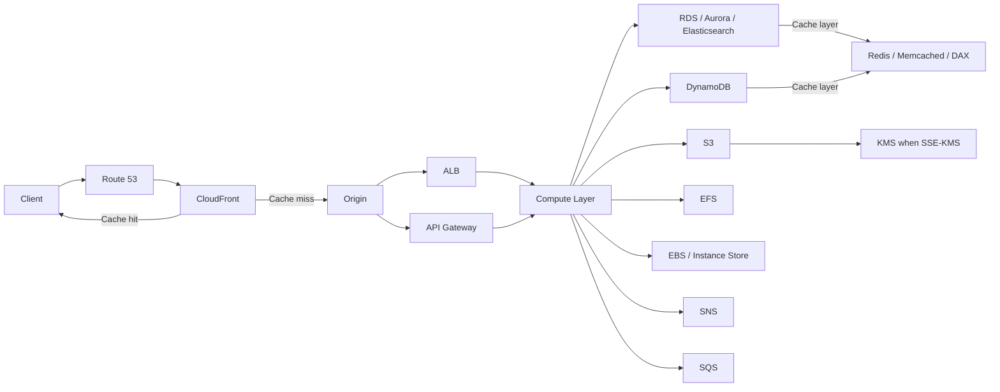

# 86. Handling Extreme Rates

## 🎯 Giới thiệu
Khi thiết kế solution architecture trên AWS, điểm quan trọng nhất là hiểu **nơi nào có thể chặn request sớm bằng caching** và **nơi nào bắt buộc phải đi sâu vào hệ thống**. Transcript nhấn mạnh rằng càng xử lý request ở **left side / edge** thì càng **rẻ hơn, nhanh hơn, ít latency hơn**; càng đi sâu về **right side** thì càng **tốn chi phí** và dễ chạm giới hạn hơn.

## 1. Edge và caching là lớp quan trọng nhất 🚀
- **Route 53** là global DNS service, được thiết kế để xử lý **extremely high rates of requests**.
- **Client caching** có thể giảm số request đi vào hạ tầng.
- **CloudFront** cũng có caching capability, và có thể đạt khoảng **100,000 requests per second**.
- Ở static routes, có thể dùng **CloudFront edge** và **S3**.
- Với **S3**, main line performance được nêu là:
  - **3,500 PUTs per prefix per second**
  - **5,500 GETs per prefix per second**
- Nếu dùng **SSE-KMS encryption**, **KMS** có thể trở thành bottleneck:
  - khoảng **10,000 API calls on KMS per region** theo transcript
  - số này thay đổi theo region

## 2. Origin, Compute Layer và Database Layer ⚙️
### Origin layer
- **ALB** có thể scale rất mạnh và hiện tại **scale seamlessly**.
- **API Gateway** có:
  - **soft limit 10,000 requests per second**
  - caching capability, nên có thể chặn request sớm ở đây

### Compute Layer
- Nếu dùng **ASG** hoặc **ECS on EC2**:
  - scale vẫn tốt
  - nhưng **chậm hơn** vì phải bootstrap instances sau khi VM được tạo
- Nếu dùng **Fargate**:
  - container boot nhanh hơn
  - scale có thể **quicker**
- Nếu dùng **Lambda**:
  - transcript nêu **1,000 concurrent executions** trong region
  - đây là **soft limit** và có thể tăng thêm
- Compute Layer được nhấn mạnh là **không có caching capability**

### Database Layer
- Với **RDS, Aurora, Elasticsearch**:
  - đây là **provisioned databases**
  - khó scale hơn so với các dịch vụ scaling linh hoạt hơn
- Với **DynamoDB**:
  - có **autoscaling**
  - có **on-demand scaling**
  - hỗ trợ read/write cao hơn nhiều
- Cache cho data:
  - **Redis**: scale tới **200 nodes**
  - **Memcached**: tới **20 nodes**
  - **DynamoDB DAX**: tới **10 nodes** (primary và replica)
  - DAX giúp cache **DynamoDB queries**

## 3. Storage, decoupling và thông điệp thi cử 📦
### Storage / disk
- **EBS**:
  - **gp2**: tối đa **16,000 IOPS**
  - **io1**: tối đa **64,000 IOPS**
  - có thể dùng như **cache** trên EBS volume
- **Instance Store**:
  - có thể lên tới **millions of IOPS**
  - có thể dùng làm **local cache** cho EC2 instances
- **EFS**:
  - khác vì share files across many instances
  - có 2 performance mode:
    - **General**
    - **Max IO / provisioned IO**
  - ý chính: có thể tăng performance theo số file hoặc theo nhu cầu IOPS cao hơn số file

### Decoupling
- **SNS** và **SQS** được mô tả là **virtually have unlimited scales**.
- Với **SQS FIFO**:
  - khoảng **3,000 requests per second** với batching
  - khoảng **300 requests per second** không batching
- Transcript cũng nêu:
  - mỗi chart provisioned có khoảng **1 MB/s in** và **2 MB/s out**

## 📊 Bảng tóm tắt
| Tiêu chí | Mô tả |
|----------|------|
| Edge / DNS | **Route 53** và **CloudFront** là tuyến đầu để xử lý request cực lớn |
| Caching | Caching ở client, CloudFront, API Gateway, Redis, Memcached, DAX, EBS, Instance Store giúp giảm tải và giảm chi phí |
| Compute | **ALB** scale mạnh; **API Gateway** có soft limit 10,000 rps; **Lambda** có 1,000 concurrent executions soft limit |
| Database | **DynamoDB** linh hoạt hơn nhờ autoscaling và on-demand scaling; **RDS/Aurora/Elasticsearch** là provisioned |
| Storage | **EBS**, **Instance Store**, **EFS** có đặc tính IOPS/performance khác nhau |
| Decoupling | **SNS** và **SQS** giúp tách lớp xử lý; **SQS FIFO** có giới hạn throughput rõ hơn |
| Cost | Càng đi sâu vào architecture, càng tốn chi phí và latency cao hơn |

## 💡 Mẹo ghi nhớ cho kỳ thi AWS
- Nhớ nguyên tắc: **cache càng sớm càng tốt**.
- **CloudFront** là nơi rất mạnh để chặn request ở edge.
- **API Gateway** có thể cache và có **10,000 rps soft limit**.
- **Lambda** có **1,000 concurrent executions** là con số cần nhớ trong transcript.
- **DynamoDB** là lựa chọn nổi bật khi cần scaling đọc/ghi tốt.
- **S3 + SSE-KMS** có thể bị giới hạn bởi **KMS API calls**.
- **EBS / Instance Store / EFS** khác nhau chủ yếu ở cách scale, IOPS và cách dùng cache.
- **SNS / SQS** phù hợp khi muốn decouple và giảm áp lực trực tiếp lên compute/database.

## ✅ Kết luận
Bài giảng tập trung vào việc hiểu **giới hạn của từng lớp trong AWS architecture** và chọn đúng điểm để **cache, scale, hoặc decouple**. Trong kỳ thi AWS, ưu tiên nhớ rằng **xử lý request càng gần edge càng tốt**, còn các lớp sâu hơn như compute, database, storage sẽ dễ trở thành bottleneck và làm chi phí tăng lên.
