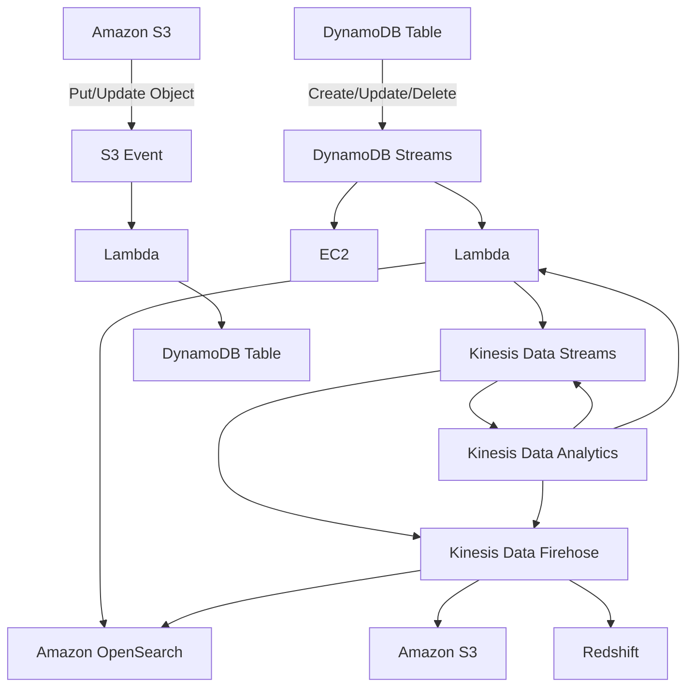

# 87. DynamoDB

## 🎯 Giới thiệu
DynamoDB là một **NoSQL database** được **fully managed** và **serverless**, có thể mở rộng ở quy mô rất lớn, lên tới **1 million requests per second**. Kiến trúc của nó gần với **Apache Cassandra**, nên người dùng Cassandra có thể migrate sang DynamoDB.

Một số điểm cốt lõi:
- Không cần provision disk space
- Kích thước tối đa của một item là **400 KB**
- Dữ liệu lớn hơn nên lưu ở **Amazon S3**, rồi lưu **reference** trong DynamoDB
- Hỗ trợ **CRUD**
- Read có thể là **eventually consistent** hoặc **strongly consistent**
- Hỗ trợ **transactions** across multiple tables, tức có thể có **ACID support**
- Có **backups** và **point-in-time recovery**
- Có 2 **table classes**:
  - **Standard**: dữ liệu truy cập thường xuyên
  - **Infrequent access**: dữ liệu truy cập ít

## 1. Cấu trúc bảng và kiểu dữ liệu
DynamoDB được tổ chức theo **tables**:
- Mỗi table có **primary key** phải được quyết định ngay khi tạo
- Mỗi table có thể chứa số lượng item rất lớn
- Mỗi **item** có các **attributes**, giống như columns và có thể được thêm dần theo thời gian
- Attribute có thể là `null`

Các **data types** được đề cập:
- **Scalar**: string, number, binary, Boolean, null
- **Document**: list, map
- **Set**: string set, number set, binary set

## 2. Primary key và Indexes
### Primary key
Có 2 kiểu chính:

- **Partition key בלבד**  
  - Còn gọi là **HASH**
  - Phải **unique** cho từng item
  - Nên đủ đa dạng để phân phối dữ liệu tốt
  - Ví dụ: `user_id` cho bảng users

- **Partition key + Sort key**  
  - Đây là **composite key**
  - Điều phải unique là **combination** của 2 key
  - Partition key có thể lặp lại nếu sort key khác nhau
  - Sort key còn được gọi là **range key**
  - Ví dụ:
    - `user_id` + `game_id`
    - `user_id` + `timestamp`

### Indexes
DynamoDB có 2 loại index quan trọng:

- **LSI (Local Secondary Index)**
  - Giữ nguyên **partition key**
  - Chỉ thay đổi **sort key**
  - Phải định nghĩa ngay lúc **table creation**

- **GSI (Global Secondary Index)**
  - Có thể đổi **primary key**
  - Có thể có hoặc không có **sort key**
  - Có thể tạo **sau khi table đã được tạo**

Điểm quan trọng khi ôn thi:
- DynamoDB không query tự do như RDS
- Bạn chỉ query theo **primary key + sort key** trên main table hoặc index
- Muốn query theo attribute cụ thể, thường phải tạo **index** từ trước

## 3. Tính năng nâng cao và kiến trúc thường gặp
### TTL, Streams, Global Tables, Kinesis
- **TTL**: làm một row tự hết hạn sau một khoảng thời gian
- **DynamoDB Streams**:
  - Theo dõi thay đổi của table theo thời gian thực
  - Thường được đọc bởi **Lambda** hoặc **EC2**
  - Retention của stream là **24 hours**

- **Global Tables**:
  - Replicate table across nhiều region
  - Là kiểu **Active-Active replication**
  - Phải enable **DynamoDB Streams** trước
  - Hữu ích cho:
    - low latency access đa region
    - disaster recovery với **low RTO**

- **DynamoDB Streams + Kinesis Data Streams**:
  - Có thể đẩy item-level changes từ DynamoDB Streams sang Kinesis Data Streams
  - Lợi ích:
    - retention lâu hơn, tới **365 days**
    - có thể dùng hệ sinh thái Kinesis để xử lý dữ liệu

### Mermaid: luồng sự kiện và đồng bộ dữ liệu

### S3 + DynamoDB cho metadata search
Một kiến trúc rất phổ biến:
- Dữ liệu object được ghi vào **Amazon S3**
- **Lambda** được trigger bởi **S3 events**
- Lambda lấy **metadata** của object và ghi vào **DynamoDB**
- Sau đó có thể tạo API để search metadata bằng **LSI/GSI**

Nhờ vậy có thể trả lời các truy vấn như:
- Lấy tất cả object theo **date**
- Tính tổng storage của một customer
- Lấy tất cả object có một attribute nhất định

### DAX và cache strategy
**DAX (DynamoDB Accelerator)** là cache dành cho DynamoDB:
- Làm việc **seamless**, không cần rewrite application
- Writes vẫn đi qua DAX xuống DynamoDB
- Cho **micro-second latency** cho cache reads và queries
- Giải quyết **hot key problem**
- Default cache TTL là **5 minutes**
- Có thể có tối đa **10 nodes**
- Có thể **multi-AZ**
- AWS khuyến nghị **3 nodes minimum** cho production
- Hỗ trợ bảo mật: **KMS**, **VPC integration**, **IAM**, **CloudTrail**

Phân biệt nhanh:
- **DAX**:
  - cache cho **individual objects**
  - cache cho **query/scan results** của DynamoDB
- **ElastiCache**:
  - dùng để cache **bất kỳ thứ gì**
  - phù hợp khi có **heavy computation** và muốn cache kết quả tổng hợp trung tâm

## 📊 Bảng tóm tắt
| Tiêu chí | Mô tả |
|----------|------|
| Loại dịch vụ | NoSQL, fully managed, serverless |
| Khả năng mở rộng | Rất lớn, tới 1 million requests per second |
| Kích thước item | Tối đa 400 KB |
| Capacity mode | Provisioned hoặc On-Demand |
| Consistency | Eventually consistent hoặc strongly consistent |
| Transaction | Hỗ trợ transactions, ACID across multiple tables |
| Key model | Partition key hoặc Partition key + Sort key |
| Index | LSI và GSI |
| Streams | 24 hours retention |
| Global Tables | Active-Active replication đa region |
| Cache | DAX cho cache query/object của DynamoDB |

## 💡 Mẹo ghi nhớ cho kỳ thi AWS
- **DynamoDB = query theo key trước, rồi mới nghĩ đến index**
- **LSI** giữ nguyên partition key, đổi sort key, và phải tạo lúc tạo table
- **GSI** cho phép đổi primary key và có thể tạo sau
- **Streams 24h**, còn **Kinesis Data Streams** giữ lâu hơn
- **Global Tables** cần **DynamoDB Streams**
- **DAX** dùng cho cache của DynamoDB, không phải cache tổng quát như ElastiCache
- Item lớn hơn **400 KB** thì đưa vào **S3**, rồi lưu reference trong DynamoDB

## ✅ Kết luận
DynamoDB là dịch vụ **NoSQL serverless** có khả năng scale lớn, thiết kế xoay quanh **primary key**, **indexes**, và các kiến trúc event-driven như **Streams**, **Global Tables**, **Kinesis**, **S3 + Lambda**, cùng với cache tối ưu bằng **DAX**. Trong ôn thi AWS, trọng tâm là hiểu cách chọn key, khi nào cần index, và cách DynamoDB tham gia vào flow xử lý dữ liệu.
