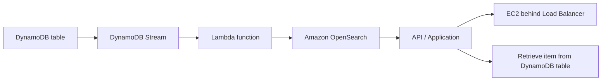
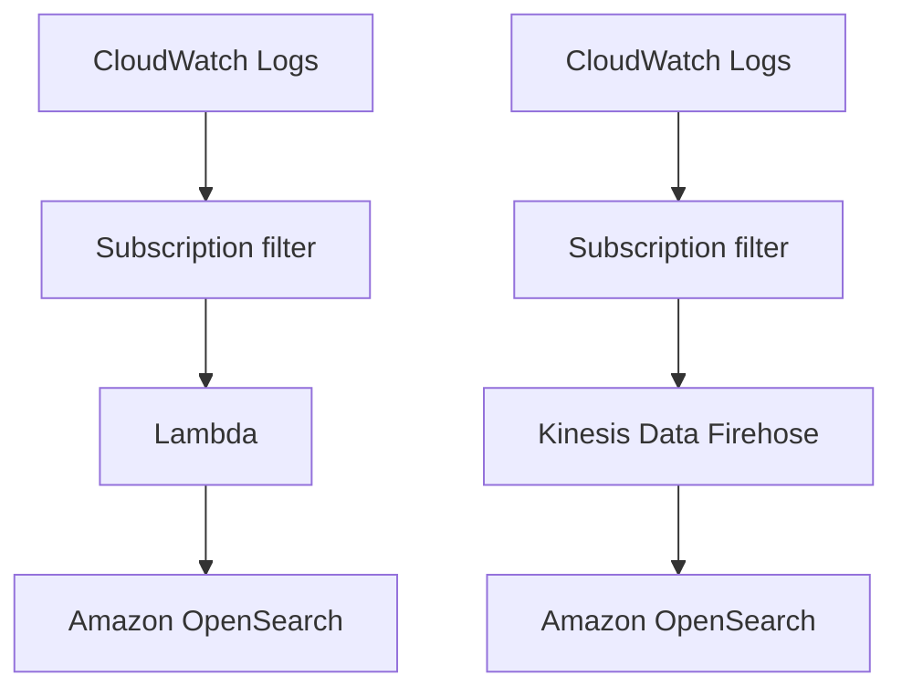

# 88. Amazon OpenSearch

## 🎯 Giới thiệu
- **Amazon OpenSearch** là tên mới của **ElasticSearch service** trong AWS.
- Trong kỳ thi, khi thấy **ElasticSearch** thì cần hiểu là đang nói đến **OpenSearch**.
- **Kibana** trước đây được đổi tên thành **OpenSearch Dashboards**.
- Đây là một **managed service** cho **OpenSearch**, dựa trên **open source project** và là một **fork of ElasticSearch**.
- Lý do đổi tên là vì **ElasticSearch** đã thay đổi license, nên AWS tạo dự án open source riêng để tiếp tục cung cấp dịch vụ trên Amazon.

## 1. Khái niệm và chế độ vận hành
- Amazon OpenSearch có 2 chế độ:
  - **Managed Cluster**: tự define loại server cần dùng.
  - **Serverless cluster**: dùng Amazon OpenSearch theo kiểu đơn giản hơn, không cần quản lý cluster theo cách truyền thống.
- Bộ công cụ liên quan:
  - **OpenSearch**: search và indexing.
  - **OpenSearch Dashboards**: realtime dashboards trên dữ liệu trong OpenSearch.
  - **Logstash**: log ingestion mechanism.
- **OpenSearch Dashboards** là lựa chọn thay thế cho **CloudWatch Dashboards** khi cần dashboarding nâng cao.
- **Logstash** cần dùng **logs dash agent** và là lựa chọn thay thế cho **CloudWatch Logs** khi muốn tự quyết định **retention** và **granularity**.

## 2. Use cases chính
- **Log analytics**
- **Real time application monitoring**
- **Security analytics**
- **Full text search**
- **Clickstream analytics**
- **Indexing**

## 3. Kiến trúc tích hợp và luồng dữ liệu
### 3.1 OpenSearch với DynamoDB
- Mục tiêu: **search trên dữ liệu DynamoDB**.
- Luồng trong transcript:
  - **Create / update / delete** trong **DynamoDB** sẽ đi vào **DynamoDB Stream**.
  - Một **Lambda function** nhận dữ liệu và đẩy sang **Amazon OpenSearch**.
  - Khi dữ liệu đã ở OpenSearch, có thể tạo **API** hoặc application để search item.
  - Ứng dụng có thể chạy trên **EC2 instance** phía sau **Load Balancer**.
  - Sau khi search xong, item có thể được lấy lại trực tiếp từ **DynamoDB table**.
- Ý chính:
  - **DynamoDB** tốt cho **simple row-level operations**.
  - **OpenSearch** tốt cho **search**.
  - Kết hợp cả hai để vừa search vừa retrieve dữ liệu.

### 3.2 OpenSearch với CloudWatch Logs
- Có 2 pattern được nhắc đến:
  - **CloudWatch Logs** -> **subscription filter** -> **Lambda** -> **Amazon OpenSearch**
    - Dữ liệu được đẩy **real time**.
  - **CloudWatch Logs** -> **subscription filter** -> **Kinesis Data Firehose** -> **Amazon OpenSearch**
    - Dữ liệu được đẩy **near real time** vì **Kinesis Data Firehose** có **batching capability**.

## 📊 Bảng tóm tắt
| Tiêu chí | Mô tả |
|----------|------|
| Tên dịch vụ | **Amazon OpenSearch** là tên mới của **ElasticSearch service** |
| Dashboard | **Kibana** đổi thành **OpenSearch Dashboards** |
| Bản chất | Managed version của **OpenSearch**, một **fork of ElasticSearch** |
| Chế độ | **Managed Cluster** và **Serverless cluster** |
| Tính năng chính | **Search**, **indexing**, dashboarding, log ingestion |
| Use cases | Log analytics, real time monitoring, security analytics, full text search, clickstream analytics |
| Tích hợp dữ liệu | **DynamoDB Stream + Lambda**, hoặc **CloudWatch Logs + Lambda / Kinesis Data Firehose** |
| Điểm mạnh | Kết hợp tốt với **DynamoDB** cho search và retrieve |

## 💡 Mẹo ghi nhớ cho kỳ thi AWS
- Gặp **ElasticSearch** trong đề thi thì nghĩ ngay đến **OpenSearch**.
- Gặp **Kibana** thì nhớ là **OpenSearch Dashboards**.
- Nhớ 3 mảnh ghép chính:
  - **OpenSearch** = search/indexing
  - **OpenSearch Dashboards** = dashboard
  - **Logstash** = log ingestion
- Nếu đề hỏi kiến trúc search trên **DynamoDB**, nhớ pattern:
  - **DynamoDB Stream -> Lambda -> OpenSearch**
- Nếu đề hỏi ingest logs:
  - **CloudWatch Logs -> subscription filter -> Lambda -> OpenSearch**
  - hoặc **CloudWatch Logs -> subscription filter -> Kinesis Data Firehose -> OpenSearch**
- **DynamoDB** dùng để lưu và truy xuất dữ liệu row-level đơn giản, còn **OpenSearch** dùng để tìm kiếm.

## ✅ Kết luận
- **Amazon OpenSearch** là dịch vụ AWS quản lý cho bài toán **search, indexing, dashboard và log analytics**.
- Đây là tên mới của **ElasticSearch service**, với **OpenSearch Dashboards** thay cho **Kibana**.
- Trong thực tế và trong kỳ thi, OpenSearch thường xuất hiện cùng **DynamoDB**, **CloudWatch Logs**, **Lambda**, và **Kinesis Data Firehose** để tạo pipeline tìm kiếm và phân tích dữ liệu.
