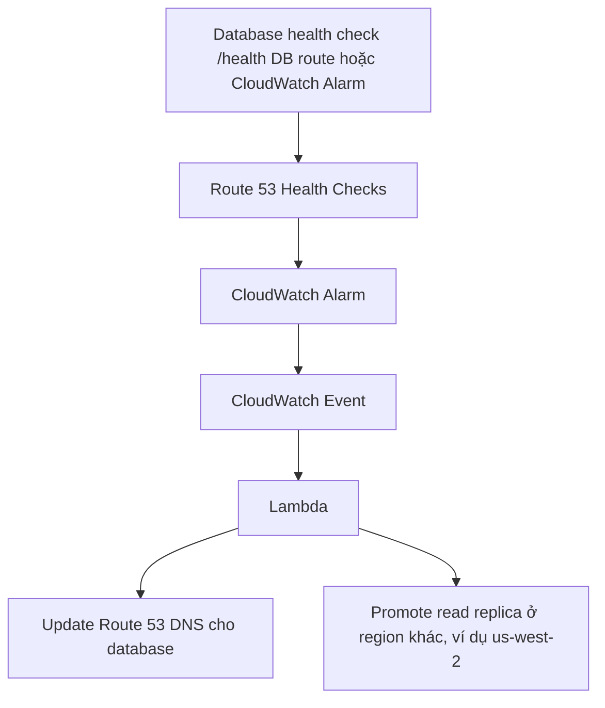

# 89. RDS

## 🎯 Giới thiệu
- **RDS** là dịch vụ **managed database** của AWS, nhưng bạn vẫn phải **provision server** và chọn **instance type**.
- Các **engine** cần nhớ:
  - PostgreSQL
  - MySQL
  - MariaDB
  - IBM DB2
  - Oracle
  - Microsoft SQL Server
- RDS thường được triển khai trong **VPC**, ở **private subnet**.
- Truy cập DB được kiểm soát bằng **security groups**.
- Nếu **Lambda** cần truy cập RDS, Lambda cũng պետք phải nằm trong **private VPC subnet** để kết nối được với RDS.

## 1. Storage, backup và event
- Storage của RDS nằm trên **EBS volumes**.
- Có thể **tăng dung lượng volume tự động** nhờ **auto-scaling**.
- Backup có 2 kiểu chính:
  - **Automated backups** với **point-in-time recovery**
  - **Snapshots** là **manual**, có thể giữ lâu theo ý muốn
- Snapshot có thể **copy cross-region**, hữu ích cho **disaster recovery**.
- RDS phát hành **events** về trạng thái database:
  - operations
  - outages
  - backup start
  - các thay đổi liên quan khác
- Các event này có thể đẩy vào **SNS topic** thông qua **RDS event notifications**.

## 2. High availability và read scaling
- **Multi-AZ** dùng cho **failover** khi có outage.
- Mô hình:
  - 1 **Master RDS Database**
  - 1 **standby instance** ở AZ khác
  - replication là **synchronous**
- Ứng dụng chỉ truy cập qua **một DNS name**.
- Khi failover, **DNS name tự động đổi**.
- Standby database **không bao giờ được ứng dụng dùng trực tiếp**.
- **Multi-AZ** là cho **recovery**, không phải để scale reads.
- Nếu muốn scale reads thì dùng **Read Replicas**:
  - replication **asynchronous**
  - có **eventual consistency**
  - có thể tạo **cross-region**
- Ứng dụng có thể:
  - **reads/writes** trên main RDS
  - **reads only** trên read replica

### 🌐 Route 53 cho phân phối read traffic
- Dùng **Route 53 weighted record set** để chia reads cho nhiều replica.
- Có thể đặt weight theo tỷ lệ, ví dụ **25% mỗi replica**.
- Nếu các replica có cùng spec, nên đặt **cùng weight**.
- Có thể bật **Route 53 health checks** để loại replica lỗi khỏi record.

## 3. Security, IAM auth, Oracle, migration và RDS Proxy
- **KMS encryption** áp dụng cho:
  - underlying **EBS volume**
  - **snapshots**
- **TDE** có sẵn cho **Oracle** và **SQL Server**.
- **SSL encryption** dùng cho các kết nối in-flight tới RDS, và có thể **enforce**.
- **IAM authentication** dùng cho:
  - MySQL
  - PostgreSQL
  - MariaDB
- Dù dùng IAM để authenticate, **authorization vẫn diễn ra trong RDS**.
- **CloudTrail** không dùng để track query bên trong RDS.
- Với **IAM authentication**:
  - không cần password
  - dùng **authentication token**
  - token lấy qua **RDS API calls**
  - token có thời hạn **15 phút**
  - hết hạn thì phải lấy token mới
- Ví dụ flow:
  - **EC2 instance** có đúng **IAM role**
  - gọi API để lấy token từ RDS
  - dùng token đó qua **SSL connection**
  - security groups phải cấu hình đúng

### 🧩 Oracle specifics
- Có 2 cách backup Oracle:
  - **RDS Backups**: backup/restore cho **Amazon RDS for Oracle**
  - **Oracle RMAN**: backup/restore cho **non-RDS Oracle**
- Flow được nhắc:
  - RDS Oracle DB Instance -> RDS Backup -> RDS Oracle DB Instance
  - RDS Oracle DB Instance -> RMAN Backup -> Amazon S3 -> external Oracle database
- **RAC (Real Applications Cluster)** không được hỗ trợ trên **RDS for Oracle**.
- **RAC** chỉ chạy trên **Oracle on EC2** vì có full control.
- Oracle trên RDS vẫn hỗ trợ **TDE**.
- **DMS** works với **Oracle RDS** để replicate/migrate dữ liệu từ on-premises lên Cloud.

### 🧰 MySQL migration
- Có thể dùng **native MySQL dump tool** để migrate từ **RDS MySQL** sang **non-RDS MySQL**.
- Target non-RDS có thể là:
  - on-premises
  - Amazon EC2
- Flow:
  - export bằng dump tool
  - import vào target
  - chạy replication giữa 2 DB
  - khi sync xong thì dừng replication và dừng source DB

### ⚙️ RDS Proxy
- **RDS Proxy** hữu ích khi dùng với **Lambda** để tránh **TooManyConnections**.
- Khi không dùng proxy, Lambda có thể mở và giữ quá nhiều DB connections.
- RDS Proxy giúp:
  - không cần code xử lý idle connections
  - không cần tự quản lý connection pool
- Proxy hỗ trợ:
  - **IAM authentication**
  - **database authentication**
  - **auto-scaling**
- Proxy phải deploy trong **private subnet** vì **không public**.
- Lambda cũng phải ở trong **VPC** để kết nối tới proxy.
- Kết quả: các DB connections được **pool** qua **RDS Proxy**.

### 🔁 Cross-region failover architecture

## 📊 Bảng tóm tắt
| Tiêu chí | Mô tả |
|----------|------|
| Dịch vụ | **Managed database** nhưng vẫn phải provision server và chọn instance type |
| Engine | PostgreSQL, MySQL, MariaDB, IBM DB2, Oracle, Microsoft SQL Server |
| Triển khai | Trong **VPC**, thường ở **private subnet** |
| Storage | **EBS volumes**, có thể auto-scale dung lượng |
| Backup | Automated backups, point-in-time recovery, snapshots manual, copy cross-region |
| HA | **Multi-AZ** với synchronous standby cho failover |
| Read scaling | **Read Replicas** với asynchronous replication và eventual consistency |
| Routing reads | **Route 53 weighted records** + health checks |
| Security | **KMS**, **TDE** cho Oracle/SQL Server, **SSL**, **IAM auth** |
| IAM auth token | Dùng token, thời hạn **15 phút** |
| Oracle | RDS Backup vs **RMAN**, **RAC không hỗ trợ** trên RDS |
| Proxy | **RDS Proxy** giảm TooManyConnections cho Lambda |
| CloudTrail | Không dùng để track query trong RDS |

## 💡 Mẹo ghi nhớ cho kỳ thi AWS
- **Multi-AZ = failover/recovery**, không phải read scaling.
- **Read Replica = read scaling**, replication **asynchronous**, có thể **cross-region**.
- **RDS + Lambda**: nếu Lambda truy cập DB, thường cần đi qua **VPC/private subnet**.
- **IAM authentication** trên RDS:
  - nhớ **token 15 phút**
  - dùng với **MySQL, PostgreSQL, MariaDB**
- **RDS Proxy** là câu trả lời khi gặp **TooManyConnections** với Lambda.
- **Oracle on RDS**:
  - **RDS Backup** cho RDS restore
  - **RMAN** cho non-RDS restore
  - **RAC không hỗ trợ**
- **CloudTrail không track query** trong RDS.

## ✅ Kết luận
- RDS là dịch vụ database được quản lý, nhưng vẫn cần hiểu rõ **engine**, **deployment trong VPC**, **backup**, **Multi-AZ**, **Read Replica**, **security**, và các điểm riêng như **Oracle**, **MySQL migration**, **RDS Proxy**.
- Với kỳ thi AWS, trọng tâm là phân biệt đúng:
  - **Multi-AZ vs Read Replica**
  - **IAM auth vs DB authorization**
  - **RDS Backup vs RMAN**
  - **RDS Proxy vs direct Lambda connections**
