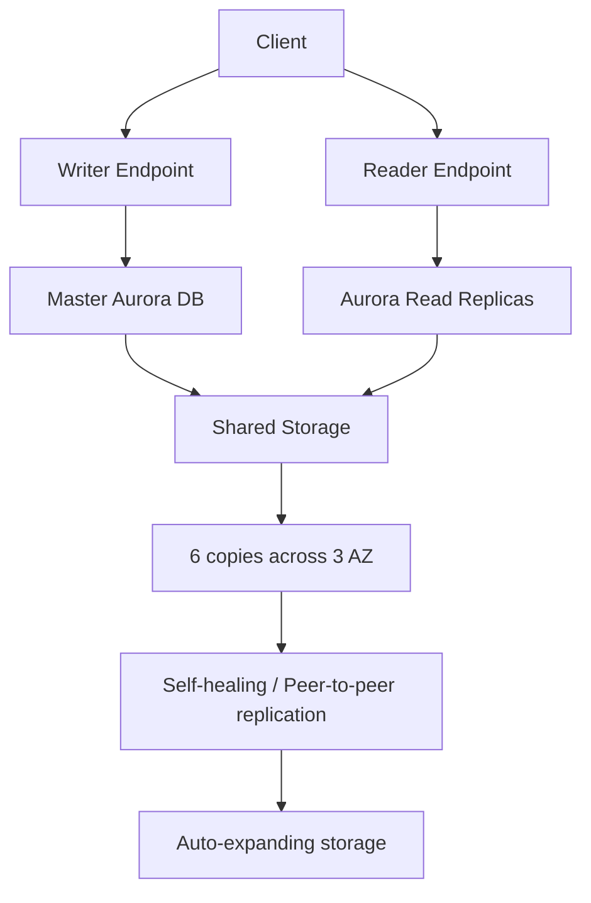

# 90. Aurora - Part 1

## 🎯 Giới thiệu
Aurora là chủ đề quan trọng về mặt kiến trúc trong AWS exam, đặc biệt khi so sánh với `RDS` và `DynamoDB`.

- Aurora chỉ hỗ trợ `PostgreSQL` và `MySQL-compatible APIs`
- Điểm nổi bật nhất là `storage`:
  - Tự động mở rộng theo bước `10 GB`
  - Tối đa `256 TB`
  - Giảm bớt gánh nặng quản lý dung lượng
- Aurora mặc định là `Multi-AZ`
- Có thể tạo `read replicas` để tăng khả năng đọc và mở rộng hệ thống

## 1. Kiến trúc storage và độ sẵn sàng của Aurora 🧱
Aurora dùng kiến trúc storage đặc biệt để tăng độ bền và khả năng chịu lỗi.

- Dữ liệu được nhân bản thành `6 copies` trên `3 AZ`
- `4/6` copies cần cho `write`
- `3/6` copies cần cho `read`
- Có `self-healing` với `peer-to-peer replication`
- Storage được `striped` trên hàng trăm volume, tránh `single point of failure`
- `master` là DB duy nhất có quyền `write` vào storage
- `failover` của master diễn ra trong `less than 30 seconds`

## 2. Read replicas, endpoints và cross-region replication 🔁
Aurora tách rõ đường đi cho `write` và `read` thông qua các loại endpoint.

- Có thể tạo tối đa `15 read replicas`
- `Reader endpoint`:
  - Dùng để truy cập tất cả read replicas
  - Thực hiện `connection load balancing`
  - Chỉ dùng cho `read operations`
- `Writer endpoint` / `cluster endpoint`:
  - Trỏ vào `primary DB instance`
  - Dùng cho `insert`, `update`, `delete` và các thao tác ghi
- `Instance endpoint`:
  - Kết nối đến một DB instance cụ thể
  - Hữu ích khi cần chẩn đoán hoặc fine-tune một instance
- `Custom endpoints`:
  - Cho phép chọn một nhóm DB instances theo nhu cầu
  - Hữu ích khi cần làm việc với các instance có cấu hình/capacity khác nhau
- `Cross-region read replica`:
  - Sao chép **toàn bộ database**, không phải từng table
  - Có thể dùng cho `disaster recovery`
  - Có thể `promote` replica sang region riêng nếu region gốc gặp sự cố lớn
- Có thể export hoặc load dữ liệu trực tiếp giữa Aurora và `S3`
  - Không cần client application trung gian
  - Tiết kiệm resource và network cost

## 3. Logs và giám sát hiệu năng 📈
Aurora cung cấp nhiều công cụ để theo dõi và troubleshooting.

- Log có thể monitor:
  - `error logs`
  - `slow query logs`
  - `general log`
  - `audit log`
- Log có thể:
  - Download trực tiếp
  - Publish sang `CloudWatch Logs`
- `Performance Insights`:
  - Cho thấy `waits`
  - `SQL statements`
  - `host`
  - `users`
- `CloudWatch metrics` cung cấp thông tin cơ bản:
  - `CPU usage`
  - `memory usage`
  - `swap memory usage`
- `Enhanced monitoring`:
  - Cung cấp metric theo `second`
  - Cho biết thông tin cấp host
  - Có thể xem `top 100 processes` trên database
- Khi cần điều tra hiệu năng, cũng có thể xem `slow query logs`

## 📊 Bảng tóm tắt
| Tiêu chí | Mô tả |
|----------|------|
| Loại engine | Chỉ hỗ trợ `PostgreSQL` và `MySQL-compatible APIs` |
| Storage | Tự động tăng `10 GB` mỗi bước, tối đa `256 TB` |
| High availability | `6 copies` trên `3 AZ`, mặc định `Multi-AZ` |
| Read scaling | Tối đa `15 read replicas`, dùng `reader endpoint` |
| Write path | `writer/cluster endpoint` trỏ vào `master` |
| Failover | `less than 30 seconds` |
| Cross-region | Sao chép toàn bộ database, dùng cho `disaster recovery` |
| Monitoring | `CloudWatch`, `Performance Insights`, `enhanced monitoring`, logs |

## 💡 Mẹo ghi nhớ cho kỳ thi AWS
- `Aurora = RDS-like but cloud-native hơn` theo cách diễn đạt trong bài giảng, nhất là ở `failover` và `storage`
- Nhớ cụm:
  - `6 copies across 3 AZ`
  - `4/6 writes`, `3/6 reads`
  - `up to 15 read replicas`
- Phân biệt nhanh:
  - `Writer endpoint` = ghi
  - `Reader endpoint` = đọc và load balancing
  - `Instance endpoint` = một instance cụ thể
  - `Custom endpoint` = nhóm instance tự chọn
- `Cross-region replica` là sao chép **toàn DB**, không phải từng bảng
- Troubleshooting nên nhớ 3 lớp:
  - `Performance Insights`
  - `CloudWatch metrics`
  - `logs` và `slow query logs`

## ✅ Kết luận
Aurora trong bài này được mô tả như một hệ thống database có `storage` tự mở rộng, nhân bản mạnh, `multi-AZ`, hỗ trợ nhiều `read replicas`, và có các `endpoint` rõ ràng cho `write` và `read`. Phần giám sát cũng rất quan trọng với `Performance Insights`, `CloudWatch`, và các loại log để phục vụ tối ưu hiệu năng và troubleshooting.
