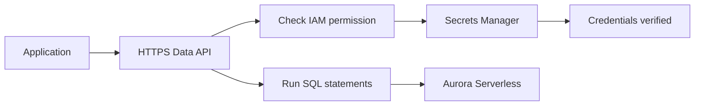
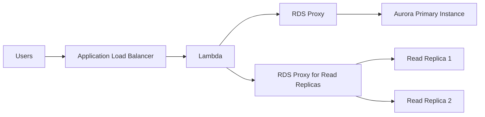
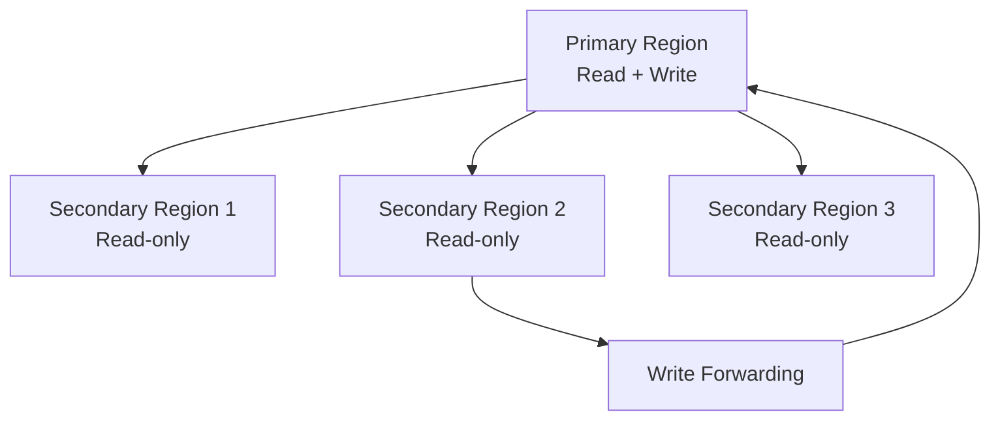

# 91. Aurora - Part 2

## 🎯 Giới thiệu
- Bài này tập trung vào các tính năng quan trọng của **Aurora**:
  - **Aurora Serverless**
  - **Data API**
  - **RDS Proxy for Aurora**
  - **Aurora Global Database**
  - Cách **convert RDS database sang Aurora**

## 1. Aurora Serverless + Data API
- **Aurora Serverless** là phiên bản serverless của Aurora database.
- Đặc điểm chính:
  - **Autoscaling** và **automated database instantiation** dựa trên usage thực tế.
  - Phù hợp với workload:
    - infrequent
    - intermittent
    - unpredictable
  - Không cần **capacity planning**.
  - Tính phí theo **second**, có thể tiết kiệm chi phí hơn.
- Về kiến trúc:
  - Client vẫn dùng **one endpoint**.
  - Aurora dùng **proxy fleet** được quản lý phía sau.
  - Backend sẽ tự scale theo usage.

### Data API
- **Data API** cho phép truy cập Aurora Serverless mà **không cần JDBC connection**.
- Chỉ cần:
  - một **secure HTTPS endpoint**
  - gửi **SQL statements** qua API
- Lợi ích:
  - không phải quản lý **persistent database connections**
  - giảm độ phức tạp cho ứng dụng
- Cơ chế quyền:
  - Application phải có quyền trong **IAM policy**
  - phải được phép truy cập:
    - **Aurora Serverless Data API**
    - **Secrets Manager** nơi credentials được kiểm tra
  - API sẽ quyết định **allow / deny** một cách transparent

### Mermaid: Luồng truy cập Data API

## 2. RDS Proxy for Aurora
- Nếu muốn **manage connections** theo kiểu truyền thống, có thể dùng **RDS Proxy for Aurora**.
- Aurora **primary instance** xử lý cả **read and write**.
- Có thể đặt **RDS Proxy** phía trước primary instance để tạo mô hình ứng dụng truyền thống:
  - **Users** → **Application Load Balancer** → **Lambda** → **RDS Proxy**
- Điểm đáng chú ý:
  - Có thể tạo **RDS proxy chỉ cho read-only endpoints**
  - Tức là dành riêng cho **Read Replicas**
- Khi đó:
  - primary instance vẫn xử lý read/write
  - Read Replicas có **read-only endpoint**
  - Lambda functions có thể dùng endpoint chỉ đọc với các tính năng của RDS Proxy

### Mermaid: Luồng kết nối với RDS Proxy

## 3. Aurora Global Database + Chuyển từ RDS sang Aurora
### Aurora Global Database
- Dùng cho **cross-region replication** và **disaster recovery**.
- Cấu trúc:
  - **Primary region**: nhận **reads and writes**
  - Tối đa **10 read-only secondary regions**
- Đặc điểm:
  - replication lag **less than one second**
  - mỗi secondary region có thể có tới **16 Read Replicas**
- Mục tiêu sử dụng:
  - giảm **latency**
  - hỗ trợ **disaster recovery**
- Nếu primary region down:
  - có thể promote region khác
  - **RTO less than one minute**
- Với **Aurora PostgreSQL**:
  - có thêm setting để quản lý **RPO**
  - mục tiêu là đảm bảo lag thấp hơn

### Write Forwarding
- Đây là tính năng của **Aurora Global Database**.
- Cách hoạt động:
  - secondary database cluster nhận SQL statement có write
  - write đó được **forward** về **primary database cluster**
- Lưu ý:
  - writes **không bao giờ xảy ra trực tiếp** trên secondary cluster
  - primary cluster là nơi giữ bản copy **always up-to-date**
- Lý do dùng:
  - giảm số lượng endpoints cần quản lý
  - application ở region khác vẫn có thể kết nối vào secondary region và thực hiện read/write, trong đó write sẽ được forward

### Chuyển từ RDS sang Aurora
Có **2 cách**:

1. **Snapshot và restore**
   - Tạo **database snapshot**
   - Restore trực tiếp vào **Aurora database instance**
   - Ưu điểm:
     - khá nhanh
   - Hạn chế:
     - nếu application vẫn dùng RDS chính, có thể gặp vấn đề với phần dữ liệu còn lại
     - hoặc phải dừng DB trước rồi mới snapshot

2. **Aurora Read Replica trên RDS**
   - Tạo **Aurora Read Replica** từ **RDS database instance**
   - Khi replication lag gần **zero**:
     - promote replica thành Aurora database instance riêng
     - migrate application từ RDS sang Aurora

### Mermaid: Global Database và Write Forwarding

## 📊 Bảng tóm tắt
| Tiêu chí | Mô tả |
|----------|------|
| Aurora Serverless | Serverless Aurora, tự autoscaling theo usage, pay per second |
| Phù hợp cho | Workload ít thường xuyên, gián đoạn, khó dự đoán |
| Data API | Truy cập Aurora Serverless qua HTTPS và SQL, không cần JDBC connection |
| IAM + Secrets Manager | Application phải có quyền truy cập cả Data API và secret trong Secrets Manager |
| RDS Proxy for Aurora | Dùng để manage connections theo kiểu truyền thống, có thể áp dụng cho primary hoặc read-only endpoints |
| Aurora Global Database | Primary region + up to 10 secondary regions, replication lag < 1 second |
| Write Forwarding | Secondary cluster forward write request về primary cluster |
| RTO | Khi primary region down, có thể promote region khác với RTO < 1 minute |
| Chuyển RDS sang Aurora | 2 cách: snapshot/restore hoặc tạo Aurora Read Replica rồi promote |

## 💡 Mẹo ghi nhớ cho kỳ thi AWS
- **Serverless = autoscaling + pay per second + không cần capacity planning**.
- **Data API** = dùng **HTTPS endpoint**, không cần **JDBC connection**.
- **RDS Proxy** = giải pháp cho quản lý connection, nhớ cả **read-only endpoint cho Read Replicas**.
- **Global Database** = ưu tiên cho **cross-region replication** và **disaster recovery**.
- **Write Forwarding** = write từ secondary region sẽ được **forward** về primary, không ghi trực tiếp lên secondary.
- Khi migrate **RDS -> Aurora**, nhớ 2 hướng:
  - **snapshot/restore**
  - **Aurora Read Replica rồi promote**

## ✅ Kết luận
- Aurora trong bài này xoay quanh 5 ý chính:
  - **Aurora Serverless** cho workload linh hoạt
  - **Data API** để truy cập DB không cần JDBC
  - **RDS Proxy** để quản lý connection
  - **Aurora Global Database** cho multi-region và DR
  - **2 phương pháp** chuyển từ **RDS** sang **Aurora**
- Đây là các điểm rất quan trọng để ôn thi vì liên quan trực tiếp đến **scaling, connectivity, replication, DR, và migration**.
