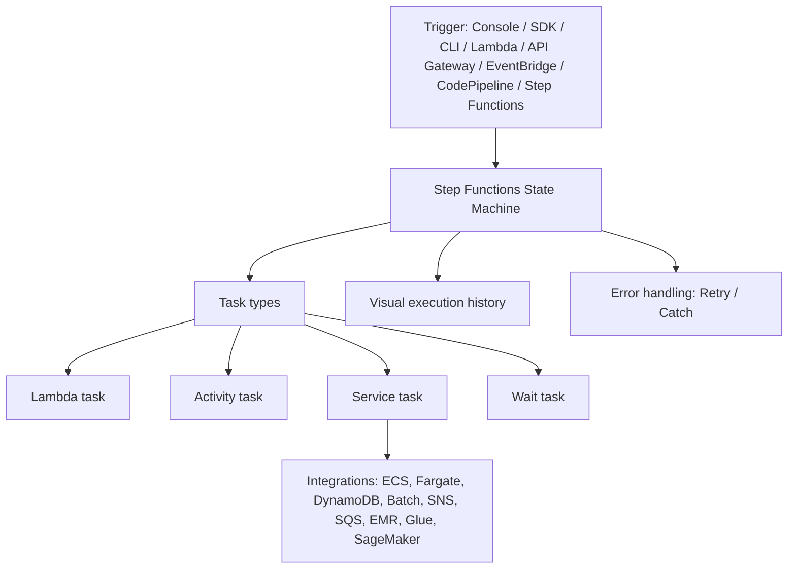

# 92. Step Functions

## 🎯 Giới thiệu
- **Step Functions** dùng để xây dựng **serverless visual workflow** nhằm **orchestrate** các service, đặc biệt là **Lambda**.
- Đây là một **state machine**: mô tả luồng xử lý bằng các state nối tiếp nhau.
- Các khả năng chính được nhắc đến trong transcript:
  - `sequence actions`
  - `parallel actions`
  - `conditions`
  - `timeouts`
  - `error handling`
  - `human approval`
- Khi chain nhiều **Lambda functions** bằng Step Functions, cần chú ý **latency** giữa các lần gọi vì dữ liệu được truyền từ bước này sang bước khác.
- Workflow được biểu diễn bằng **JSON state machine** và AWS sẽ tạo **visual graph** để theo dõi execution.

## 1. Các loại task trong Step Functions
- **Lambda task**
  - Chỉ đơn giản là gọi một **Lambda function**.
- **Activity task**
  - Dùng **HTTP activity worker**.
  - Worker có thể là **EC2 instance**, **mobile device** hoặc **on-premise data center**.
  - Worker sẽ **poll** Step Functions để lấy việc cần làm.
  - Không phải serverless.
- **Service task**
  - Tích hợp trực tiếp với service AWS được hỗ trợ.
  - Có thể gồm:
    - **Lambda**
    - **ECS task**
    - **Fargate container**
    - **DynamoDB table**
    - **Batch job**
    - **SNS topic**
    - **SQS queue**
- **Wait task**
  - Dùng để chờ theo **duration** hoặc đến một **timestamp**.

## 2. Standard workflow vs Express workflow
| Tiêu chí | Standard workflow | Express workflow |
|----------|-------------------|------------------|
| Thời lượng tối đa | **1 year** | **5 minutes** |
| Mục tiêu | Workflow dài, chậm hơn | Workflow rất nhanh, throughput cao |
| Tốc độ start | Khoảng **2000 executions/second** | Trên **100,000 starts/second** |
| State transitions | Khoảng **4000 transitions/second/account** | Gần như **unlimited** |
| Pricing | Theo **state transition** | Theo **executions**, **duration**, và **memory** |
| Execution history | Có đầy đủ | Không có history nội bộ, dùng **CloudWatch Logs** |
| Delivery semantics | **Exactly once** workflow execution | **At least once** workflow execution |

## 3. Sync và Async Express Workflow
- **Synchronous express workflow**
  - Chờ workflow hoàn tất rồi mới trả kết quả.
  - Phù hợp khi orchestrate **microservices**, xử lý **errors**, **retries**, **parallel tasks**.
  - Ví dụ trong transcript:
    - **API Gateway** gọi workflow
    - đợi workflow hoàn tất
    - trả kết quả về cho user
- **Asynchronous express workflow**
  - Chỉ khởi chạy workflow, không chờ kết quả.
  - Phù hợp khi không cần phản hồi ngay.
  - Ví dụ:
    - **API Gateway** gọi workflow
    - nhận xác nhận rằng workflow đã start
    - user chưa biết execution result từ request này

## 4. Trigger, error handling và ứng dụng
- Step Functions có thể được trigger bằng nhiều cách:
  - **Management Console**
  - **AWS SDK**
  - **CLI**
  - **AWS Lambda**
  - **API Gateway**
  - **EventBridge**
  - **CodePipeline**
  - và cả **Step Functions** khác
- Step Functions có nhiều ứng dụng được nhắc đến:
  - xử lý nhiều message từ **SQS**
  - train machine learning model khi cần phối hợp **SageMaker**, **Lambda**, **Amazon S3**
  - quản lý **batch job**
  - quản lý **container task** như **Fargate task**
- **Error handling**
  - Có thể dùng **retry** ngay trong state machine.
  - Nếu workflow fail, có thể dùng **EventBridge** bắt failure event.
  - Sau đó trigger **SNS topic** để gửi email alert.
- Một điểm thi cần nhớ:
  - **Step Functions không tích hợp AWS Mechanical Turk**
  - Transcript nói trường hợp này nên dùng **SWF** thay vì Step Functions.

## 📊 Bảng tóm tắt
| Tiêu chí | Mô tả |
|----------|------|
| Mục đích | Orchestrate serverless workflow, nhất là với **Lambda** |
| Mô hình | **State machine** với visual graph |
| Task chính | **Lambda task**, **Activity task**, **Service task**, **Wait task** |
| Trigger | Console, SDK, CLI, Lambda, API Gateway, EventBridge, CodePipeline, Step Functions |
| Standard workflow | Dài hơn, **1 year**, tính theo **state transition** |
| Express workflow | Rất nhanh, **5 minutes**, throughput cao |
| Theo dõi | Standard có history; Express dùng **CloudWatch Logs** |
| Semantics | Standard: **exactly once**; Express: **at least once** |
| Error handling | **Retry**, **EventBridge**, **SNS** |
| Lưu ý thi | Không dùng cho **Mechanical Turk** |

## 💡 Mẹo ghi nhớ cho kỳ thi AWS
- Nhớ từ khóa: **Step Functions = orchestrate workflow**, không phải chỉ riêng Lambda.
- **Standard** = lâu hơn, có history, **exactly once**, pricing theo **state transition**.
- **Express** = rất nhanh, **5 minutes**, throughput cao, dùng **CloudWatch Logs**, **at least once**.
- Nếu đề bài nói cần:
  - nhiều bước xử lý
  - retry / parallel / approval
  - phối hợp nhiều service
  - workflow nhìn trực quan  
  thì nghĩ ngay đến **Step Functions**.
- Nếu nhắc **Mechanical Turk**, transcript khẳng định **không phải Step Functions**.

## ✅ Kết luận
- **Step Functions** là công cụ orchestration rất quan trọng trong kiến trúc AWS.
- Điểm cốt lõi cần nhớ là khả năng điều phối workflow, tích hợp nhiều service, hỗ trợ retry/error handling, và phân biệt rõ **Standard workflow** với **Express workflow**.
