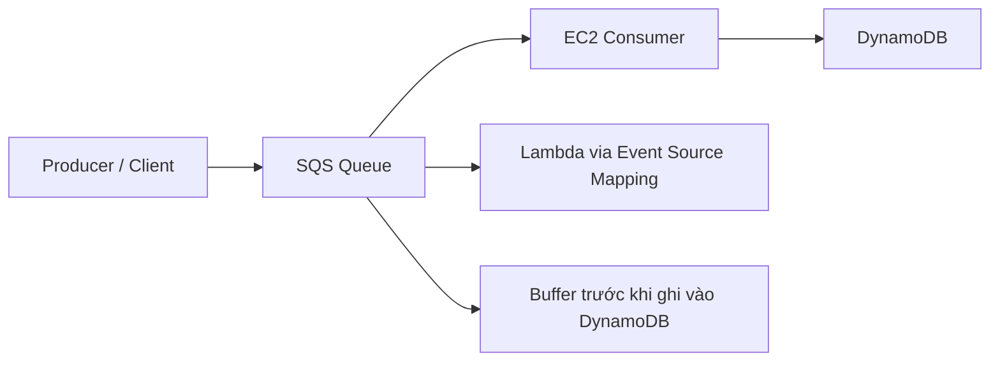
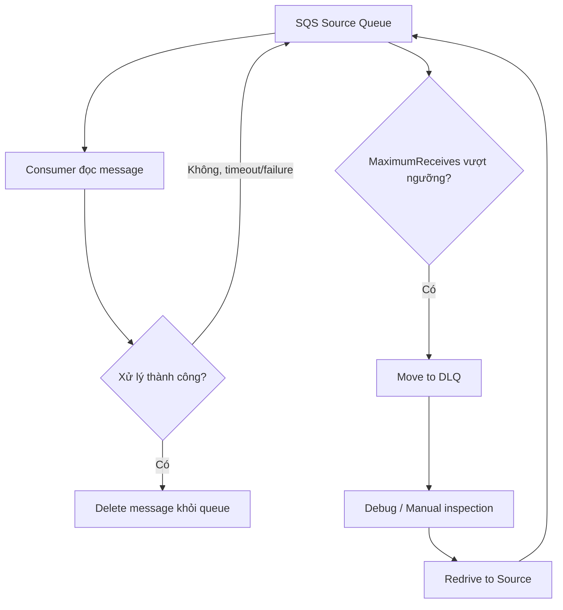

# 93. SQS

## 🎯 Giới thiệu
- **SQS (Simple Queue Service)** là dịch vụ **serverless**, **managed queue**, và tích hợp chặt với **IAM** để bảo mật.
- Mục tiêu chính của SQS là **decouple** giữa các services để:
  - scale độc lập
  - xử lý công việc **asynchronously**
- **SQS Standard** có khả năng scale rất lớn, không cần provision trước.

## 1. SQS cơ bản và kiến trúc sử dụng
- SQS dùng để nhận message từ producer, sau đó consumer đọc message và xử lý riêng.
- Consumer có thể là:
  - **EC2 instances**
  - **Auto Scaling group**
  - **AWS Lambda** qua **event source mapping**
- Một pattern phổ biến là dùng SQS làm **write buffer cho DynamoDB**:
  - ghi vào SQS trước
  - sau đó một application khác đọc từ SQS và ghi vào DynamoDB
  - cách này giúp tránh throttling khi ghi trực tiếp vào DynamoDB

## 2. Giới hạn, Standard vs FIFO, và message processing
- SQS **không phù hợp với message lớn**.
- **Max message size** là **1,024 KB**.
- Nếu cần gửi file lớn, cách làm là:
  - upload file lên **Amazon S3**
  - gửi **S3 key** qua SQS
  - consumer lấy key rồi đọc file từ S3
- **SQS FIFO**:
  - đảm bảo message được nhận theo đúng thứ tự gửi
  - đổi lại có **limited scale**
  - throughput:
    - **300 messages/second** không batching
    - **3,000 messages/second** với batching

### So sánh nhanh

| Tiêu chí | SQS Standard | SQS FIFO |
|----------|--------------|----------|
| Ordering | Không đảm bảo chặt | Đảm bảo thứ tự |
| Scale | Rất lớn | Hạn chế hơn |
| Throughput | Cao | 300 msg/s hoặc 3,000 msg/s với batching |
| Use case | Decoupling, async processing | Khi cần ordering |

## 3. Visibility Timeout, DLQ, Redrive và idempotency
- Nếu consumer không xử lý xong message trong **Visibility Timeout**:
  - message sẽ tự quay lại queue
- Nếu lỗi này xảy ra lặp lại, message có thể bị xử lý nhiều lần.
- Để tránh vòng lặp lỗi, dùng **dead-letter queue (DLQ)** với **MaximumReceives**:
  - nếu vượt ngưỡng, message được chuyển sang DLQ
  - message bị remove khỏi source queue và chuyển sang queue khác để xử lý sau

### DLQ flow

- DLQ rất hữu ích cho:
  - **debugging**
  - kiểm tra message lỗi
  - xử lý lại sau khi đã sửa consumer
- Lưu ý:
  - **DLQ của FIFO queue phải là FIFO queue**
  - **DLQ của Standard queue phải là Standard queue**
- Nên đặt **retention** dài cho DLQ, ví dụ **14 days**
- **Redrive to Source**:
  - dùng để đẩy message từ DLQ quay lại source queue
  - consumer xử lý lại mà không cần biết message từng ở DLQ

### Idempotency
- Vì message có thể bị xử lý **twice** do failure hoặc timeout, consumer phải **idempotent**.
- Ý nghĩa:
  - xử lý cùng một message nhiều lần nhưng **không tạo effect bị nhân đôi**
- Ví dụ:
  - **không idempotent**: mỗi lần đọc SQS lại insert thêm một row mới vào DynamoDB
  - **idempotent**: dùng **upsert** với primary key, nếu record đã có thì update/overwrite

## 4. Lambda + SQS và request-response architecture
- **Lambda** có thể đọc từ SQS qua **event source mapping**:
  - event source mapper pull từ SQS
  - trả về **batch**
  - invoke Lambda với batch đó
- Mặc định event source mapping dùng **long polling**
- **Batch size**: từ **1 đến 10 messages**
- Recommended:
  - **Queue Visibility Timeout = 6x Lambda timeout**
- Nếu muốn dùng DLQ cho việc message không xử lý được:
  - cấu hình **DLQ ở SQS queue level**
  - không phải ở Lambda function
- **Lambda Destinations** là một feature khác:
  - Lambda có thể đẩy event lỗi sang **SNS topic** hoặc **SQS queue**

### Request-response flow

- Mô hình này mang lại:
  - **full decoupling**
  - scale hai phía độc lập
  - **fault tolerance**
  - **load balancing**
- Đây là pattern phù hợp khi cần xử lý request theo kiểu **at least once** và muốn hệ thống scale tốt

## 📊 Bảng tóm tắt
| Tiêu chí | Mô tả |
|----------|------|
| Loại dịch vụ | **Serverless managed queue** |
| Bảo mật | Tích hợp với **IAM** |
| Mục đích chính | **Decouple** services và xử lý **asynchronously** |
| Message size | Tối đa **1,024 KB** |
| Message lớn | Lưu trong **S3**, gửi **S3 key** qua SQS |
| Consumer | **EC2**, **Auto Scaling group**, **Lambda** |
| FIFO | Đảm bảo thứ tự, nhưng scale hạn chế |
| Visibility Timeout | Nếu consumer không xử lý xong, message quay lại queue |
| DLQ | Nhận message thất bại quá số lần cho phép |
| Redrive to Source | Đẩy message từ DLQ về source queue |
| Idempotency | Cần thiết vì message có thể được xử lý nhiều lần |
| Lambda integration | Dùng **event source mapping** và **long polling** |

## 💡 Mẹo ghi nhớ cho kỳ thi AWS
- **SQS = Decouple + Async**
- **Standard = scale cực lớn**
- **FIFO = giữ thứ tự, scale thấp hơn**
- Message lớn thì nhớ: **S3 + SQS key**
- **Visibility Timeout** hết hạn thì message quay lại queue
- **DLQ** dùng khi message bị fail nhiều lần, nhớ **MaximumReceives**
- **DLQ Standard phải đi với Standard, FIFO phải đi với FIFO**
- Với Lambda + SQS:
  - nhớ **event source mapping**
  - nhớ **batch size 1-10**
  - nhớ **Visibility Timeout = 6x Lambda timeout**
- Consumer phải **idempotent** để tránh xử lý trùng

## ✅ Kết luận
- **SQS** là lựa chọn rất mạnh khi cần **decoupling**, **async processing**, và **scale độc lập** giữa các thành phần.
- Khi thiết kế với SQS, cần đặc biệt nhớ các điểm thi quan trọng:
  - **message size limit**
  - **FIFO vs Standard**
  - **Visibility Timeout**
  - **DLQ / Redrive**
  - **idempotent consumer**
  - **Lambda event source mapping**
- Nếu đề bài nói về xử lý theo kiểu **at least once**, buffering, hoặc tách producer/consumer, thì **SQS** thường là đáp án rất phù hợp.
